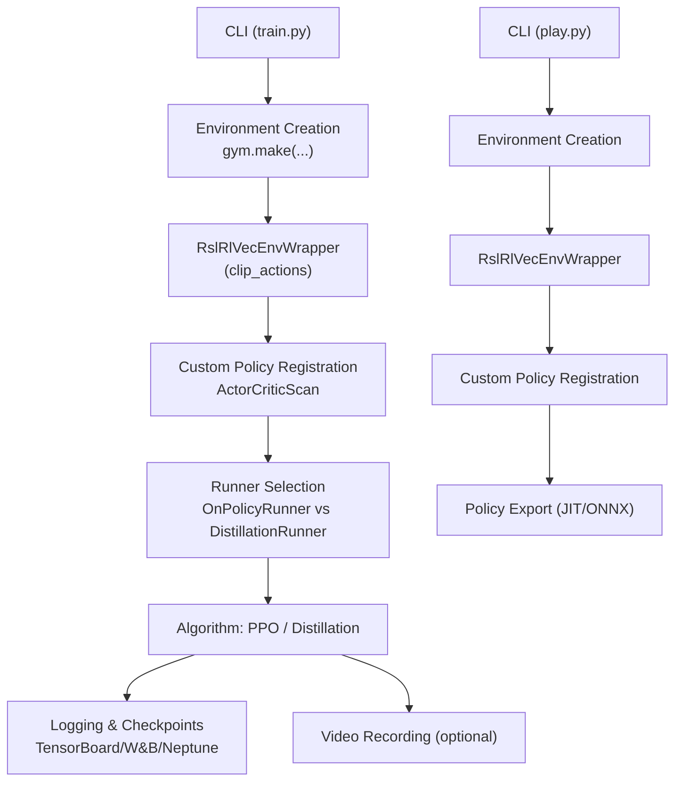
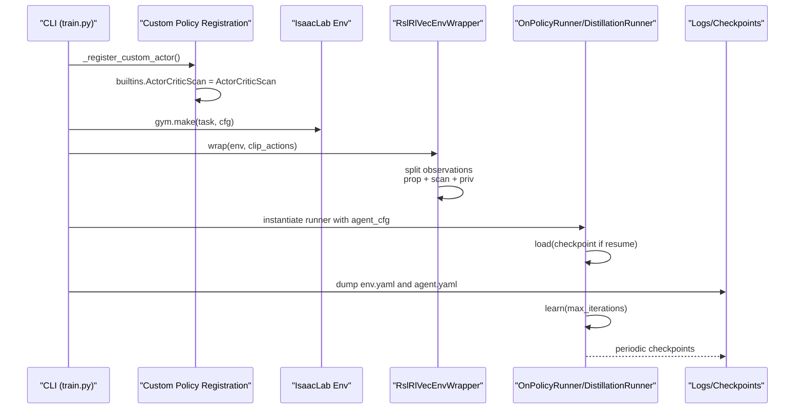
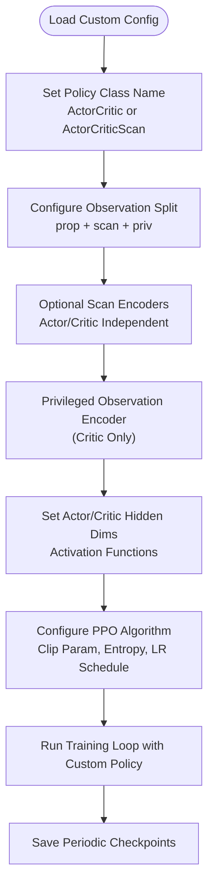
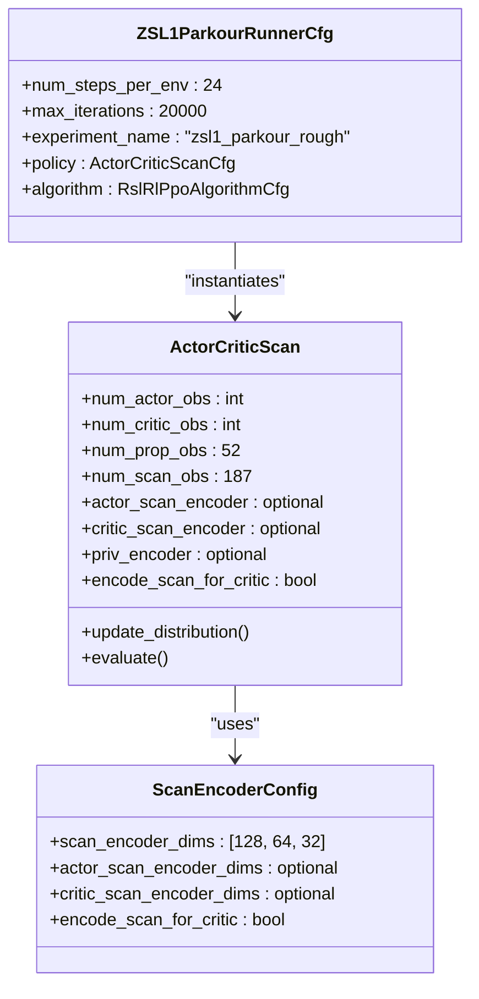
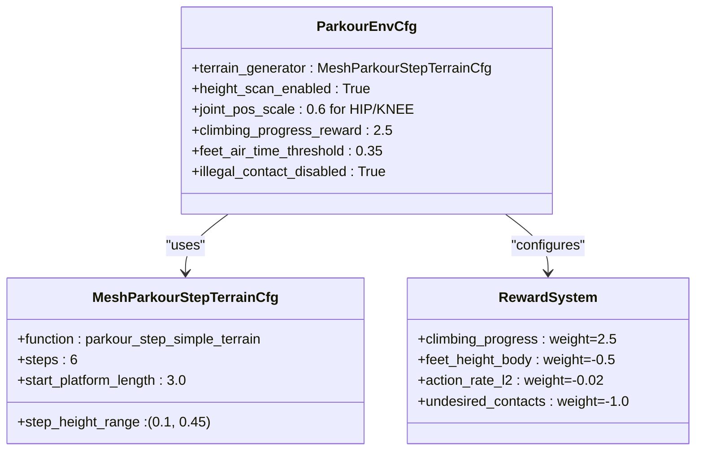
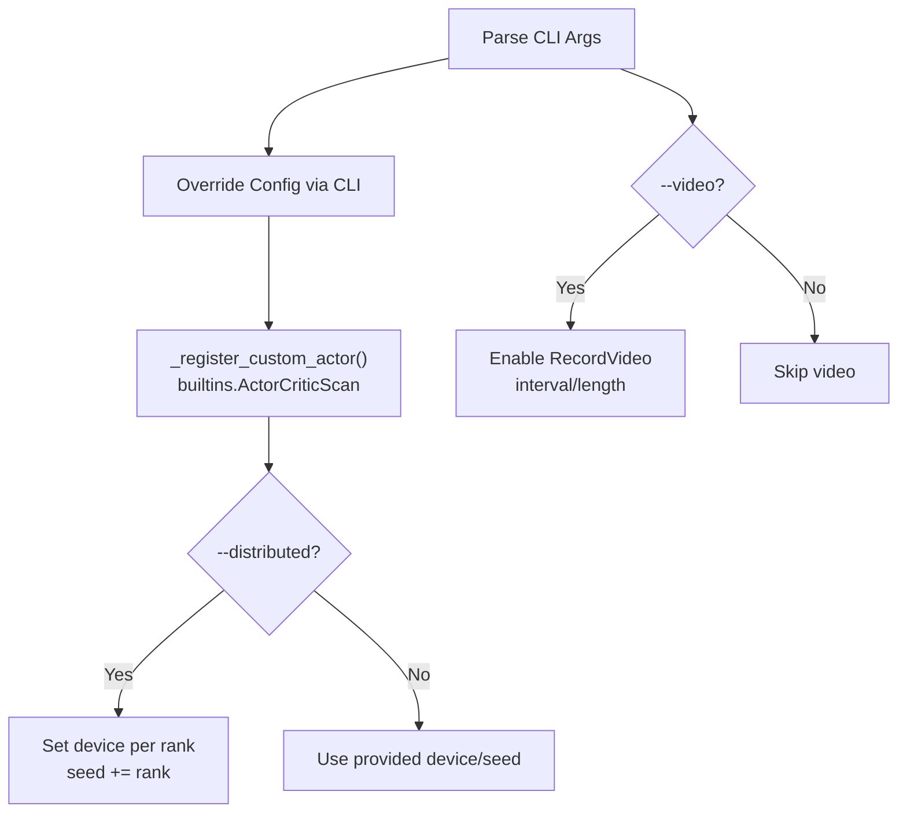
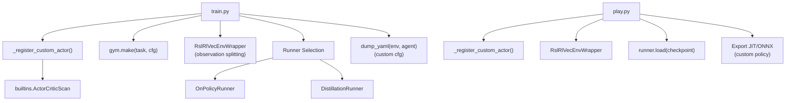

# RSL-RL Training System

<cite>
**Referenced Files in This Document**
- [README.md](file://README.md)
- [train.py](file://scripts/reinforcement_learning/rsl_rl/train.py)
- [play.py](file://scripts/reinforcement_learning/rsl_rl/play.py)
- [cli_args.py](file://scripts/reinforcement_learning/rsl_rl/cli_args.py)
- [rl_cfg.py](file://scripts/reinforcement_learning/rsl_rl/rl_cfg.py)
- [rsl_rl_ppo_cfg.py](file://source/robot_lab/robot_lab/tasks/manager_based/locomotion/velocity/config/quadruped/anymal_d/agents/rsl_rl_ppo_cfg.py)
- [rsl_rl_distillation_cfg.py](file://source/robot_lab/robot_lab/tasks/manager_based/locomotion/velocity/config/quadruped/anymal_d/agents/rsl_rl_distillation_cfg.py)
- [flat_env_cfg.py](file://source/robot_lab/robot_lab/tasks/manager_based/locomotion/velocity/config/quadruped/anymal_d/flat_env_cfg.py)
- [rsl_rl_ppo_cfg.py](file://source/robot_lab/robot_lab/tasks/manager_based/locomotion/velocity/config/quadruped/zsibot_zsl1/agents/rsl_rl_ppo_cfg.py)
- [stair_env_cfg.py](file://source/robot_lab/robot_lab/tasks/manager_based/locomotion/velocity/config/quadruped/zsibot_zsl1/stair_env_cfg.py)
- [velocity_env_cfg.py](file://source/robot_lab/robot_lab/tasks/manager_based/locomotion/velocity/velocity_env_cfg.py)
- [rl_utils.py](file://scripts/reinforcement_learning/rl_utils.py)
- [__init__.py](file://source/robot_lab/robot_lab/tasks/manager_based/locomotion/velocity/config/quadruped/zsibot_zsl1/__init__.py)
- [cusrl_ppo_cfg.py](file://source/robot_lab/robot_lab/tasks/manager_based/locomotion/velocity/config/quadruped/unitree_go2/agents/cusrl_ppo_cfg.py)
- [parkour_env_cfg.py](file://source/robot_lab/robot_lab/tasks/manager_based/locomotion/velocity/config/quadruped/zsibot_zsl1/parkour_env_cfg.py)
- [actor_critic_scan.py](file://source/robot_lab/robot_lab/tasks/manager_based/locomotion/velocity/config/quadruped/unitree_go2_parkour/agents/actor_critic_scan.py)
- [rsl_rl_ppo_cfg.py](file://source/robot_lab/robot_lab/tasks/manager_based/locomotion/velocity/config/quadruped/unitree_go2_parkour/agents/rsl_rl_ppo_cfg.py)
- [actor_critic_scan.py](file://source/robot_lab/robot_lab/tasks/manager_based/locomotion/velocity/config/quadruped/zsibot_zsl1_parkour/agents/actor_critic_scan.py)
- [rsl_rl_ppo_cfg.py](file://source/robot_lab/robot_lab/tasks/manager_based/locomotion/velocity/config/quadruped/zsibot_zsl1_parkour/agents/rsl_rl_ppo_cfg.py)
- [parkour_env_cfg.py](file://source/robot_lab/robot_lab/tasks/manager_based/locomotion/velocity/config/quadruped/zsibot_zsl1_parkour/parkour_env_cfg.py)
</cite>

## Update Summary
**Changes Made**
- Enhanced with comprehensive ZSL1 parkour training framework featuring ActorCriticScan neural network architecture
- Added custom RslRlCustomPpoActorCriticCfg replacing standard RslRlPpoActorCriticCfg for advanced observation processing
- Integrated ActorCriticScan network architecture with scan encoders and privileged observation handling
- Implemented advanced observation processing capabilities with configurable observation splitting
- Added comprehensive ZSL1 parkour environment configuration with custom terrains and reward systems
- Enhanced custom policy registration system for runtime actor class resolution
- Updated training pipeline to support both standard and custom policy architectures

## Table of Contents
1. [Introduction](#introduction)
2. [Project Structure](#project-structure)
3. [Core Components](#core-components)
4. [Architecture Overview](#architecture-overview)
5. [Detailed Component Analysis](#detailed-component-analysis)
6. [Dependency Analysis](#dependency-analysis)
7. [Performance Considerations](#performance-considerations)
8. [Troubleshooting Guide](#troubleshooting-guide)
9. [Conclusion](#conclusion)
10. [Appendices](#appendices)

## Introduction
This document explains the RSL-RL training system implemented in the repository, with enhanced support for custom RL configuration systems and specialized parkour training frameworks. The system now features comprehensive ZSL1 parkour training capabilities, custom PPO actor-critic configuration classes, specialized training frameworks for extreme quadruped locomotion, and advanced observation processing capabilities including scan encoders and privileged observation handling.

**Updated** Enhanced with comprehensive ZSL1 parkour training framework featuring ActorCriticScan neural network architecture, custom PPO configuration system, and advanced observation processing capabilities for extreme quadruped locomotion scenarios.

## Project Structure
The RSL-RL training system is organized around three primary scripts and configuration modules, now enhanced with custom policy support and specialized parkour training frameworks:
- Training entry point: scripts/reinforcement_learning/rsl_rl/train.py
- Playback/inference entry point: scripts/reinforcement_learning/rsl_rl/play.py
- CLI argument helpers: scripts/reinforcement_learning/rsl_rl/cli_args.py
- Custom RL configuration: scripts/reinforcement_learning/rsl_rl/rl_cfg.py
- Agent configuration templates: source/robot_lab/robot_lab/tasks/.../agents/rsl_rl_ppo_cfg.py and rsl_rl_distillation_cfg.py
- Custom policy implementations: source/robot_lab/robot_lab/tasks/manager_based/locomotion/velocity/config/quadruped/*/agents/actor_critic_scan.py
- Environment configuration templates: source/robot_lab/robot_lab/tasks/.../flat_env_cfg.py, rough_env_cfg.py, stair_env_cfg.py, and parkour_env_cfg.py
- ZSL1 parkour specific configurations: specialized terrains and reward systems for extreme quadruped parkour training

**Diagram sources**
- [train.py:23-31](file://scripts/reinforcement_learning/rsl_rl/train.py#L23-L31)
- [play.py:23-31](file://scripts/reinforcement_learning/rsl_rl/play.py#L23-L31)
- [train.py:171-224](file://scripts/reinforcement_learning/rsl_rl/train.py#L171-L224)
- [play.py:158-214](file://scripts/reinforcement_learning/rsl_rl/play.py#L158-L214)

**Section sources**
- [README.md:193-348](file://README.md#L193-L348)
- [train.py:1-247](file://scripts/reinforcement_learning/rsl_rl/train.py#L1-L247)
- [play.py:1-272](file://scripts/reinforcement_learning/rsl_rl/play.py#L1-L272)

## Core Components
- **Custom PPO Configuration System**: RslRlCustomPpoActorCriticCfg replaces standard configuration with support for scan encoders and privileged observations. See [rl_cfg.py:12-62](file://scripts/reinforcement_learning/rsl_rl/rl_cfg.py#L12-L62).
- **ActorCriticScan Network**: Advanced policy architecture with optional scan and privileged observation encoders for enhanced perception. See [actor_critic_scan.py:20-263](file://source/robot_lab/robot_lab/tasks/manager_based/locomotion/velocity/config/quadruped/unitree_go2_parkour/agents/actor_critic_scan.py#L20-L263).
- **Custom Policy Registration**: Runtime registration system for custom actor classes using builtins namespace. See [train.py:23-31](file://scripts/reinforcement_learning/rsl_rl/train.py#L23-L31) and [play.py:23-31](file://scripts/reinforcement_learning/rsl_rl/play.py#L23-L31).
- **ZSL1 Parkour-Specific Environments**: Specialized terrains and reward systems for extreme quadruped parkour training. See [parkour_env_cfg.py:26-442](file://source/robot_lab/robot_lab/tasks/manager_based/locomotion/velocity/config/quadruped/zsibot_zsl1/parkour_env_cfg.py#L26-L442).
- **Enhanced Environment Wrapping**: Support for custom observation splitting and scan encoder integration. See [train.py:212](file://scripts/reinforcement_learning/rsl_rl/train.py#L212) and [play.py:196](file://scripts/reinforcement_learning/rsl_rl/play.py#L196).
- **Advanced Observation Processing**: Configurable observation splitting into proprioceptive, scan, and privileged components with independent encoder support. See [actor_critic_scan.py:54-114](file://source/robot_lab/robot_lab/tasks/manager_based/locomotion/velocity/config/quadruped/unitree_go2_parkour/agents/actor_critic_scan.py#L54-L114).

**Section sources**
- [rl_cfg.py:12-62](file://scripts/reinforcement_learning/rsl_rl/rl_cfg.py#L12-L62)
- [actor_critic_scan.py:20-263](file://source/robot_lab/robot_lab/tasks/manager_based/locomotion/velocity/config/quadruped/unitree_go2_parkour/agents/actor_critic_scan.py#L20-L263)
- [train.py:23-31](file://scripts/reinforcement_learning/rsl_rl/train.py#L23-L31)
- [parkour_env_cfg.py:26-442](file://source/robot_lab/robot_lab/tasks/manager_based/locomotion/velocity/config/quadruped/zsibot_zsl1/parkour_env_cfg.py#L26-L442)

## Architecture Overview
The enhanced training pipeline integrates custom policy registration, environment creation, optional video recording, environment wrapping with scan encoder support, runner instantiation, checkpoint loading, and algorithm learning loops. The system now supports both standard ActorCritic and custom ActorCriticScan policies with advanced observation processing capabilities for extreme quadruped locomotion scenarios.

**Diagram sources**
- [train.py:23-31](file://scripts/reinforcement_learning/rsl_rl/train.py#L23-L31)
- [train.py:187-212](file://scripts/reinforcement_learning/rsl_rl/train.py#L187-L212)
- [train.py:214-228](file://scripts/reinforcement_learning/rsl_rl/train.py#L214-L228)

## Detailed Component Analysis

### Custom RL Configuration System
- **RslRlCustomPpoActorCriticCfg**: Enhanced configuration class supporting scan encoders and privileged observations with flexible observation splitting. See [rl_cfg.py:12-62](file://scripts/reinforcement_learning/rsl_rl/rl_cfg.py#L12-L62).
- **ActorCriticScan Architecture**: Advanced policy with optional scan encoders for actor and critic, privileged observation processing, and configurable observation splitting. See [actor_critic_scan.py:24-134](file://source/robot_lab/robot_lab/tasks/manager_based/locomotion/velocity/config/quadruped/unitree_go2_parkour/agents/actor_critic_scan.py#L24-L134).
- **Custom Policy Registration**: Runtime registration system enabling custom actor classes through builtins namespace. See [train.py:23-31](file://scripts/reinforcement_learning/rsl_rl/train.py#L23-L31).

**Updated** Enhanced with custom RL configuration system supporting scan encoders and privileged observations for advanced perception capabilities in extreme quadruped locomotion scenarios.

**Diagram sources**
- [rl_cfg.py:12-62](file://scripts/reinforcement_learning/rsl_rl/rl_cfg.py#L12-L62)
- [actor_critic_scan.py:24-134](file://source/robot_lab/robot_lab/tasks/manager_based/locomotion/velocity/config/quadruped/unitree_go2_parkour/agents/actor_critic_scan.py#L24-L134)

**Section sources**
- [rl_cfg.py:12-62](file://scripts/reinforcement_learning/rsl_rl/rl_cfg.py#L12-L62)
- [actor_critic_scan.py:24-134](file://source/robot_lab/robot_lab/tasks/manager_based/locomotion/velocity/config/quadruped/unitree_go2_parkour/agents/actor_critic_scan.py#L24-L134)

### Comprehensive ZSL1 Parkour Training Framework
- **ActorCriticScan Policy**: Custom policy with integrated scan encoders for depth sensor processing and privileged observation handling. See [actor_critic_scan.py:20-263](file://source/robot_lab/robot_lab/tasks/manager_based/locomotion/velocity/config/quadruped/zsibot_zsl1_parkour/agents/actor_critic_scan.py#L20-L263).
- **Parkour Runner Configurations**: Multiple runner configurations for flat and rough terrains with ablation studies. See [rsl_rl_ppo_cfg.py:128-237](file://source/robot_lab/robot_lab/tasks/manager_based/locomotion/velocity/config/quadruped/zsibot_zsl1_parkour/agents/rsl_rl_ppo_cfg.py#L128-L237).
- **Scan Encoder Integration**: Configurable scan encoder dimensions and selective encoding for critic inputs. See [rsl_rl_ppo_cfg.py:169-179](file://source/robot_lab/robot_lab/tasks/manager_based/locomotion/velocity/config/quadruped/zsibot_zsl1_parkour/agents/rsl_rl_ppo_cfg.py#L169-L179).
- **Advanced Observation Processing**: Configurable observation splitting with independent scan encoders for actor and critic networks. See [actor_critic_scan.py:54-114](file://source/robot_lab/robot_lab/tasks/manager_based/locomotion/velocity/config/quadruped/zsibot_zsl1_parkour/agents/actor_critic_scan.py#L54-L114).

**Updated** Enhanced with comprehensive ZSL1 parkour training framework featuring custom ActorCriticScan policy, specialized runner configurations, and advanced observation processing capabilities for extreme quadruped locomotion scenarios.

**Diagram sources**
- [actor_critic_scan.py:20-263](file://source/robot_lab/robot_lab/tasks/manager_based/locomotion/velocity/config/quadruped/zsibot_zsl1_parkour/agents/actor_critic_scan.py#L20-L263)
- [rsl_rl_ppo_cfg.py:128-194](file://source/robot_lab/robot_lab/tasks/manager_based/locomotion/velocity/config/quadruped/zsibot_zsl1_parkour/agents/rsl_rl_ppo_cfg.py#L128-L194)

**Section sources**
- [actor_critic_scan.py:20-263](file://source/robot_lab/robot_lab/tasks/manager_based/locomotion/velocity/config/quadruped/zsibot_zsl1_parkour/agents/actor_critic_scan.py#L20-L263)
- [rsl_rl_ppo_cfg.py:128-237](file://source/robot_lab/robot_lab/tasks/manager_based/locomotion/velocity/config/quadruped/zsibot_zsl1_parkour/agents/rsl_rl_ppo_cfg.py#L128-L237)

### Enhanced Environment Configuration for Parkour Training
- **Parkour Terrains**: Custom mesh terrains generating stepped platforms with configurable difficulty and step patterns. See [parkour_env_cfg.py:26-249](file://source/robot_lab/robot_lab/tasks/manager_based/locomotion/velocity/config/quadruped/zsibot_zsl1/parkour_env_cfg.py#L26-L249).
- **Enhanced Reward System**: Specialized rewards for climbing, air time control, and foothold precision with reduced jumping incentives. See [parkour_env_cfg.py:337-418](file://source/robot_lab/robot_lab/tasks/manager_based/locomotion/velocity/config/quadruped/zsibot_zsl1/parkour_env_cfg.py#L337-L418).
- **Action Scaling**: Increased joint position scaling for HIP/KNEE joints to enable leg lifting for 0.23m step heights. See [parkour_env_cfg.py:299-308](file://source/robot_lab/robot_lab/tasks/manager_based/locomotion/velocity/config/quadruped/zsibot_zsl1/parkour_env_cfg.py#L299-L308).

**Updated** Enhanced with comprehensive parkour training environment configuration featuring custom terrains and specialized reward systems optimized for extreme quadruped locomotion with ZSL1 robot platform.

**Diagram sources**
- [parkour_env_cfg.py:252-442](file://source/robot_lab/robot_lab/tasks/manager_based/locomotion/velocity/config/quadruped/zsibot_zsl1/parkour_env_cfg.py#L252-L442)
- [parkour_env_cfg.py:212-249](file://source/robot_lab/robot_lab/tasks/manager_based/locomotion/velocity/config/quadruped/zsibot_zsl1/parkour_env_cfg.py#L212-L249)

**Section sources**
- [parkour_env_cfg.py:26-442](file://source/robot_lab/robot_lab/tasks/manager_based/locomotion/velocity/config/quadruped/zsibot_zsl1/parkour_env_cfg.py#L26-L442)

### Enhanced CLI Argument System
Key CLI arguments for training and playback with custom policy support:
- Video recording: --video, --video_length, --video_interval
- Environment scaling: --num_envs
- Task selection: --task, --agent
- Seed and iterations: --seed, --max_iterations
- Distributed training: --distributed
- Export I/O descriptors: --export_io_descriptors
- Custom policy registration: automatic via _register_custom_actor()
- RSL-RL specific: --experiment_name, --run_name, --resume, --load_run, --checkpoint, --logger, --log_project_name

**Updated** Enhanced with automatic custom policy registration system supporting both standard and custom actor classes for ZSL1 parkour training scenarios.

**Diagram sources**
- [train.py:23-31](file://scripts/reinforcement_learning/rsl_rl/train.py#L23-L31)
- [train.py:120-146](file://scripts/reinforcement_learning/rsl_rl/train.py#L120-L146)
- [train.py:182-192](file://scripts/reinforcement_learning/rsl_rl/train.py#L182-L192)
- [cli_args.py:19-95](file://scripts/reinforcement_learning/rsl_rl/cli_args.py#L19-L95)

**Section sources**
- [train.py:23-31](file://scripts/reinforcement_learning/rsl_rl/train.py#L23-L31)
- [train.py:120-146](file://scripts/reinforcement_learning/rsl_rl/train.py#L120-L146)
- [cli_args.py:19-95](file://scripts/reinforcement_learning/rsl_rl/cli_args.py#L19-L95)

### Enhanced Environment Wrapper and Observation Processing
- The environment is wrapped with RslRlVecEnvWrapper to adapt observations/actions for RSL-RL with support for custom observation splitting. See [train.py:212](file://scripts/reinforcement_learning/rsl_rl/train.py#L212) and [play.py:196](file://scripts/reinforcement_learning/rsl_rl/play.py#L196).
- Custom observation splitting supports proprioceptive, scan, and privileged observations with configurable encoder dimensions. See [actor_critic_scan.py:54-114](file://source/robot_lab/robot_lab/tasks/manager_based/locomotion/velocity/config/quadruped/unitree_go2_parkour/agents/actor_critic_scan.py#L54-L114).
- Action clipping is controlled by agent_cfg.clip_actions and applied by the wrapper.

**Section sources**
- [train.py:212](file://scripts/reinforcement_learning/rsl_rl/train.py#L212)
- [play.py:196](file://scripts/reinforcement_learning/rsl_rl/play.py#L196)
- [actor_critic_scan.py:54-114](file://source/robot_lab/robot_lab/tasks/manager_based/locomotion/velocity/config/quadruped/unitree_go2_parkour/agents/actor_critic_scan.py#L54-L114)

### Video Recording and Playback Enhancements
- Training: Optional video recording with configurable interval and length, enhanced with custom policy visualization. See [train.py:182-208](file://scripts/reinforcement_learning/rsl_rl/train.py#L182-L208).
- Playback: Single-frame trigger at episode start with enhanced camera following and keyboard control support. See [play.py:183-256](file://scripts/reinforcement_learning/rsl_rl/play.py#L183-L256).

**Section sources**
- [train.py:182-208](file://scripts/reinforcement_learning/rsl_rl/train.py#L182-L208)
- [play.py:183-256](file://scripts/reinforcement_learning/rsl_rl/play.py#L183-L256)

### Distributed Training and Custom Policy Support
- Single-node multi-GPU: Use torch.distributed.run with --nproc_per_node equal to the number of GPUs, with custom policy registration per rank. See [README.md:333-347](file://README.md#L333-L347).
- Multi-node: Launch processes per node with custom policy registration across ranks. See [README.md:339-347](file://README.md#L339-L347).
- Custom policy registration: Automatic registration of ActorCriticScan class via builtins namespace. See [train.py:23-31](file://scripts/reinforcement_learning/rsl_rl/train.py#L23-L31).

**Section sources**
- [README.md:333-347](file://README.md#L333-L347)
- [train.py:23-31](file://scripts/reinforcement_learning/rsl_rl/train.py#L23-L31)

### Experiment Logging and Checkpoint Management
- Logging directory: logs/rsl_rl/{experiment_name}/{timestamp}_{run_name} with custom policy support. See [train.py:164-174](file://scripts/reinforcement_learning/rsl_rl/train.py#L164-L174).
- Configuration dumps: env.yaml and agent.yaml saved under logs with custom configuration serialization. See [train.py:230-231](file://scripts/reinforcement_learning/rsl_rl/train.py#L230-L231).
- Checkpoint loading: get_checkpoint_path resolves run/checkpoint with custom policy compatibility; loaded by runner.load. See [train.py:194-228](file://scripts/reinforcement_learning/rsl_rl/train.py#L194-L228).
- Playback checkpoint resolution and export: JIT/ONNX export of custom policies and optional normalizer. See [play.py:209-232](file://scripts/reinforcement_learning/rsl_rl/play.py#L209-L232).

**Section sources**
- [train.py:164-231](file://scripts/reinforcement_learning/rsl_rl/train.py#L164-L231)
- [play.py:209-232](file://scripts/reinforcement_learning/rsl_rl/play.py#L209-L232)

### Enhanced Debugging and Visualization Features
- **Height Scanner Debug Visualization**: Dynamic toggle based on headless mode for better terrain perception debugging. See [play.py:172-175](file://scripts/reinforcement_learning/rsl_rl/play.py#L172-L175).
- **Camera Following**: Enhanced camera control with smoothing for better visualization during playback. See [rl_utils.py:9-27](file://scripts/reinforcement_learning/rl_utils.py#L9-L27).
- **Custom Policy Visualization**: Enhanced debugging support for custom actor classes and scan encoder visualization.

**Section sources**
- [play.py:172-175](file://scripts/reinforcement_learning/rsl_rl/play.py#L172-L175)
- [rl_utils.py:9-27](file://scripts/reinforcement_learning/rl_utils.py#L9-L27)

### Concrete Examples
- Configure training runs: Select task and agent entry point, set seed and iterations, choose environment variant (Flat/Rough/Parkour). See [README.md:197-216](file://README.md#L197-L216).
- Multi-GPU training: Use torch.distributed.run with --nproc_per_node=N for multi-GPU on a single node; extend to multiple nodes with --nnodes and --node_rank. See [README.md:333-347](file://README.md#L333-L347).
- Export model checkpoints: After loading a checkpoint in playback, the policy is exported to JIT and ONNX under the checkpoint's exported/ directory. See [play.py:229-232](file://scripts/reinforcement_learning/rsl_rl/play.py#L229-L232).
- Custom policy training: Use ActorCriticScan class with scan encoders for advanced perception tasks. See [rsl_rl_ppo_cfg.py:128-194](file://source/robot_lab/robot_lab/tasks/manager_based/locomotion/velocity/config/quadruped/unitree_go2_parkour/agents/rsl_rl_ppo_cfg.py#L128-L194).

**Updated** Enhanced with comprehensive examples for custom policy training and ZSL1 parkour environment configuration with advanced observation processing capabilities.

**Section sources**
- [README.md:197-216](file://README.md#L197-L216)
- [README.md:333-347](file://README.md#L333-L347)
- [play.py:229-232](file://scripts/reinforcement_learning/rsl_rl/play.py#L229-L232)
- [rsl_rl_ppo_cfg.py:128-194](file://source/robot_lab/robot_lab/tasks/manager_based/locomotion/velocity/config/quadruped/unitree_go2_parkour/agents/rsl_rl_ppo_cfg.py#L128-L194)

## Dependency Analysis
The enhanced training and playback scripts depend on:
- Environment registration and configuration via task entry points
- Custom RSL-RL runners (OnPolicyRunner, DistillationRunner) with custom policy support
- Enhanced environment wrapper (RslRlVecEnvWrapper) with observation splitting
- Custom policy registration system for runtime actor class resolution
- Logging and checkpoint utilities with custom configuration serialization

**Diagram sources**
- [train.py:23-31](file://scripts/reinforcement_learning/rsl_rl/train.py#L23-L31)
- [train.py:187-231](file://scripts/reinforcement_learning/rsl_rl/train.py#L187-L231)
- [play.py:23-31](file://scripts/reinforcement_learning/rsl_rl/play.py#L23-L31)
- [play.py:196-232](file://scripts/reinforcement_learning/rsl_rl/play.py#L196-L232)

**Section sources**
- [train.py:23-31](file://scripts/reinforcement_learning/rsl_rl/train.py#L23-L31)
- [train.py:187-231](file://scripts/reinforcement_learning/rsl_rl/train.py#L187-L231)
- [play.py:23-31](file://scripts/reinforcement_learning/rsl_rl/play.py#L23-L31)
- [play.py:196-232](file://scripts/reinforcement_learning/rsl_rl/play.py#L196-L232)

## Performance Considerations
- Enable TF32 and disable deterministic CUDNN for speed on supported GPUs. See [train.py:125-129](file://scripts/reinforcement_learning/rsl_rl/train.py#L125-L129).
- Adjust num_envs to saturate devices; tune num_steps_per_env and num_mini_batches for throughput. See [rsl_rl_ppo_cfg.py:12-15](file://source/robot_lab/robot_lab/tasks/manager_based/locomotion/velocity/config/quadruped/anymal_d/agents/rsl_rl_ppo_cfg.py#L12-L15).
- Use --distributed for multi-GPU scaling; ensure seeds are offset per rank to avoid identical randomization. See [train.py:153-162](file://scripts/reinforcement_learning/rsl_rl/train.py#L153-L162).
- Custom policy performance: ActorCriticScan with scan encoders may require additional memory but provides enhanced perception capabilities. See [actor_critic_scan.py:73-88](file://source/robot_lab/robot_lab/tasks/manager_based/locomotion/velocity/config/quadruped/unitree_go2_parkour/agents/actor_critic_scan.py#L73-L88).
- Reduce environment randomness during playback to stabilize evaluation. See [play.py:131-136](file://scripts/reinforcement_learning/rsl_rl/play.py#L131-L136).

## Troubleshooting Guide
- Unsupported runner class: Ensure agent_cfg.class_name is OnPolicyRunner, DistillationRunner, or custom ActorCriticScan. See [train.py:215-221](file://scripts/reinforcement_learning/rsl_rl/train.py#L215-L221).
- Custom policy registration failure: Verify _register_custom_actor() executes successfully and ActorCriticScan class is importable. See [train.py:23-31](file://scripts/reinforcement_learning/rsl_rl/train.py#L23-L31).
- Distributed training on CPU: Distributed training requires CUDA devices; the script raises an error if device is CPU with --distributed. See [train.py:147-151](file://scripts/reinforcement_learning/rsl_rl/train.py#L147-L151).
- Video recording not appearing: Ensure --video is enabled and enable_cameras is set; verify video_folder permissions. See [train.py:59-61](file://scripts/reinforcement_learning/rsl_rl/train.py#L59-L61) and [train.py:198-208](file://scripts/reinforcement_learning/rsl_rl/train.py#L198-L208).
- Custom policy checkpoint compatibility: Ensure checkpoint contains compatible state_dict for ActorCriticScan class. See [actor_critic_scan.py:193-201](file://source/robot_lab/robot_lab/tasks/manager_based/locomotion/velocity/config/quadruped/unitree_go2_parkour/agents/actor_critic_scan.py#L193-L201).

**Section sources**
- [train.py:215-221](file://scripts/reinforcement_learning/rsl_rl/train.py#L215-L221)
- [train.py:23-31](file://scripts/reinforcement_learning/rsl_rl/train.py#L23-L31)
- [train.py:147-151](file://scripts/reinforcement_learning/rsl_rl/train.py#L147-L151)
- [train.py:59-61](file://scripts/reinforcement_learning/rsl_rl/train.py#L59-L61)
- [actor_critic_scan.py:193-201](file://source/robot_lab/robot_lab/tasks/manager_based/locomotion/velocity/config/quadruped/unitree_go2_parkour/agents/actor_critic_scan.py#L193-L201)

## Conclusion
The enhanced RSL-RL training system now features a comprehensive custom RL configuration system supporting advanced policy architectures like ActorCriticScan with scan encoders and privileged observation processing. The system integrates seamlessly with ZSL1 parkour-specific environments, provides robust distributed training capabilities, and maintains backward compatibility with standard ActorCritic policies. The custom policy registration system enables flexible deployment of specialized architectures while preserving the existing training pipeline infrastructure.

**Updated** The system now includes comprehensive ZSL1 parkour training framework with ActorCriticScan neural network architecture, custom PPO configuration system, and advanced observation processing capabilities for extreme quadruped locomotion scenarios with both standard and custom policy support.

## Appendices

### Appendix A: Custom RL Configuration System
**Updated** Enhanced with custom RL configuration system replacing standard RslRlPpoActorCriticCfg:

The custom configuration system introduces RslRlCustomPpoActorCriticCfg with advanced observation processing capabilities:

- **Observation Splitting**: Supports configurable splitting of observations into proprioceptive, scan, and privileged components
- **Scan Encoders**: Optional encoders for actor and critic networks with independent configuration
- **Privileged Observations**: Dedicated encoder for privileged observations (critic-only)
- **Flexible Architecture**: Compatible with both standard ActorCritic and custom ActorCriticScan policies

**Section sources**
- [rl_cfg.py:12-62](file://scripts/reinforcement_learning/rsl_rl/rl_cfg.py#L12-L62)

### Appendix B: ActorCriticScan Network Architecture
The ActorCriticScan network provides advanced perception capabilities through configurable observation processing:

- **Input Splitting**: Automatically splits observations into proprioceptive, scan, and privileged components
- **Independent Encoders**: Separate scan encoders for actor and critic with customizable dimensions
- **Privileged Processing**: Dedicated encoder for privileged observations processed only by critic
- **Flexible Integration**: Supports both encoded and raw observation inputs based on configuration

**Section sources**
- [actor_critic_scan.py:20-263](file://source/robot_lab/robot_lab/tasks/manager_based/locomotion/velocity/config/quadruped/unitree_go2_parkour/agents/actor_critic_scan.py#L20-L263)

### Appendix C: ZSL1 Parkour Training Configuration
The ZSL1 parkour training system provides comprehensive support for extreme quadruped locomotion:

- **Multiple Runner Configurations**: Flat, rough, and ablation study configurations
- **Scan Encoder Integration**: Configurable scan encoders for depth sensor processing
- **Privileged Observation Support**: Optional privileged observation processing for enhanced control
- **Ablation Studies**: Systematic evaluation of scan encoder and privileged observation contributions

**Section sources**
- [rsl_rl_ppo_cfg.py:128-237](file://source/robot_lab/robot_lab/tasks/manager_based/locomotion/velocity/config/quadruped/unitree_go2_parkour/agents/rsl_rl_ppo_cfg.py#L128-L237)

### Appendix D: ZSL1 Parkour Environment Configuration
The ZSL1 parkour environment provides specialized training scenarios for extreme quadruped locomotion:

- **Custom Terrains**: Mesh-based stepped platforms with configurable difficulty and step patterns
- **Specialized Rewards**: Rewards optimized for climbing, foothold precision, and controlled movement
- **Action Scaling**: Increased joint position scaling for HIP/KNEE joints to enable leg lifting
- **Reduced Jumping Incentives**: Modified reward system discouraging excessive jumping

**Section sources**
- [parkour_env_cfg.py:26-442](file://source/robot_lab/robot_lab/tasks/manager_based/locomotion/velocity/config/quadruped/zsibot_zsl1/parkour_env_cfg.py#L26-L442)

### Appendix E: Custom Policy Registration System
**Updated** Enhanced with automatic custom policy registration:

The system now includes automatic registration of custom actor classes:

- **Runtime Registration**: Custom policies registered via builtins namespace after Omniverse initialization
- **Fallback Support**: Graceful handling of registration failures with standard policy fallback
- **Policy Discovery**: Built-in policy discovery mechanism for runtime actor class resolution
- **Compatibility**: Maintains compatibility with existing standard ActorCritic policies

**Section sources**
- [train.py:23-31](file://scripts/reinforcement_learning/rsl_rl/train.py#L23-L31)
- [play.py:23-31](file://scripts/reinforcement_learning/rsl_rl/play.py#L23-L31)

### Appendix F: Enhanced Environment Observation Processing
**Updated** Enhanced with custom observation splitting capabilities:

The environment wrapper now supports advanced observation processing:

- **Observation Splitting**: Automatic splitting of combined observations into proprioceptive, scan, and privileged components
- **Dimension Validation**: Ensures proper dimension allocation across observation components
- **Encoder Integration**: Seamless integration with custom scan encoders for advanced perception
- **Memory Efficiency**: Optimized memory usage through selective observation encoding

**Section sources**
- [actor_critic_scan.py:54-114](file://source/robot_lab/robot_lab/tasks/manager_based/locomotion/velocity/config/quadruped/unitree_go2_parkour/agents/actor_critic_scan.py#L54-L114)
- [train.py:212](file://scripts/reinforcement_learning/rsl_rl/train.py#L212)
- [play.py:196](file://scripts/reinforcement_learning/rsl_rl/play.py#L196)

### Appendix G: Advanced Observation Processing Capabilities
**Updated** Enhanced with comprehensive observation processing for ZSL1 parkour training:

The system now supports advanced observation processing with configurable observation splitting:

- **Proprioceptive Observations**: 52-dimensional proprioceptive input for joint positions, velocities, and base dynamics
- **Scan Observations**: 187-dimensional scan input for depth sensor processing with configurable encoder dimensions
- **Privileged Observations**: Optional privileged observation processing for critic networks with dedicated encoder
- **Independent Encoder Configuration**: Separate scan encoders for actor and critic with customizable hidden dimensions
- **Flexible Input Composition**: Dynamic composition of actor and critic inputs based on available observation modalities

**Section sources**
- [actor_critic_scan.py:54-114](file://source/robot_lab/robot_lab/tasks/manager_based/locomotion/velocity/config/quadruped/zsibot_zsl1_parkour/agents/actor_critic_scan.py#L54-L114)
- [rsl_rl_ppo_cfg.py:169-179](file://source/robot_lab/robot_lab/tasks/manager_based/locomotion/velocity/config/quadruped/zsibot_zsl1_parkour/agents/rsl_rl_ppo_cfg.py#L169-L179)