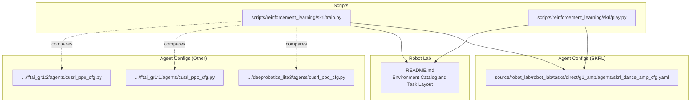
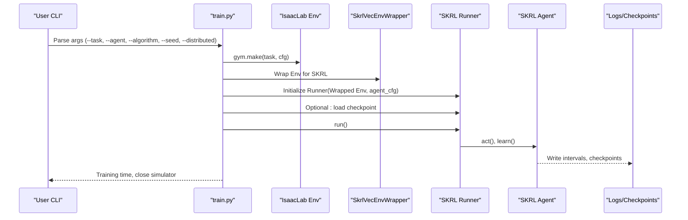
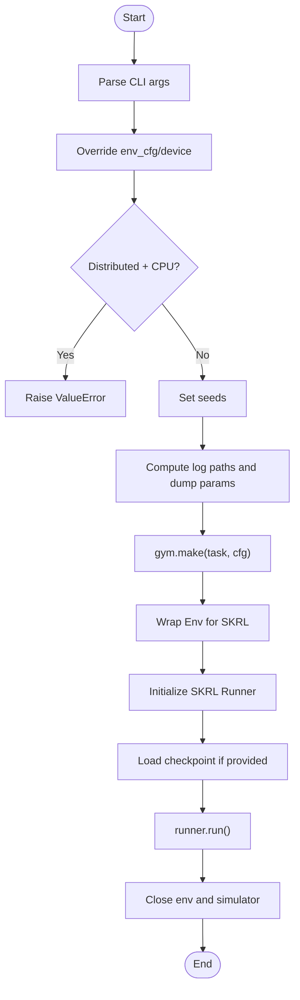
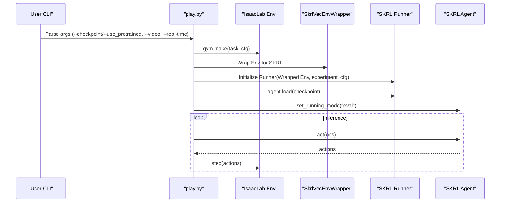
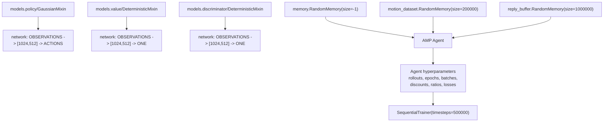
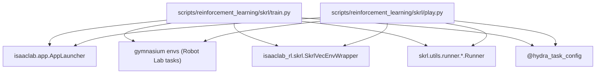

# SKRL Training System

<cite>
**Referenced Files in This Document**
- [README.md](file://README.md)
- [train.py](file://scripts/reinforcement_learning/skrl/train.py)
- [play.py](file://scripts/reinforcement_learning/skrl/play.py)
- [skrl_dance_amp_cfg.yaml](file://source/robot_lab/robot_lab/tasks/direct/g1_amp/agents/skrl_dance_amp_cfg.yaml)
- [cusrl_ppo_cfg.py (Deeprobotics Lite3)](file://source/robot_lab/robot_lab/tasks/manager_based/locomotion/velocity/config/quadruped/deeprobotics_lite3/agents/cusrl_ppo_cfg.py)
- [cusrl_ppo_cfg.py (FFTAI GR1T1)](file://source/robot_lab/robot_lab/tasks/manager_based/locomotion/velocity/config/humanoid/fftai_gr1t1/agents/cusrl_ppo_cfg.py)
- [cusrl_ppo_cfg.py (FFTAI GR1T2)](file://source/robot_lab/robot_lab/tasks/manager_based/locomotion/velocity/config/humanoid/fftai_gr1t2/agents/cusrl_ppo_cfg.py)
</cite>

## Table of Contents
1. [Introduction](#introduction)
2. [Project Structure](#project-structure)
3. [Core Components](#core-components)
4. [Architecture Overview](#architecture-overview)
5. [Detailed Component Analysis](#detailed-component-analysis)
6. [Dependency Analysis](#dependency-analysis)
7. [Performance Considerations](#performance-considerations)
8. [Troubleshooting Guide](#troubleshooting-guide)
9. [Conclusion](#conclusion)
10. [Appendices](#appendices)

## Introduction
This document describes the SKRL training system integrated into the Robot Lab ecosystem. It explains how SKRL is used to train agents for continuous control tasks in physics-based simulators, how algorithm configurations are organized, and how the training pipeline is orchestrated. It also highlights the broader environment compatibility and asset integration within Robot Lab, and provides practical guidance on configuration, hyperparameter tuning, and performance optimization.

## Project Structure
The SKRL training system spans several areas:
- Scripts that launch and orchestrate training and evaluation with SKRL
- YAML-based agent configurations for SKRL
- Alternative agent configurations using other frameworks (e.g., CusRL) for comparison
- Environment registration and task templates under Robot Lab

**Diagram sources**
- [train.py](file://scripts/reinforcement_learning/skrl/train.py#L1-L250)
- [play.py](file://scripts/reinforcement_learning/skrl/play.py#L1-L253)
- [skrl_dance_amp_cfg.yaml](file://source/robot_lab/robot_lab/tasks/direct/g1_amp/agents/skrl_dance_amp_cfg.yaml#L1-L118)
- [cusrl_ppo_cfg.py (Deeprobotics Lite3)](file://source/robot_lab/robot_lab/tasks/manager_based/locomotion/velocity/config/quadruped/deeprobotics_lite3/agents/cusrl_ppo_cfg.py#L1-L49)
- [cusrl_ppo_cfg.py (FFTAI GR1T1)](file://source/robot_lab/robot_lab/tasks/manager_based/locomotion/velocity/config/humanoid/fftai_gr1t1/agents/cusrl_ppo_cfg.py#L1-L48)
- [cusrl_ppo_cfg.py (FFTAI GR1T2)](file://source/robot_lab/robot_lab/tasks/manager_based/locomotion/velocity/config/humanoid/fftai_gr1t2/agents/cusrl_ppo_cfg.py#L1-L48)
- [README.md](file://README.md#L15-L400)

**Section sources**
- [README.md](file://README.md#L15-L400)
- [train.py](file://scripts/reinforcement_learning/skrl/train.py#L1-L250)
- [play.py](file://scripts/reinforcement_learning/skrl/play.py#L1-L253)

## Core Components
- SKRL training script orchestrates environment creation, configuration, and training loop via the SKRL Runner.
- SKRL evaluation script loads a checkpoint and runs inference in the environment.
- Agent configuration files define models, memories, agent hyperparameters, and trainer settings for SKRL.
- Alternative agent configurations (e.g., CusRL PPO) demonstrate comparable setups for cross-framework comparisons.

Key responsibilities:
- Environment lifecycle and seeding
- Multi-device and distributed training support
- Logging, checkpointing, and experiment organization
- Video capture during training and evaluation

**Section sources**
- [train.py](file://scripts/reinforcement_learning/skrl/train.py#L126-L242)
- [play.py](file://scripts/reinforcement_learning/skrl/play.py#L122-L245)
- [skrl_dance_amp_cfg.yaml](file://source/robot_lab/robot_lab/tasks/direct/g1_amp/agents/skrl_dance_amp_cfg.yaml#L64-L118)

## Architecture Overview
The SKRL training pipeline integrates with Robot Lab’s environment ecosystem and SKRL’s Runner abstraction.

**Diagram sources**
- [train.py](file://scripts/reinforcement_learning/skrl/train.py#L126-L242)
- [play.py](file://scripts/reinforcement_learning/skrl/play.py#L131-L245)

## Detailed Component Analysis

### SKRL Training Script
Responsibilities:
- Argument parsing for task selection, algorithm choice, ML framework, and distributed training
- Environment configuration overrides (number of envs, device)
- Experiment directory management and parameter dumping
- Environment wrapping for SKRL vectorization
- Runner instantiation and training execution
- Optional video recording during training

**Diagram sources**
- [train.py](file://scripts/reinforcement_learning/skrl/train.py#L126-L242)

**Section sources**
- [train.py](file://scripts/reinforcement_learning/skrl/train.py#L23-L97)
- [train.py](file://scripts/reinforcement_learning/skrl/train.py#L126-L242)

### SKRL Evaluation Script
Responsibilities:
- Load a checkpoint (local or published)
- Configure environment for evaluation
- Wrap environment for SKRL
- Set agent to eval mode and run inference loop
- Optional real-time stepping using environment step_dt

**Diagram sources**
- [play.py](file://scripts/reinforcement_learning/skrl/play.py#L131-L245)

**Section sources**
- [play.py](file://scripts/reinforcement_learning/skrl/play.py#L131-L245)

### SKRL Agent Configuration (Example: AMP)
This YAML defines:
- Model families (policy/value/discriminator) using SKRL’s model instantiators
- Memory configurations for rollout, motion dataset, and reply buffer
- Agent hyperparameters (learning rates, schedulers, clipping, loss scales)
- Preprocessors and experiment/logging settings

**Diagram sources**
- [skrl_dance_amp_cfg.yaml](file://source/robot_lab/robot_lab/tasks/direct/g1_amp/agents/skrl_dance_amp_cfg.yaml#L9-L118)

**Section sources**
- [skrl_dance_amp_cfg.yaml](file://source/robot_lab/robot_lab/tasks/direct/g1_amp/agents/skrl_dance_amp_cfg.yaml#L64-L118)

### Alternative Agent Configurations (CusRL PPO)
While not SKRL, these configurations illustrate comparable on-policy setups for continuous control tasks in Robot Lab, useful for comparative tuning and understanding trade-offs.

Examples:
- Deeprobotics Lite3 rough/flat environments
- FFTAI GR1T1 rough/flat environments

Highlights:
- MLP backbones for actor/critic
- Normal distribution for stochastic policies
- GAE, advantage normalization, PPO surrogate, entropy loss, gradient clipping
- Adaptive LR schedule

**Section sources**
- [cusrl_ppo_cfg.py (Deeprobotics Lite3)](file://source/robot_lab/robot_lab/tasks/manager_based/locomotion/velocity/config/quadruped/deeprobotics_lite3/agents/cusrl_ppo_cfg.py#L10-L49)
- [cusrl_ppo_cfg.py (FFTAI GR1T1)](file://source/robot_lab/robot_lab/tasks/manager_based/locomotion/velocity/config/humanoid/fftai_gr1t1/agents/cusrl_ppo_cfg.py#L10-L48)
- [cusrl_ppo_cfg.py (FFTAI GR1T2)](file://source/robot_lab/robot_lab/tasks/manager_based/locomotion/velocity/config/humanoid/fftai_gr1t2/agents/cusrl_ppo_cfg.py#L10-L48)

## Dependency Analysis
- The training and evaluation scripts depend on:
  - Robot Lab’s AppLauncher for simulator lifecycle
  - SKRL Runner for training/inference loops
  - Gymnasium environments registered under Robot Lab
  - Hydra-based task configuration resolution
- Environment wrappers adapt Robot Lab environments to SKRL’s vectorized interface.

**Diagram sources**
- [train.py](file://scripts/reinforcement_learning/skrl/train.py#L74-L122)
- [play.py](file://scripts/reinforcement_learning/skrl/play.py#L74-L120)

**Section sources**
- [train.py](file://scripts/reinforcement_learning/skrl/train.py#L74-L122)
- [play.py](file://scripts/reinforcement_learning/skrl/play.py#L74-L120)

## Performance Considerations
- Distributed training: The training script supports multi-GPU by assigning CUDA devices per process and disallowing CPU-only distributed runs.
- Device selection: The script dynamically sets the device for environments when running distributed.
- Logging overhead: The trainer can be tuned to reduce logging frequency to minimize I/O overhead.
- Memory usage:
  - Rollout memory sizing affects RAM consumption; automatic sizing aligns with agent rollouts.
  - AMP-specific memories (motion dataset and reply buffer) require significant memory; tune sizes according to hardware.
- Preprocessing: Using running scalers can stabilize training but adds small overhead; consider disabling if memory-constrained.
- Checkpointing: Frequent checkpoint intervals increase disk I/O; adjust based on storage capacity and desired recovery granularity.

Practical tips:
- Reduce environment batch size (num_envs) to fit memory budgets.
- Lower rollout length or mini-batch size for smaller memory footprints.
- Disable TensorBoard writes during training if not needed.
- Prefer GPU devices for distributed training.

**Section sources**
- [train.py](file://scripts/reinforcement_learning/skrl/train.py#L142-L158)
- [skrl_dance_amp_cfg.yaml](file://source/robot_lab/robot_lab/tasks/direct/g1_amp/agents/skrl_dance_amp_cfg.yaml#L45-L61)

## Troubleshooting Guide
Common issues and resolutions:
- Unsupported SKRL version: The scripts check the installed version and exit if below the minimum requirement. Upgrade SKRL accordingly.
- Distributed training on CPU: The script raises an error when attempting distributed training on CPU; switch to GPU devices.
- Checkpoint loading: Ensure the checkpoint path exists and matches the algorithm/framework used for training.
- Environment step timing for real-time playback: If real-time stepping appears off, verify the environment’s step_dt and adjust sleep durations.

Operational checks:
- Verify task name and agent configuration entry point resolution.
- Confirm environment rendering mode for video capture is enabled when requested.
- Validate experiment directory permissions for writing logs and checkpoints.

**Section sources**
- [train.py](file://scripts/reinforcement_learning/skrl/train.py#L90-L97)
- [train.py](file://scripts/reinforcement_learning/skrl/train.py#L142-L147)
- [play.py](file://scripts/reinforcement_learning/skrl/play.py#L89-L96)

## Conclusion
The SKRL training system in Robot Lab provides a robust, configurable pipeline for continuous control tasks. It integrates seamlessly with Robot Lab’s environment catalog and asset ecosystem, supports modern RL algorithms (including AMP), and offers flexible configuration via YAML. With careful tuning of hyperparameters, memory, and logging, practitioners can scale training effectively across multiple devices while maintaining reproducibility and performance.

## Appendices

### Environment Compatibility and Asset Integration
- Robot Lab registers a wide range of locomotion tasks across quadrupeds, wheeled platforms, and humanoids, enabling consistent benchmarking and evaluation.
- Assets are organized per robot family with URDFs and articulation configurations, facilitating rapid deployment and customization.

**Section sources**
- [README.md](file://README.md#L15-L400)