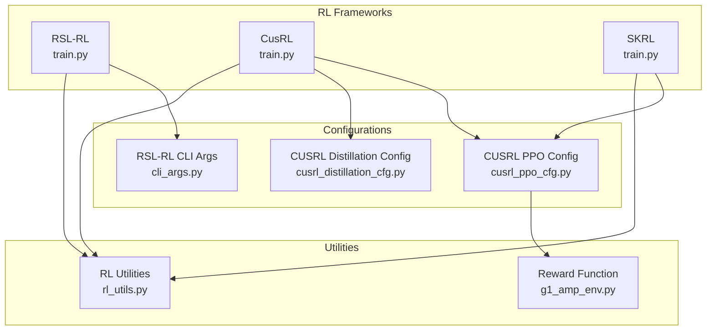
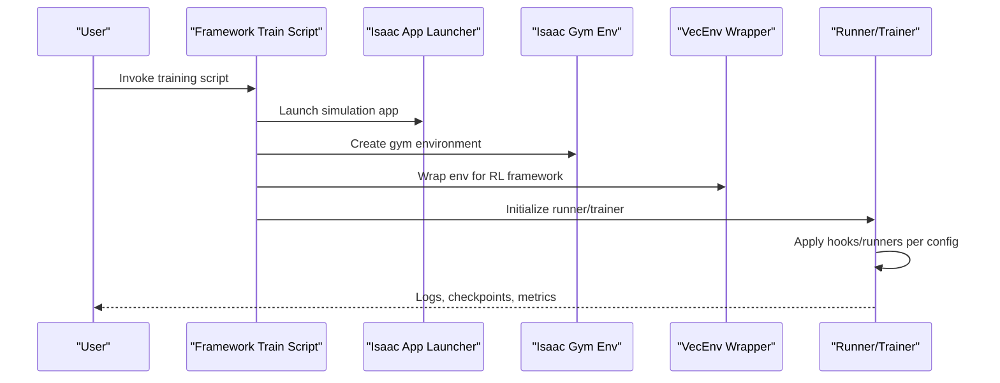
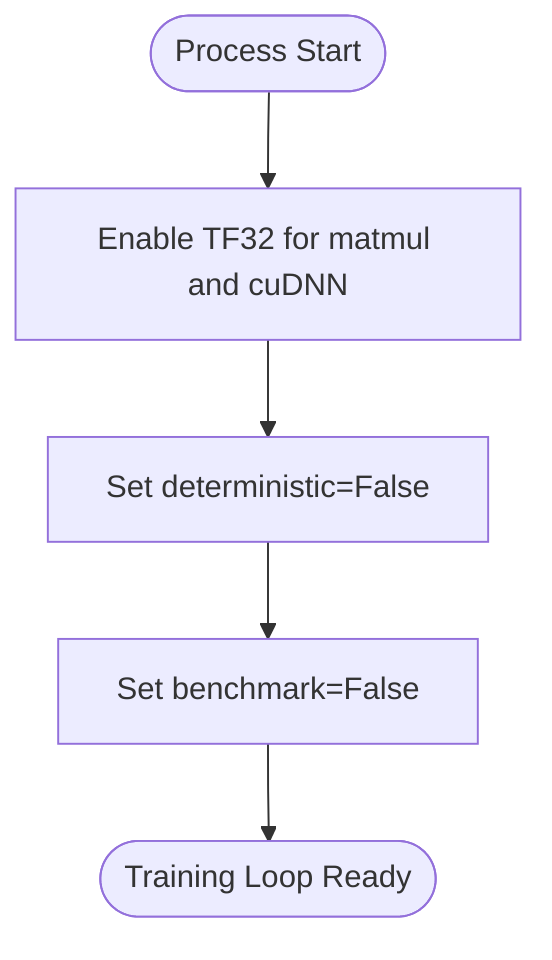
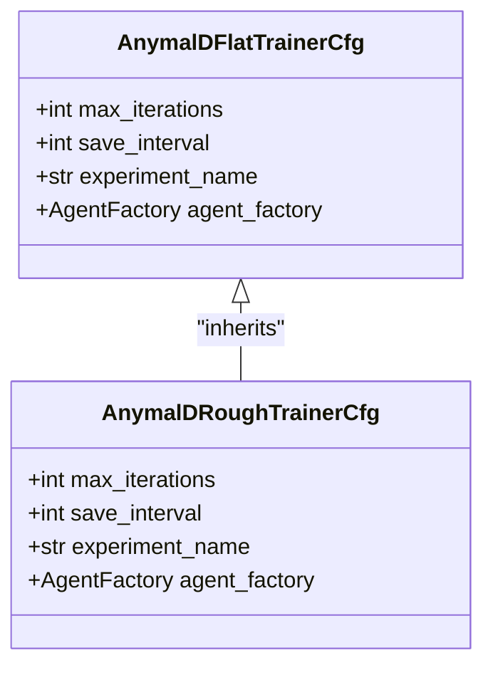
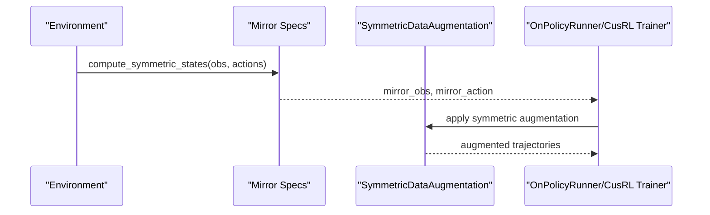
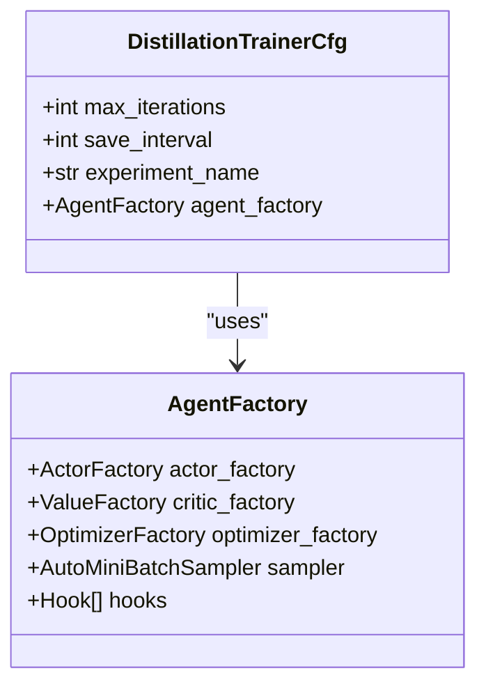
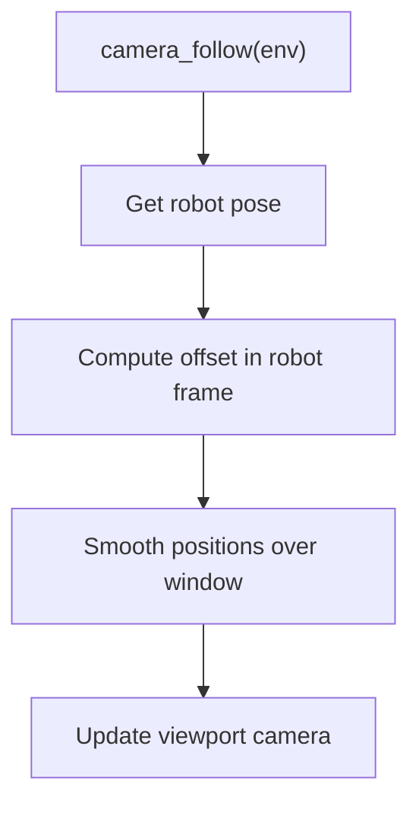
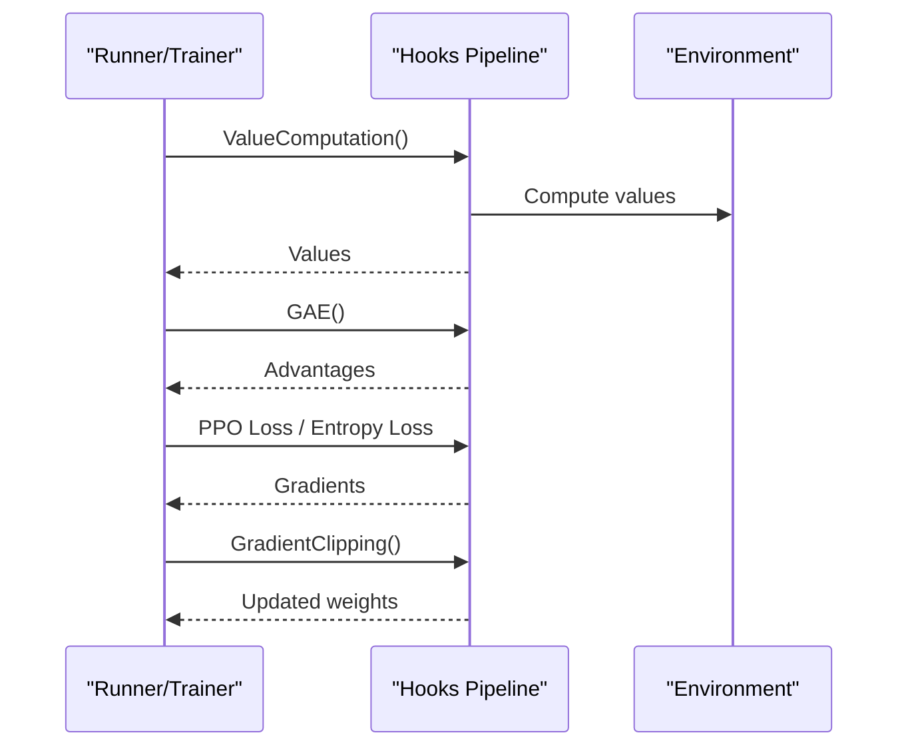
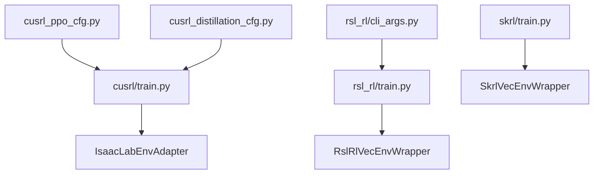

# Training Optimization Techniques

<cite>
**Referenced Files in This Document**
- [rl_utils.py](file://scripts/reinforcement_learning/rl_utils.py)
- [rsl_rl/train.py](file://scripts/reinforcement_learning/rsl_rl/train.py)
- [rsl_rl/cli_args.py](file://scripts/reinforcement_learning/rsl_rl/cli_args.py)
- [cusrl/train.py](file://scripts/reinforcement_learning/cusrl/train.py)
- [skrl/train.py](file://scripts/reinforcement_learning/skrl/train.py)
- [cusrl_ppo_cfg.py](file://source/robot_lab/robot_lab/tasks/manager_based/locomotion/velocity/config/quadruped/anymal_d/agents/cusrl_ppo_cfg.py)
- [cusrl_distillation_cfg.py](file://source/robot_lab/robot_lab/tasks/manager_based/locomotion/velocity/config/quadruped/anymal_d/agents/cusrl_distillation_cfg.py)
- [g1_amp_env.py](file://source/robot_lab/robot_lab/tasks/direct/g1_amp/g1_amp_env.py)
</cite>

## Table of Contents
1. [Introduction](#introduction)
2. [Project Structure](#project-structure)
3. [Core Components](#core-components)
4. [Architecture Overview](#architecture-overview)
5. [Detailed Component Analysis](#detailed-component-analysis)
6. [Dependency Analysis](#dependency-analysis)
7. [Performance Considerations](#performance-considerations)
8. [Troubleshooting Guide](#troubleshooting-guide)
9. [Conclusion](#conclusion)
10. [Appendices](#appendices)

## Introduction
This document explains advanced training optimization techniques and utilities available in the repository. It focuses on:
- Curriculum learning configurations
- Symmetry data augmentation strategies
- Model distillation methods
- RL utilities and training helpers
- Optimization algorithms and performance settings (TF32, deterministic vs benchmark modes, memory management)
- Practical examples for customizing training pipelines
- Monitoring and profiling guidance
- How optimization techniques relate to robot categories, task types, and training objectives

## Project Structure
The training stack is organized around three RL frameworks (RSL-RL, CusRL, SKRL), each with dedicated training scripts and configuration files. Utility scripts provide runtime helpers for camera control and environment-specific augmentations.

**Diagram sources**
- [rsl_rl/train.py](file://scripts/reinforcement_learning/rsl_rl/train.py#L111-L115)
- [cusrl/train.py](file://scripts/reinforcement_learning/cusrl/train.py#L73-L77)
- [skrl/train.py](file://scripts/reinforcement_learning/skrl/train.py#L126-L133)
- [cusrl_ppo_cfg.py](file://source/robot_lab/robot_lab/tasks/manager_based/locomotion/velocity/config/quadruped/anymal_d/agents/cusrl_ppo_cfg.py#L11-L43)
- [cusrl_distillation_cfg.py](file://source/robot_lab/robot_lab/tasks/manager_based/locomotion/velocity/config/quadruped/anymal_d/agents/cusrl_distillation_cfg.py#L10-L34)
- [rsl_rl/cli_args.py](file://scripts/reinforcement_learning/rsl_rl/cli_args.py#L19-L43)
- [rl_utils.py](file://scripts/reinforcement_learning/rl_utils.py#L9-L28)
- [g1_amp_env.py](file://source/robot_lab/robot_lab/tasks/direct/g1_amp/g1_amp_env.py#L420-L448)

**Section sources**
- [rsl_rl/train.py](file://scripts/reinforcement_learning/rsl_rl/train.py#L111-L115)
- [cusrl/train.py](file://scripts/reinforcement_learning/cusrl/train.py#L73-L77)
- [skrl/train.py](file://scripts/reinforcement_learning/skrl/train.py#L126-L133)
- [cusrl_ppo_cfg.py](file://source/robot_lab/robot_lab/tasks/manager_based/locomotion/velocity/config/quadruped/anymal_d/agents/cusrl_ppo_cfg.py#L11-L43)
- [cusrl_distillation_cfg.py](file://source/robot_lab/robot_lab/tasks/manager_based/locomotion/velocity/config/quadruped/anymal_d/agents/cusrl_distillation_cfg.py#L10-L34)
- [rsl_rl/cli_args.py](file://scripts/reinforcement_learning/rsl_rl/cli_args.py#L19-L43)
- [rl_utils.py](file://scripts/reinforcement_learning/rl_utils.py#L9-L28)
- [g1_amp_env.py](file://source/robot_lab/robot_lab/tasks/direct/g1_amp/g1_amp_env.py#L420-L448)

## Core Components
- TF32 and deterministic/benchmark settings: CUDA and cuDNN TF32 flags and deterministic/benchmark toggles are configured at script startup for reproducibility and performance.
- Curriculum learning: Implemented via task-specific configuration classes that adjust training iterations and environment specs (e.g., flat vs rough terrains).
- Symmetry data augmentation: Integrated via environment spec overrides and hook-based augmentation for quadrupeds.
- Model distillation: Supported through a dedicated runner and configuration that injects policy distillation loss.
- RL utilities: Camera following helper for live inspection and reward shaping utilities for robust training.

**Section sources**
- [rsl_rl/train.py](file://scripts/reinforcement_learning/rsl_rl/train.py#L111-L115)
- [cusrl/train.py](file://scripts/reinforcement_learning/cusrl/train.py#L73-L77)
- [cusrl_ppo_cfg.py](file://source/robot_lab/robot_lab/tasks/manager_based/locomotion/velocity/config/quadruped/anymal_d/agents/cusrl_ppo_cfg.py#L71-L111)
- [cusrl_distillation_cfg.py](file://source/robot_lab/robot_lab/tasks/manager_based/locomotion/velocity/config/quadruped/anymal_d/agents/cusrl_distillation_cfg.py#L10-L34)
- [rl_utils.py](file://scripts/reinforcement_learning/rl_utils.py#L9-L28)
- [g1_amp_env.py](file://source/robot_lab/robot_lab/tasks/direct/g1_amp/g1_amp_env.py#L420-L448)

## Architecture Overview
The training pipeline initializes the Isaac Sim app, constructs the environment, wraps it for the chosen RL framework, and runs the selected algorithm with hooks or runners. TF32 flags and device selection are applied early to optimize numerical precision and device placement.

**Diagram sources**
- [rsl_rl/train.py](file://scripts/reinforcement_learning/rsl_rl/train.py#L117-L220)
- [cusrl/train.py](file://scripts/reinforcement_learning/cusrl/train.py#L79-L136)
- [skrl/train.py](file://scripts/reinforcement_learning/skrl/train.py#L135-L237)

## Detailed Component Analysis

### TF32 Settings and Deterministic/Benchmark Modes
- Both RSL-RL and CusRL scripts set allow_tf32 for matmul and cudnn, and configure deterministic/benchmark flags for reproducibility vs speed.
- These settings are applied at process start to ensure consistent numerical behavior across runs.

**Diagram sources**
- [rsl_rl/train.py](file://scripts/reinforcement_learning/rsl_rl/train.py#L111-L115)
- [cusrl/train.py](file://scripts/reinforcement_learning/cusrl/train.py#L73-L77)

**Section sources**
- [rsl_rl/train.py](file://scripts/reinforcement_learning/rsl_rl/train.py#L111-L115)
- [cusrl/train.py](file://scripts/reinforcement_learning/cusrl/train.py#L73-L77)

### Curriculum Learning Implementations
- Curriculum is realized through separate configuration classes for rough and flat terrains, adjusting max_iterations and experiment names.
- Example: quadruped configurations define rough and flat variants with different iteration counts and augmentation hooks.

**Diagram sources**
- [cusrl_ppo_cfg.py](file://source/robot_lab/robot_lab/tasks/manager_based/locomotion/velocity/config/quadruped/anymal_d/agents/cusrl_ppo_cfg.py#L11-L49)

**Section sources**
- [cusrl_ppo_cfg.py](file://source/robot_lab/robot_lab/tasks/manager_based/locomotion/velocity/config/quadruped/anymal_d/agents/cusrl_ppo_cfg.py#L11-L49)

### Symmetry Data Augmentation Strategies
- Dynamic environment spec override supplies mirror observation/action mappings.
- SymmetricDataAugmentation hook augments on-policy data using mirrored states.
- Environment mirrors are computed via a symmetry utility that transforms observations/actions.

**Diagram sources**
- [cusrl_ppo_cfg.py](file://source/robot_lab/robot_lab/tasks/manager_based/locomotion/velocity/config/quadruped/anymal_d/agents/cusrl_ppo_cfg.py#L52-L104)

**Section sources**
- [cusrl_ppo_cfg.py](file://source/robot_lab/robot_lab/tasks/manager_based/locomotion/velocity/config/quadruped/anymal_d/agents/cusrl_ppo_cfg.py#L52-L104)

### Model Distillation Methods
- Distillation is supported via a dedicated runner and configuration that injects a policy distillation loss hook.
- The distillation configuration defines a stub critic and gradient clipping to stabilize teacher-student alignment.

**Diagram sources**
- [cusrl_distillation_cfg.py](file://source/robot_lab/robot_lab/tasks/manager_based/locomotion/velocity/config/quadruped/anymal_d/agents/cusrl_distillation_cfg.py#L10-L34)

**Section sources**
- [cusrl_distillation_cfg.py](file://source/robot_lab/robot_lab/tasks/manager_based/locomotion/velocity/config/quadruped/anymal_d/agents/cusrl_distillation_cfg.py#L10-L34)

### RL Utilities Functions
- Camera following utility computes smoothed camera position relative to the robot and updates the viewport controller.
- Reward shaping utility provides a piecewise exponential reward with a floor to balance large and small errors.

**Diagram sources**
- [rl_utils.py](file://scripts/reinforcement_learning/rl_utils.py#L9-L28)

**Section sources**
- [rl_utils.py](file://scripts/reinforcement_learning/rl_utils.py#L9-L28)
- [g1_amp_env.py](file://source/robot_lab/robot_lab/tasks/direct/g1_amp/g1_amp_env.py#L420-L448)

### Optimization Algorithms and Hooks
- PPO with Generalized Advantage Estimation, advantage normalization, value loss, entropy loss, gradient clipping, and adaptive LR scheduling.
- Distillation loss hook integrates teacher supervision into student training.
- Hooks are orchestrated by the framework’s runner/trainer to form a cohesive training loop.

**Diagram sources**
- [cusrl_ppo_cfg.py](file://source/robot_lab/robot_lab/tasks/manager_based/locomotion/velocity/config/quadruped/anymal_d/agents/cusrl_ppo_cfg.py#L31-L42)
- [cusrl_distillation_cfg.py](file://source/robot_lab/robot_lab/tasks/manager_based/locomotion/velocity/config/quadruped/anymal_d/agents/cusrl_distillation_cfg.py#L28-L33)

**Section sources**
- [cusrl_ppo_cfg.py](file://source/robot_lab/robot_lab/tasks/manager_based/locomotion/velocity/config/quadruped/anymal_d/agents/cusrl_ppo_cfg.py#L31-L42)
- [cusrl_distillation_cfg.py](file://source/robot_lab/robot_lab/tasks/manager_based/locomotion/velocity/config/quadruped/anymal_d/agents/cusrl_distillation_cfg.py#L28-L33)

## Dependency Analysis
- Training scripts depend on the Isaac App Launcher and environment creation.
- Framework-specific wrappers (RSL-RL, CusRL, SKRL) encapsulate environment and agent orchestration.
- Configurations define agent factories and hooks that drive the training dynamics.

**Diagram sources**
- [rsl_rl/train.py](file://scripts/reinforcement_learning/rsl_rl/train.py#L196-L205)
- [cusrl/train.py](file://scripts/reinforcement_learning/cusrl/train.py#L123-L132)
- [skrl/train.py](file://scripts/reinforcement_learning/skrl/train.py#L224-L229)
- [cusrl_ppo_cfg.py](file://source/robot_lab/robot_lab/tasks/manager_based/locomotion/velocity/config/quadruped/anymal_d/agents/cusrl_ppo_cfg.py#L15-L42)
- [cusrl_distillation_cfg.py](file://source/robot_lab/robot_lab/tasks/manager_based/locomotion/velocity/config/quadruped/anymal_d/agents/cusrl_distillation_cfg.py#L15-L34)
- [rsl_rl/cli_args.py](file://scripts/reinforcement_learning/rsl_rl/cli_args.py#L19-L43)

**Section sources**
- [rsl_rl/train.py](file://scripts/reinforcement_learning/rsl_rl/train.py#L196-L205)
- [cusrl/train.py](file://scripts/reinforcement_learning/cusrl/train.py#L123-L132)
- [skrl/train.py](file://scripts/reinforcement_learning/skrl/train.py#L224-L229)
- [cusrl_ppo_cfg.py](file://source/robot_lab/robot_lab/tasks/manager_based/locomotion/velocity/config/quadruped/anymal_d/agents/cusrl_ppo_cfg.py#L15-L42)
- [cusrl_distillation_cfg.py](file://source/robot_lab/robot_lab/tasks/manager_based/locomotion/velocity/config/quadruped/anymal_d/agents/cusrl_distillation_cfg.py#L15-L34)
- [rsl_rl/cli_args.py](file://scripts/reinforcement_learning/rsl_rl/cli_args.py#L19-L43)

## Performance Considerations
- TF32 settings: Enable TF32 for matmul and cuDNN to improve throughput on modern GPUs while maintaining acceptable precision.
- Deterministic vs benchmark: Deterministic mode disables optimizations that can vary across runs; benchmark mode lets cuDNN auto-tune convolutions. Choose deterministic for reproducibility and benchmark for peak performance.
- Mixed precision and compilation: CusRL supports autocast and torch.compile flags for further acceleration.
- Distributed training: Scripts support multi-GPU setups; ensure device placement aligns with local rank and seeds are varied per process.
- Environment mirroring: Symmetry augmentation increases effective batch size but adds compute overhead; tune batch sizes and epochs accordingly.

[No sources needed since this section provides general guidance]

## Troubleshooting Guide
- Version mismatches: Scripts check minimum supported library versions and instruct corrective installation steps.
- Distributed training constraints: CPU devices are not supported for distributed training; ensure GPU device selection.
- Video recording: Enable cameras when recording videos; video kwargs are logged for clarity.
- Checkpoint loading: Resume paths are resolved before creating log directories; ensure correct run/checkpoint naming.

**Section sources**
- [rsl_rl/train.py](file://scripts/reinforcement_learning/rsl_rl/train.py#L64-L76)
- [skrl/train.py](file://scripts/reinforcement_learning/skrl/train.py#L90-L98)
- [rsl_rl/train.py](file://scripts/reinforcement_learning/rsl_rl/train.py#L132-L136)
- [rsl_rl/train.py](file://scripts/reinforcement_learning/rsl_rl/train.py#L183-L192)
- [cusrl/train.py](file://scripts/reinforcement_learning/cusrl/train.py#L110-L121)

## Conclusion
The repository provides a comprehensive toolkit for RL training optimization:
- TF32 and deterministic/benchmark controls for performance and reproducibility
- Curriculum learning via task-specific configurations
- Symmetry data augmentation integrated through hooks
- Model distillation with dedicated runner and configuration
- RL utilities for camera control and reward shaping
Adopting these techniques enables efficient, robust, and scalable training across diverse robot categories and tasks.

[No sources needed since this section summarizes without analyzing specific files]

## Appendices

### Practical Examples and Recipes
- Implementing curriculum learning:
  - Define rough and flat variants of the same configuration class and adjust max_iterations and experiment names accordingly.
  - Reference: [cusrl_ppo_cfg.py](file://source/robot_lab/robot_lab/tasks/manager_based/locomotion/velocity/config/quadruped/anymal_d/agents/cusrl_ppo_cfg.py#L11-L49)
- Enabling symmetry augmentation:
  - Add dynamic environment spec override and symmetric data augmentation hooks to the agent factory.
  - Reference: [cusrl_ppo_cfg.py](file://source/robot_lab/robot_lab/tasks/manager_based/locomotion/velocity/config/quadruped/anymal_d/agents/cusrl_ppo_cfg.py#L71-L104)
- Using model distillation:
  - Select the distillation runner and configure the policy distillation loss hook with appropriate optimizer and sampler settings.
  - Reference: [cusrl_distillation_cfg.py](file://source/robot_lab/robot_lab/tasks/manager_based/locomotion/velocity/config/quadruped/anymal_d/agents/cusrl_distillation_cfg.py#L10-L34)
- Monitoring training performance:
  - Use built-in logging and optional video recording; inspect logs under the generated directories.
  - References: [rsl_rl/train.py](file://scripts/reinforcement_learning/rsl_rl/train.py#L148-L158), [cusrl/train.py](file://scripts/reinforcement_learning/cusrl/train.py#L93-L101), [skrl/train.py](file://scripts/reinforcement_learning/skrl/train.py#L169-L183)

### Relationship Between Optimization Techniques and Domains
- Robot categories: Quadrupeds benefit from symmetry augmentation; humanoid and other categories can adopt similar hooks with domain-appropriate mirror mappings.
- Task types: Locomotion tasks often use PPO with GAE and adaptive KL scheduling; AMP-style tasks may leverage reward shaping utilities.
- Training objectives: Curricula progress from rough to flat terrains; distillation accelerates convergence using teacher policies.

[No sources needed since this section provides general guidance]