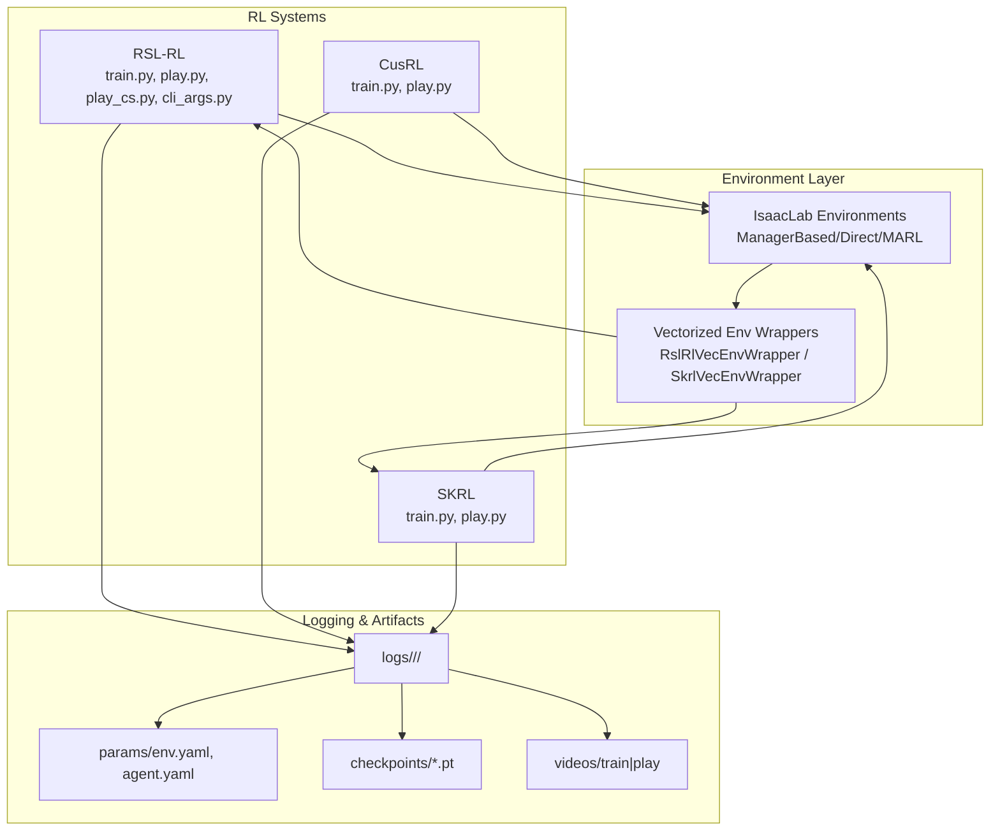
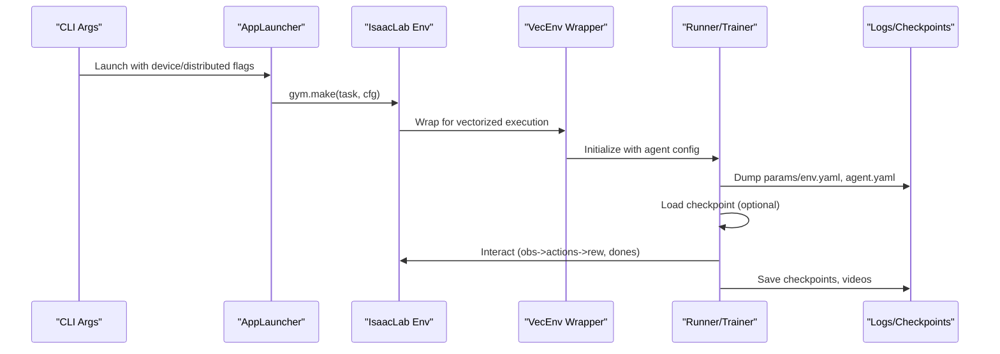
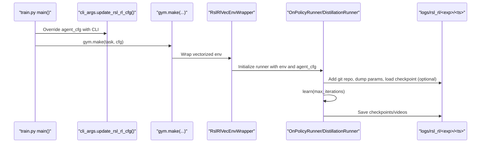
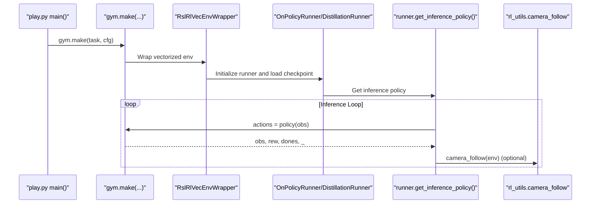
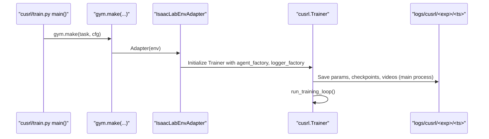
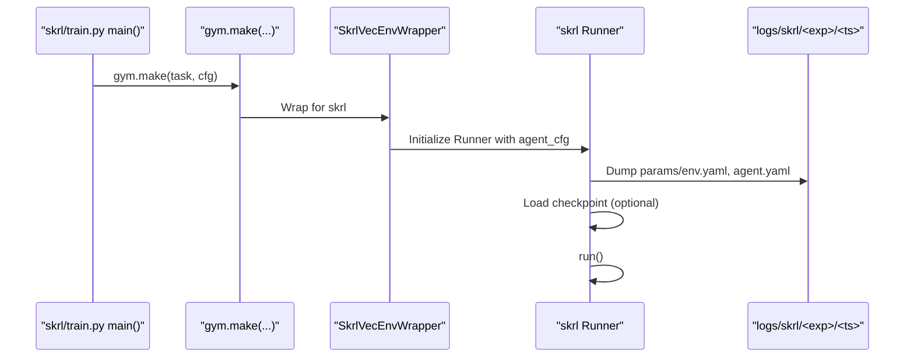
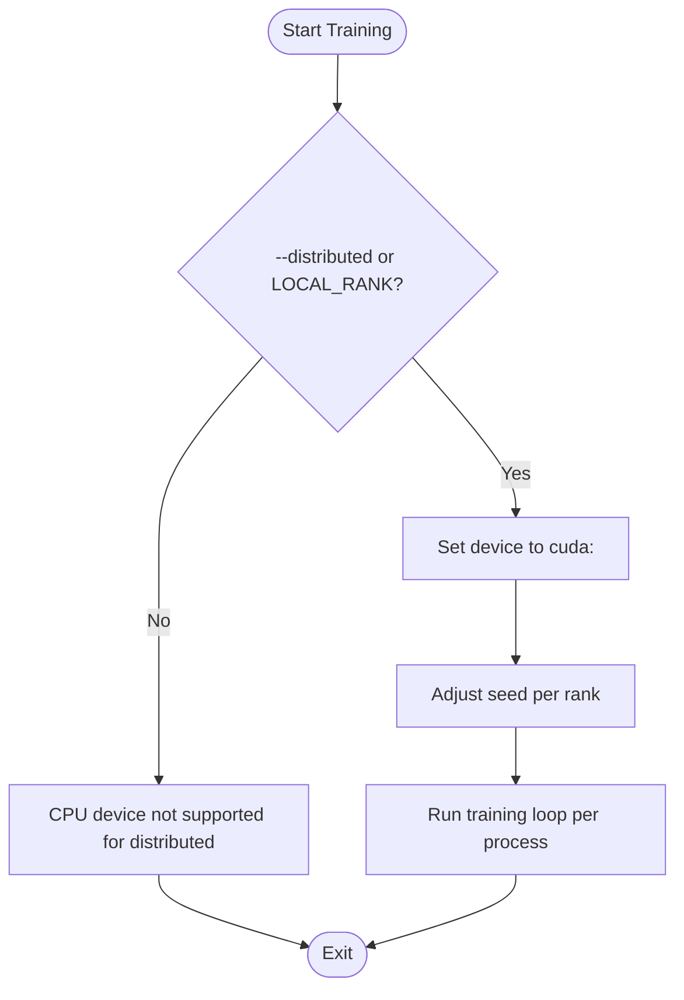
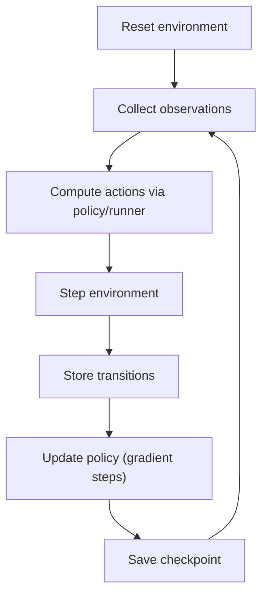
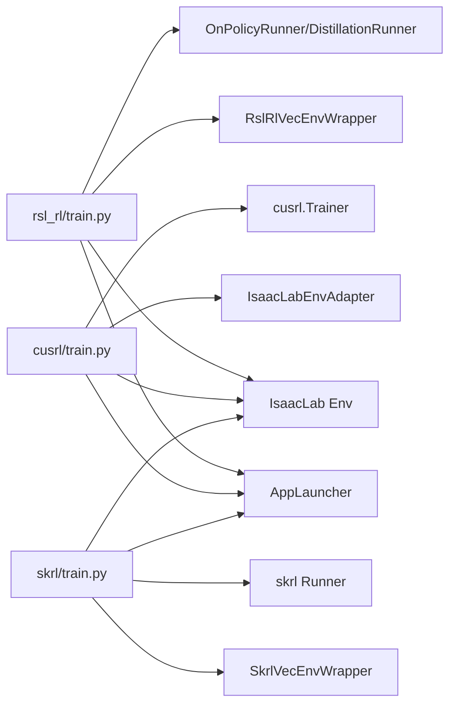

# Training Pipeline Architecture

<cite>
**Referenced Files in This Document**
- [scripts/reinforcement_learning/rsl_rl/train.py](file://scripts/reinforcement_learning/rsl_rl/train.py)
- [scripts/reinforcement_learning/rsl_rl/cli_args.py](file://scripts/reinforcement_learning/rsl_rl/cli_args.py)
- [scripts/reinforcement_learning/rsl_rl/play.py](file://scripts/reinforcement_learning/rsl_rl/play.py)
- [scripts/reinforcement_learning/rsl_rl/play_cs.py](file://scripts/reinforcement_learning/rsl_rl/play_cs.py)
- [scripts/reinforcement_learning/cusrl/train.py](file://scripts/reinforcement_learning/cusrl/train.py)
- [scripts/reinforcement_learning/cusrl/play.py](file://scripts/reinforcement_learning/cusrl/play.py)
- [scripts/reinforcement_learning/skrl/train.py](file://scripts/reinforcement_learning/skrl/train.py)
- [scripts/reinforcement_learning/skrl/play.py](file://scripts/reinforcement_learning/skrl/play.py)
- [scripts/reinforcement_learning/rl_utils.py](file://scripts/reinforcement_learning/rl_utils.py)
- [logs/rsl_rl/opendoge_apx_flat/2026-01-20_11-11-30/params/agent.yaml](file://logs/rsl_rl/opendoge_apx_flat/2026-01-20_11-11-30/params/agent.yaml)
- [source/robot_lab/robot_lab/tasks/manager_based/locomotion/velocity/config/quadruped/sdog_sdog2/agents/rsl_rl_ppo_cfg.py](file://source/robot_lab/robot_lab/tasks/manager_based/locomotion/velocity/config/quadruped/sdog_sdog2/agents/rsl_rl_ppo_cfg.py)
- [source/robot_lab/robot_lab/tasks/manager_based/locomotion/velocity/config/quadruped/sdog_sdog2/flat_env_cfg.py](file://source/robot_lab/robot_lab/tasks/manager_based/locomotion/velocity/config/quadruped/sdog_sdog2/flat_env_cfg.py)
- [source/robot_lab/robot_lab/tasks/manager_based/locomotion/velocity/config/quadruped/sdog_sdog2/rough_env_cfg.py](file://source/robot_lab/robot_lab/tasks/manager_based/locomotion/velocity/config/quadruped/sdog_sdog2/rough_env_cfg.py)
- [source/robot_lab/robot_lab/assets/sdog2.py](file://source/robot_lab/robot_lab/assets/sdog2.py)
</cite>

## Update Summary
**Changes Made**
- Updated Sdog-Sdog2 training configuration documentation to reflect increased maximum iterations
- Added detailed explanation of enhanced training periods for improved robot capabilities
- Updated hyperparameter configuration examples to show new iteration limits
- Enhanced training optimization techniques section with new Sdog-Sdog2 specifics

## Table of Contents
1. [Introduction](#introduction)
2. [Project Structure](#project-structure)
3. [Core Components](#core-components)
4. [Architecture Overview](#architecture-overview)
5. [Detailed Component Analysis](#detailed-component-analysis)
6. [Dependency Analysis](#dependency-analysis)
7. [Performance Considerations](#performance-considerations)
8. [Troubleshooting Guide](#troubleshooting-guide)
9. [Conclusion](#conclusion)
10. [Appendices](#appendices)

## Introduction
This document explains the training pipeline architecture across three RL systems integrated in the repository: RSL-RL, CusRL, and SKRL. It covers:
- Multiple RL algorithm implementations and distributed training support
- RSL-RL PPO implementation, hyperparameters, and training optimization techniques
- CusRL experimental training system and its custom algorithm implementations
- SKRL training system for advanced RL algorithms including AMP (Associative Memory Paradigm)
- Concrete examples from the codebase showing training script usage, CLI argument configuration, and experiment tracking
- Distributed training architecture supporting multi-GPU and multi-node scenarios
- Training pipeline components including environment interaction, policy execution, gradient computation, and model updates
- Training optimization techniques such as curriculum learning, symmetry data augmentation, and model distillation
- Troubleshooting guidance for common training issues and performance optimization strategies

**Updated** Enhanced training periods for Sdog-Sdog2 configurations with significantly increased maximum iterations reflecting commitment to longer training durations for improved robot capabilities.

## Project Structure
The repository organizes RL training under scripts/reinforcement_learning with three subsystems:
- rsl_rl: RSL-RL training and playback scripts, plus CLI argument parsing and configuration overrides
- cusrl: CusRL training and playback scripts with distributed and optimization flags
- skrl: SKRL training and playback scripts supporting multiple algorithms (PPO, IPPO, MAPPO, AMP)

**Diagram sources**
- [scripts/reinforcement_learning/rsl_rl/train.py](file://scripts/reinforcement_learning/rsl_rl/train.py#L117-L225)
- [scripts/reinforcement_learning/cusrl/train.py](file://scripts/reinforcement_learning/cusrl/train.py#L79-L135)
- [scripts/reinforcement_learning/skrl/train.py](file://scripts/reinforcement_learning/skrl/train.py#L135-L237)

**Section sources**
- [scripts/reinforcement_learning/rsl_rl/train.py](file://scripts/reinforcement_learning/rsl_rl/train.py#L1-L232)
- [scripts/reinforcement_learning/cusrl/train.py](file://scripts/reinforcement_learning/cusrl/train.py#L1-L146)
- [scripts/reinforcement_learning/skrl/train.py](file://scripts/reinforcement_learning/skrl/train.py#L1-L250)

## Core Components
- Environment orchestration via gym.make with configurable num_envs, device, and render modes
- Vectorized environment wrappers tailored to each RL library
- Runner/Trainer abstractions that encapsulate policy execution, gradient computation, and model updates
- CLI-driven configuration overrides for seeds, logging, resume, and distributed training
- Experiment logging with YAML parameter dumps, checkpoints, and optional video recording
- Optional camera-follow utility for interactive playback

Key implementation references:
- RSL-RL training runner selection and checkpoint loading
- CusRL trainer creation with agent factory overrides and logger factory
- SKRL runner instantiation with algorithm-specific agent configuration entry points

**Section sources**
- [scripts/reinforcement_learning/rsl_rl/train.py](file://scripts/reinforcement_learning/rsl_rl/train.py#L196-L213)
- [scripts/reinforcement_learning/cusrl/train.py](file://scripts/reinforcement_learning/cusrl/train.py#L122-L132)
- [scripts/reinforcement_learning/skrl/train.py](file://scripts/reinforcement_learning/skrl/train.py#L224-L237)

## Architecture Overview
The training pipeline follows a consistent flow across systems:
- Parse CLI arguments and apply overrides
- Initialize IsaacLab AppLauncher and environment
- Wrap environment for vectorized execution
- Instantiate runner/trainer and optionally load checkpoints
- Run training loop with logging and optional video capture
- Export policy artifacts (ONNX/JIT) for deployment

**Diagram sources**
- [scripts/reinforcement_learning/rsl_rl/train.py](file://scripts/reinforcement_learning/rsl_rl/train.py#L117-L225)
- [scripts/reinforcement_learning/cusrl/train.py](file://scripts/reinforcement_learning/cusrl/train.py#L79-L135)
- [scripts/reinforcement_learning/skrl/train.py](file://scripts/reinforcement_learning/skrl/train.py#L135-L237)

## Detailed Component Analysis

### RSL-RL Training System
RSL-RL provides OnPolicyRunner and DistillationRunner with PPO algorithm support. The training script:
- Accepts CLI arguments for video, num_envs, task, agent entry point, seed, max_iterations, distributed, and IO descriptor export
- Applies AppLauncher arguments and validates RSL-RL version
- Wraps the environment with RslRlVecEnvWrapper and selects runner based on configuration
- Supports resuming from checkpoints and exporting policy artifacts
- Records videos during training when enabled

**Updated** Enhanced Sdog-Sdog2 configurations now feature significantly increased maximum iterations:
- Rough environment: max_iterations increased from 50,000 to 100,000 (double the previous value)
- Flat environment: max_iterations increased from 5,000 to 20,000 (quadruple the previous value)

These extended training periods enable more thorough exploration of the policy space for the improved Sdog-Sdog2 quadruped robot, allowing for better convergence on complex locomotion behaviors.

**Diagram sources**
- [scripts/reinforcement_learning/rsl_rl/train.py](file://scripts/reinforcement_learning/rsl_rl/train.py#L117-L225)
- [scripts/reinforcement_learning/rsl_rl/cli_args.py](file://scripts/reinforcement_learning/rsl_rl/cli_args.py#L63-L94)

Key configuration highlights (example from logs):
- Seed, device, num_steps_per_env, max_iterations, save_interval
- Policy architecture (hidden dims, activation)
- PPO algorithm parameters (learning rate, schedule, gamma, lam, entropy_coef, clipping, normalization)

**Section sources**
- [scripts/reinforcement_learning/rsl_rl/train.py](file://scripts/reinforcement_learning/rsl_rl/train.py#L21-L44)
- [scripts/reinforcement_learning/rsl_rl/train.py](file://scripts/reinforcement_learning/rsl_rl/train.py#L117-L225)
- [scripts/reinforcement_learning/rsl_rl/cli_args.py](file://scripts/reinforcement_learning/rsl_rl/cli_args.py#L19-L94)
- [logs/rsl_rl/opendoge_apx_flat/2026-01-20_11-11-30/params/agent.yaml](file://logs/rsl_rl/opendoge_apx_flat/2026-01-20_11-11-30/params/agent.yaml#L1-L50)

### RSL-RL Playback and Camera Utilities
Playback scripts load checkpoints and run inference loops:
- Select OnPolicyRunner or DistillationRunner based on configuration
- Export policy to ONNX/JIT for deployment
- Optional keyboard control hook and camera-follow behavior for interactive sessions

**Diagram sources**
- [scripts/reinforcement_learning/rsl_rl/play.py](file://scripts/reinforcement_learning/rsl_rl/play.py#L94-L246)
- [scripts/reinforcement_learning/rl_utils.py](file://scripts/reinforcement_learning/rl_utils.py#L9-L27)

**Section sources**
- [scripts/reinforcement_learning/rsl_rl/play.py](file://scripts/reinforcement_learning/rsl_rl/play.py#L94-L246)
- [scripts/reinforcement_learning/rsl_rl/play_cs.py](file://scripts/reinforcement_learning/rsl_rl/play_cs.py#L95-L285)
- [scripts/reinforcement_learning/rl_utils.py](file://scripts/reinforcement_learning/rl_utils.py#L9-L27)

### CusRL Experimental Training System
CusRL provides a Trainer abstraction with:
- Agent factory overrides for device, autocast, and torch.compile
- Logger factory for TensorBoard-style logging
- Distributed world-size scaling of num_envs
- Optional video recording per process

**Diagram sources**
- [scripts/reinforcement_learning/cusrl/train.py](file://scripts/reinforcement_learning/cusrl/train.py#L79-L135)

**Section sources**
- [scripts/reinforcement_learning/cusrl/train.py](file://scripts/reinforcement_learning/cusrl/train.py#L79-L135)
- [scripts/reinforcement_learning/cusrl/play.py](file://scripts/reinforcement_learning/cusrl/play.py#L80-L170)

### SKRL Training System (AMP, PPO, IPPO, MAPPO)
SKRL supports multiple algorithms and ML frameworks:
- Algorithm selection via --algorithm or explicit --agent entry point
- ML framework selection (torch, jax, jax-numpy)
- Runner instantiation with environment wrapper and optional checkpoint loading
- Configurable trainer timesteps derived from max_iterations and rollouts

**Diagram sources**
- [scripts/reinforcement_learning/skrl/train.py](file://scripts/reinforcement_learning/skrl/train.py#L135-L237)

**Section sources**
- [scripts/reinforcement_learning/skrl/train.py](file://scripts/reinforcement_learning/skrl/train.py#L24-L62)
- [scripts/reinforcement_learning/skrl/train.py](file://scripts/reinforcement_learning/skrl/train.py#L135-L237)
- [scripts/reinforcement_learning/skrl/play.py](file://scripts/reinforcement_learning/skrl/play.py#L131-L245)

### Distributed Training Architecture
All three systems support multi-GPU training:
- RSL-RL: Uses AppLauncher.local_rank to set device per process and adjusts seed per rank
- SKRL: Resolves device to cuda:<local_rank> when distributed is enabled
- CusRL: Reads LOCAL_RANK from environment to set device and scale num_envs by world_size()

**Diagram sources**
- [scripts/reinforcement_learning/rsl_rl/train.py](file://scripts/reinforcement_learning/rsl_rl/train.py#L138-L146)
- [scripts/reinforcement_learning/skrl/train.py](file://scripts/reinforcement_learning/skrl/train.py#L149-L155)
- [scripts/reinforcement_learning/cusrl/train.py](file://scripts/reinforcement_learning/cusrl/train.py#L46-L50)

**Section sources**
- [scripts/reinforcement_learning/rsl_rl/train.py](file://scripts/reinforcement_learning/rsl_rl/train.py#L131-L146)
- [scripts/reinforcement_learning/skrl/train.py](file://scripts/reinforcement_learning/skrl/train.py#L142-L155)
- [scripts/reinforcement_learning/cusrl/train.py](file://scripts/reinforcement_learning/cusrl/train.py#L46-L50)

### Training Pipeline Components
- Environment interaction: Reset, step, and observation collection
- Policy execution: Deterministic/stochastic actions from policy or runner agent
- Gradient computation and updates: Encapsulated within runner/trainer (e.g., OnPolicyRunner, DistillationRunner, SKRL Runner)
- Model updates: Checkpoint saving at intervals and optional export to ONNX/JIT

### Enhanced Sdog-Sdog2 Training Configurations

**Updated** The Sdog-Sdog2 quadruped robot now features significantly enhanced training configurations with extended maximum iterations:

#### Sdog-Sdog2 RSL-RL PPO Configuration
The Sdog-Sdog2 configurations demonstrate commitment to longer training periods for improved robot capabilities:

- **Rough Environment Configuration**:
  - max_iterations: 100,000 (increased from 50,000)
  - num_steps_per_env: 24
  - save_interval: 100
  - experiment_name: "sdog_sdog2_rough"

- **Flat Environment Configuration**:
  - max_iterations: 20,000 (increased from 5,000)
  - Inherits all other settings from rough environment
  - experiment_name: "sdog_sdog2_flat"

These increased iteration limits enable more thorough exploration of the policy space, particularly important for the enhanced Sdog-Sdog2 robot's improved capabilities and complexity.

#### Environment Configuration Details
Both environments share common characteristics:
- **Robot Configuration**: Uses SDOG_SDOG2_CFG with articulated joints and contact sensors
- **Observation Scaling**: Base linear velocity scaled by 2.0, angular velocity by 0.25
- **Action Scaling**: Reduced joint position scaling (0.125 for hip joints, 0.25 for other joints)
- **Reward Structure**: Comprehensive reward function including joint torques, contact forces, and velocity tracking
- **Terrain Adaptation**: Flat environment replaces height scanning with plane terrain

**Section sources**
- [source/robot_lab/robot_lab/tasks/manager_based/locomotion/velocity/config/quadruped/sdog_sdog2/agents/rsl_rl_ppo_cfg.py](file://source/robot_lab/robot_lab/tasks/manager_based/locomotion/velocity/config/quadruped/sdog_sdog2/agents/rsl_rl_ppo_cfg.py#L1-L45)
- [source/robot_lab/robot_lab/tasks/manager_based/locomotion/velocity/config/quadruped/sdog_sdog2/flat_env_cfg.py](file://source/robot_lab/robot_lab/tasks/manager_based/locomotion/velocity/config/quadruped/sdog_sdog2/flat_env_cfg.py#L1-L32)
- [source/robot_lab/robot_lab/tasks/manager_based/locomotion/velocity/config/quadruped/sdog_sdog2/rough_env_cfg.py](file://source/robot_lab/robot_lab/tasks/manager_based/locomotion/velocity/config/quadruped/sdog_sdog2/rough_env_cfg.py#L1-L179)
- [source/robot_lab/robot_lab/assets/sdog2.py](file://source/robot_lab/robot_lab/assets/sdog2.py#L1-L83)

## Dependency Analysis
The training scripts depend on:
- AppLauncher for initializing the IsaacSim application
- Environment wrappers specific to each RL library
- Runner/trainer abstractions from each RL library
- Logging utilities for YAML dumping and checkpoint retrieval
- Optional camera-follow utility for interactive playback

**Diagram sources**
- [scripts/reinforcement_learning/rsl_rl/train.py](file://scripts/reinforcement_learning/rsl_rl/train.py#L89-L99)
- [scripts/reinforcement_learning/cusrl/train.py](file://scripts/reinforcement_learning/cusrl/train.py#L63-L63)
- [scripts/reinforcement_learning/skrl/train.py](file://scripts/reinforcement_learning/skrl/train.py#L115-L115)

**Section sources**
- [scripts/reinforcement_learning/rsl_rl/train.py](file://scripts/reinforcement_learning/rsl_rl/train.py#L89-L99)
- [scripts/reinforcement_learning/cusrl/train.py](file://scripts/reinforcement_learning/cusrl/train.py#L63-L63)
- [scripts/reinforcement_learning/skrl/train.py](file://scripts/reinforcement_learning/skrl/train.py#L115-L115)

## Performance Considerations
- Mixed precision and compilation:
  - RSL-RL: TF32 allowances and deterministic/benchmark toggles set early
  - CusRL: --autocast and --compile flags passed to agent factory
- Distributed scaling:
  - RSL-RL: Device assignment per rank and seed offset per rank
  - SKRL: Device resolution to cuda:<local_rank>
  - CusRL: num_envs scaled by world_size()
- Curriculum and augmentation:
  - Environment configs demonstrate disabling curriculum and randomization for stable evaluation
  - Symmetry configuration fields present in RSL-RL agent.yaml indicate potential for symmetry data augmentation
- Logging overhead:
  - SKRL/RSL-RL export YAML params and optionally IO descriptors for reproducibility
- **Enhanced Training Durations**:
  - Sdog-Sdog2 configurations now support up to 100,000 iterations for rough terrain training
  - Extended training allows for better policy convergence on complex quadruped locomotion
  - Increased computational requirements necessitate appropriate hardware resources

**Section sources**
- [source/robot_lab/robot_lab/tasks/manager_based/locomotion/velocity/config/quadruped/sdog_sdog2/agents/rsl_rl_ppo_cfg.py](file://source/robot_lab/robot_lab/tasks/manager_based/locomotion/velocity/config/quadruped/sdog_sdog2/agents/rsl_rl_ppo_cfg.py#L11-L43)

## Troubleshooting Guide
Common issues and resolutions:
- Unsupported RSL-RL version:
  - The script checks installed version and prints installation command for the required version
- CPU device with distributed training:
  - Distributed training requires GPU devices; the script raises an error for CPU device when distributed is enabled
- Video recording:
  - Enable cameras via CLI to record videos; ensure video kwargs are configured properly
- Checkpoint loading:
  - Use resume flags or explicit checkpoint paths; ensure log directories match expected patterns
- Keyboard control:
  - Keyboard mode sets num_envs to 1 and disables certain terminations for interactive control
- Camera follow:
  - Use the camera-follow utility during interactive sessions to track the robot
- **Extended Training Duration Issues**:
  - Monitor memory usage during long training sessions (up to 100,000 iterations)
  - Adjust batch sizes and environment counts for Sdog-Sdog2 configurations
  - Ensure adequate storage space for extended experiment logs

**Section sources**
- [scripts/reinforcement_learning/rsl_rl/train.py](file://scripts/reinforcement_learning/rsl_rl/train.py#L57-L76)
- [scripts/reinforcement_learning/rsl_rl/train.py](file://scripts/reinforcement_learning/rsl_rl/train.py#L131-L136)
- [scripts/reinforcement_learning/rsl_rl/play.py](file://scripts/reinforcement_learning/rsl_rl/play.py#L125-L137)
- [scripts/reinforcement_learning/rl_utils.py](file://scripts/reinforcement_learning/rl_utils.py#L9-L27)

## Conclusion
The repository integrates three complementary RL training systems:
- RSL-RL offers mature PPO support with robust configuration, distributed training, and checkpointing
- CusRL provides an experimental, flexible trainer with distributed and optimization flags
- SKRL enables advanced algorithms (including AMP) and multiple ML frameworks with unified runner APIs

**Updated** Recent enhancements include significantly extended training periods for the Sdog-Sdog2 quadruped robot, with maximum iterations increased from 50,000 to 100,000 for rough environments and from 5,000 to 20,000 for flat environments. These changes reflect the improved capabilities of the Sdog-Sdog2 robot and the commitment to longer, more thorough training sessions for optimal policy convergence.

Together, they form a comprehensive training pipeline supporting diverse research and deployment needs, with strong emphasis on reproducibility, distributed scalability, and practical evaluation workflows.

## Appendices

### Example CLI Argument Configuration
- RSL-RL training:
  - --video, --video_length, --video_interval, --num_envs, --task, --agent, --seed, --max_iterations, --distributed, --export_io_descriptors
- CusRL training:
  - --video, --video_length, --video_interval, --num_envs, --task, --agent, --seed, --run_name, --checkpoint, --logger, --max_iterations, --autocast, --compile
- SKRL training:
  - --video, --video_length, --video_interval, --num_envs, --task, --agent, --seed, --distributed, --checkpoint, --max_iterations, --export_io_descriptors, --ml_framework, --algorithm

**Section sources**
- [scripts/reinforcement_learning/rsl_rl/train.py](file://scripts/reinforcement_learning/rsl_rl/train.py#L22-L44)
- [scripts/reinforcement_learning/cusrl/train.py](file://scripts/reinforcement_learning/cusrl/train.py#L17-L36)
- [scripts/reinforcement_learning/skrl/train.py](file://scripts/reinforcement_learning/skrl/train.py#L24-L62)

### Hyperparameter Configuration Examples
- RSL-RL PPO configuration (example from logs):
  - Seed, device, num_steps_per_env, max_iterations, save_interval
  - Policy hidden dimensions and activation
  - PPO parameters: learning rate, schedule, gamma, lam, entropy_coef, clipping, normalization

**Updated** Enhanced Sdog-Sdog2 configurations:
- **Rough Environment**: max_iterations = 100,000, num_steps_per_env = 24
- **Flat Environment**: max_iterations = 20,000, inherits all other settings from rough environment

**Section sources**
- [logs/rsl_rl/opendoge_apx_flat/2026-01-20_11-11-30/params/agent.yaml](file://logs/rsl_rl/opendoge_apx_flat/2026-01-20_11-11-30/params/agent.yaml#L1-L50)
- [source/robot_lab/robot_lab/tasks/manager_based/locomotion/velocity/config/quadruped/sdog_sdog2/agents/rsl_rl_ppo_cfg.py](file://source/robot_lab/robot_lab/tasks/manager_based/locomotion/velocity/config/quadruped/sdog_sdog2/agents/rsl_rl_ppo_cfg.py#L11-L43)

### Sdog-Sdog2 Robot Configuration Details
- **Robot Specifications**: Quadruped with articulated joints, contact sensors, and enhanced actuator configurations
- **Joint Configuration**: 12 degrees of freedom (3 per leg) with specific torque and velocity limits
- **Actuator Setup**: DCMotorCfg with customized effort limits and PD gains
- **Initial State**: Elevated starting position (0.4m height) with specific joint configurations

**Section sources**
- [source/robot_lab/robot_lab/assets/sdog2.py](file://source/robot_lab/robot_lab/assets/sdog2.py#L14-L81)