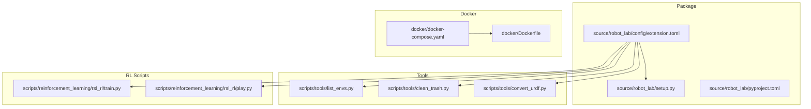
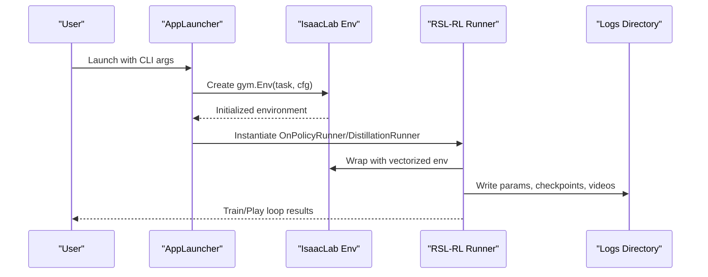
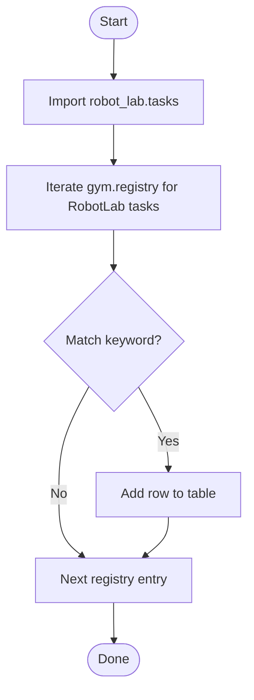
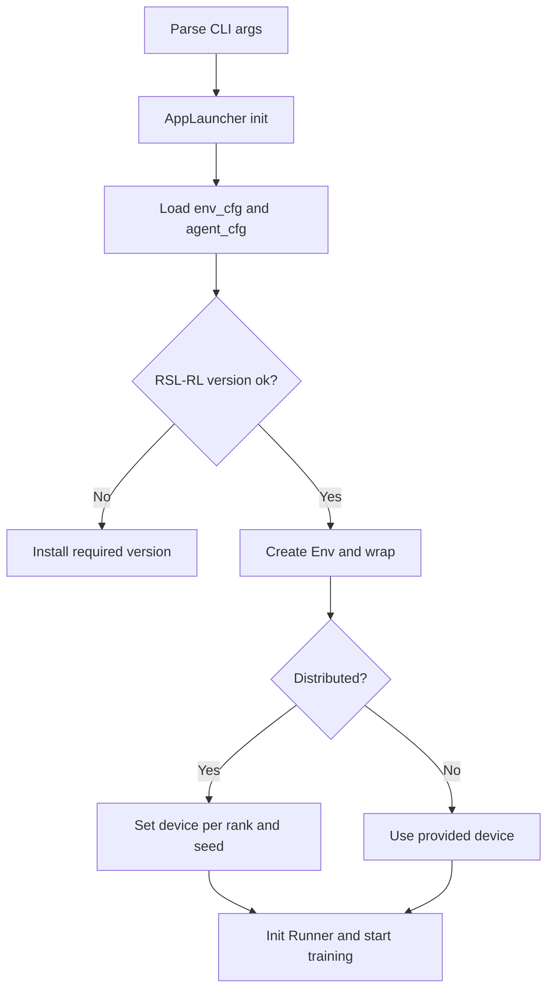
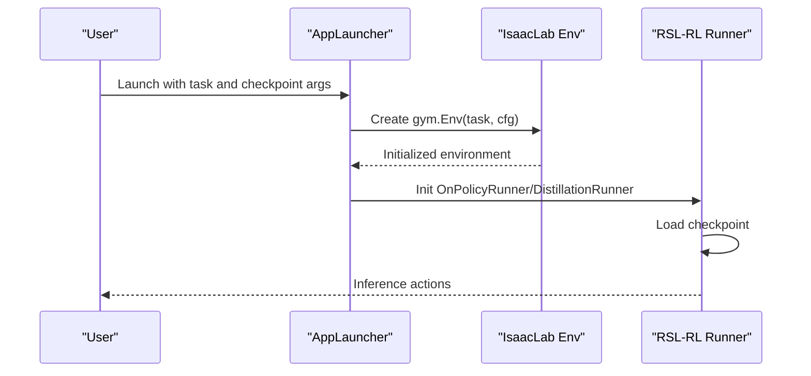
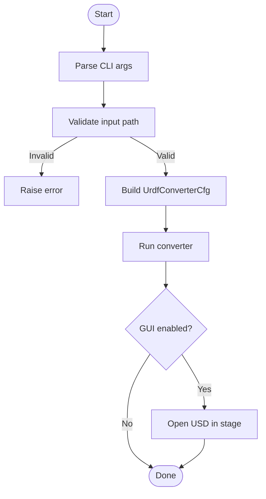
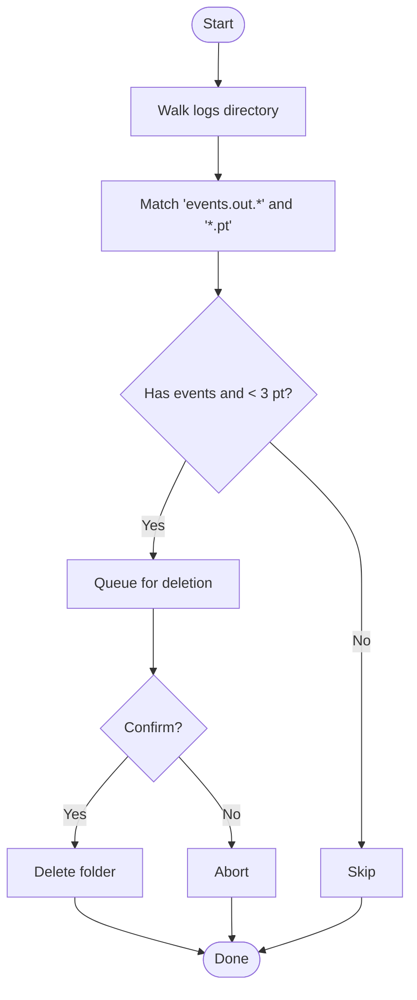
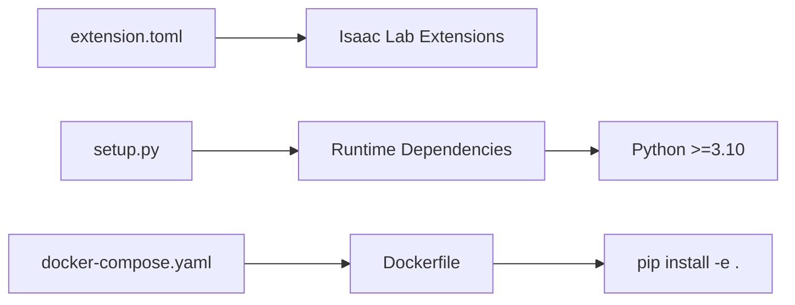

# Troubleshooting and FAQ

<cite>
**Referenced Files in This Document**
- [README.md](file://README.md)
- [CONTRIBUTORS.md](file://CONTRIBUTORS.md)
- [VERSION](file://VERSION)
- [source/robot_lab/config/extension.toml](file://source/robot_lab/config/extension.toml)
- [source/robot_lab/setup.py](file://source/robot_lab/setup.py)
- [source/robot_lab/pyproject.toml](file://source/robot_lab/pyproject.toml)
- [scripts/tools/list_envs.py](file://scripts/tools/list_envs.py)
- [scripts/tools/clean_trash.py](file://scripts/tools/clean_trash.py)
- [scripts/reinforcement_learning/rsl_rl/train.py](file://scripts/reinforcement_learning/rsl_rl/train.py)
- [scripts/reinforcement_learning/rsl_rl/play.py](file://scripts/reinforcement_learning/rsl_rl/play.py)
- [scripts/tools/convert_urdf.py](file://scripts/tools/convert_urdf.py)
- [docker/docker-compose.yaml](file://docker/docker-compose.yaml)
- [docker/Dockerfile](file://docker/Dockerfile)
</cite>

## Table of Contents
1. [Introduction](#introduction)
2. [Project Structure](#project-structure)
3. [Core Components](#core-components)
4. [Architecture Overview](#architecture-overview)
5. [Detailed Component Analysis](#detailed-component-analysis)
6. [Dependency Analysis](#dependency-analysis)
7. [Performance Considerations](#performance-considerations)
8. [Troubleshooting Guide](#troubleshooting-guide)
9. [Conclusion](#conclusion)
10. [Appendices](#appendices)

## Introduction
This Troubleshooting and FAQ section consolidates solutions, optimization tips, and debugging strategies for Robot Lab usage. It focuses on:
- Common IDE indexing issues (Pylance), USD cache cleanup, and environment validation failures
- Installation and setup problems (dependency conflicts, path configuration, version compatibility)
- Performance optimization (memory, GPU utilization, training efficiency)
- Debugging strategies (environment configuration, asset loading, training convergence)
- Cleanup procedures (temporary files, cache, system maintenance)
- Platform-specific guidance (Linux and Windows)
- Community resources, support channels, and contribution guidelines
- Benchmarking and scalability guidance for large-scale training

## Project Structure
Robot Lab is structured as an extension library for Isaac Lab with:
- A Python package definition and extension metadata
- Scripts for environment listing, training, playing, and asset conversion
- Docker configuration for containerized development and deployment
- Logs and outputs organized by task and timestamp

**Diagram sources**
- [source/robot_lab/config/extension.toml](file://source/robot_lab/config/extension.toml#L1-L36)
- [source/robot_lab/setup.py](file://source/robot_lab/setup.py#L1-L54)
- [source/robot_lab/pyproject.toml](file://source/robot_lab/pyproject.toml#L1-L4)
- [scripts/tools/list_envs.py](file://scripts/tools/list_envs.py#L1-L86)
- [scripts/tools/clean_trash.py](file://scripts/tools/clean_trash.py#L1-L63)
- [scripts/tools/convert_urdf.py](file://scripts/tools/convert_urdf.py#L1-L167)
- [scripts/reinforcement_learning/rsl_rl/train.py](file://scripts/reinforcement_learning/rsl_rl/train.py#L1-L200)
- [scripts/reinforcement_learning/rsl_rl/play.py](file://scripts/reinforcement_learning/rsl_rl/play.py#L1-L200)
- [docker/docker-compose.yaml](file://docker/docker-compose.yaml#L1-L37)
- [docker/Dockerfile](file://docker/Dockerfile#L1-L22)

**Section sources**
- [README.md](file://README.md#L1-L501)
- [source/robot_lab/config/extension.toml](file://source/robot_lab/config/extension.toml#L1-L36)
- [source/robot_lab/setup.py](file://source/robot_lab/setup.py#L1-L54)
- [docker/docker-compose.yaml](file://docker/docker-compose.yaml#L1-L37)
- [docker/Dockerfile](file://docker/Dockerfile#L1-L22)

## Core Components
- Environment discovery and listing: list_envs.py registers and enumerates environments via the Isaac Lab gym registry.
- Training and evaluation: train.py and play.py orchestrate environment creation, runner instantiation, and checkpoint loading.
- Asset conversion: convert_urdf.py converts URDF assets to USD for simulation.
- Cleanup utilities: clean_trash.py removes incomplete training runs based on log markers.
- Docker deployment: docker-compose.yaml and Dockerfile define GPU-enabled containerization and installation.

Key responsibilities:
- Environment registration and validation
- RL runner lifecycle (training/inference)
- Asset pipeline (URDF to USD)
- Log hygiene and cache management
- Containerized reproducibility

**Section sources**
- [scripts/tools/list_envs.py](file://scripts/tools/list_envs.py#L1-L86)
- [scripts/reinforcement_learning/rsl_rl/train.py](file://scripts/reinforcement_learning/rsl_rl/train.py#L1-L200)
- [scripts/reinforcement_learning/rsl_rl/play.py](file://scripts/reinforcement_learning/rsl_rl/play.py#L1-L200)
- [scripts/tools/convert_urdf.py](file://scripts/tools/convert_urdf.py#L1-L167)
- [scripts/tools/clean_trash.py](file://scripts/tools/clean_trash.py#L1-L63)
- [docker/docker-compose.yaml](file://docker/docker-compose.yaml#L1-L37)
- [docker/Dockerfile](file://docker/Dockerfile#L1-L22)

## Architecture Overview
The end-to-end flow for training and evaluation:

**Diagram sources**
- [scripts/reinforcement_learning/rsl_rl/train.py](file://scripts/reinforcement_learning/rsl_rl/train.py#L117-L200)
- [scripts/reinforcement_learning/rsl_rl/play.py](file://scripts/reinforcement_learning/rsl_rl/play.py#L94-L200)
- [README.md](file://README.md#L193-L348)

## Detailed Component Analysis

### Environment Listing and Validation
- Purpose: Enumerate all Robot Lab environments registered in the gym registry.
- Typical issues: Missing extension registration or incorrect task names.
- Resolution: Ensure the extension tasks module is imported and the environment name matches the registry.

**Diagram sources**
- [scripts/tools/list_envs.py](file://scripts/tools/list_envs.py#L42-L74)

**Section sources**
- [scripts/tools/list_envs.py](file://scripts/tools/list_envs.py#L1-L86)
- [README.md](file://README.md#L452-L472)

### Training Pipeline (RSL-RL)
- Purpose: Configure environment, runners, logging, and distributed execution.
- Key checks: RSL-RL version compatibility, device selection, distributed constraints.
- Common pitfalls: Using CPU with distributed training, insufficient GPU memory, incorrect task name.

**Diagram sources**
- [scripts/reinforcement_learning/rsl_rl/train.py](file://scripts/reinforcement_learning/rsl_rl/train.py#L57-L77)
- [scripts/reinforcement_learning/rsl_rl/train.py](file://scripts/reinforcement_learning/rsl_rl/train.py#L138-L147)
- [scripts/reinforcement_learning/rsl_rl/train.py](file://scripts/reinforcement_learning/rsl_rl/train.py#L171-L200)

**Section sources**
- [scripts/reinforcement_learning/rsl_rl/train.py](file://scripts/reinforcement_learning/rsl_rl/train.py#L1-L200)
- [README.md](file://README.md#L333-L347)

### Playback and Pretrained Checkpoints
- Purpose: Load checkpoints, optionally pretrained, and run inference with optional keyboard control.
- Key considerations: Disable randomization, adjust terrain complexity for memory, and select appropriate num_envs.

**Diagram sources**
- [scripts/reinforcement_learning/rsl_rl/play.py](file://scripts/reinforcement_learning/rsl_rl/play.py#L94-L200)

**Section sources**
- [scripts/reinforcement_learning/rsl_rl/play.py](file://scripts/reinforcement_learning/rsl_rl/play.py#L1-L200)
- [README.md](file://README.md#L209-L235)

### Asset Conversion (URDF to USD)
- Purpose: Convert URDF assets to USD for simulation using the URDF importer.
- Common issues: Invalid input path, missing GUI when previewing, incorrect joint drive settings.

**Diagram sources**
- [scripts/tools/convert_urdf.py](file://scripts/tools/convert_urdf.py#L95-L166)

**Section sources**
- [scripts/tools/convert_urdf.py](file://scripts/tools/convert_urdf.py#L1-L167)

### Cleanup Utilities
- Purpose: Remove incomplete training runs identified by log markers.
- Behavior: Deletes folders containing event logs but fewer than a threshold of model checkpoints.

**Diagram sources**
- [scripts/tools/clean_trash.py](file://scripts/tools/clean_trash.py#L9-L56)

**Section sources**
- [scripts/tools/clean_trash.py](file://scripts/tools/clean_trash.py#L1-L63)

## Dependency Analysis
- Extension metadata defines dependencies on core Isaac Lab extensions.
- Package setup declares runtime dependencies and Python version requirements.
- Docker composes a GPU-enabled image and installs the package in editable mode.

**Diagram sources**
- [source/robot_lab/config/extension.toml](file://source/robot_lab/config/extension.toml#L17-L22)
- [source/robot_lab/setup.py](file://source/robot_lab/setup.py#L16-L43)
- [docker/docker-compose.yaml](file://docker/docker-compose.yaml#L15-L37)
- [docker/Dockerfile](file://docker/Dockerfile#L14-L17)

**Section sources**
- [source/robot_lab/config/extension.toml](file://source/robot_lab/config/extension.toml#L1-L36)
- [source/robot_lab/setup.py](file://source/robot_lab/setup.py#L1-L54)
- [docker/docker-compose.yaml](file://docker/docker-compose.yaml#L1-L37)
- [docker/Dockerfile](file://docker/Dockerfile#L1-L22)

## Performance Considerations
- Memory management
  - Reduce terrain grid size during evaluation to lower memory footprint.
  - Limit number of environments for single-agent playback.
- GPU utilization optimization
  - Use distributed training with multiple GPUs or nodes for throughput scaling.
  - Ensure device selection aligns with hardware availability.
- Training efficiency improvements
  - Export IO descriptors when supported by manager-based environments.
  - Record videos selectively to avoid overhead.
  - Prefer flat terrains for faster warm-up and debugging.

[No sources needed since this section provides general guidance]

## Troubleshooting Guide

### Pylance Indexing Issues
Symptoms
- Missing symbols or unresolved references for extension modules in VS Code.

Solutions
- Add extension paths to Python extra paths in VS Code settings.
- Ensure the workspace includes the robot_lab source and related Isaac Lab extensions.

References
- [README.md](file://README.md#L452-L472)

**Section sources**
- [README.md](file://README.md#L452-L472)

### USD Cache Management
Symptoms
- Disk space consumption by temporary USD files generated during simulations.

Solutions
- Periodically clean USD cache directories.

References
- [README.md](file://README.md#L474-L480)

Cleanup procedure
- Remove temporary USD directories under the designated cache path.

**Section sources**
- [README.md](file://README.md#L474-L480)

### Environment Validation Failures
Symptoms
- Environments not listed or not found by name.

Solutions
- Verify environment registration by importing the tasks module and listing tasks.
- Ensure the task name matches the registry id.

References
- [scripts/tools/list_envs.py](file://scripts/tools/list_envs.py#L42-L74)
- [README.md](file://README.md#L74-L78)

**Section sources**
- [scripts/tools/list_envs.py](file://scripts/tools/list_envs.py#L1-L86)
- [README.md](file://README.md#L74-L78)

### Installation and Setup Problems

#### Dependency Conflicts
Symptoms
- Pip install failures or incompatible package versions.

Solutions
- Use the recommended Python version and install the package in editable mode from the source directory.
- Review declared runtime dependencies and resolve conflicts accordingly.

References
- [source/robot_lab/setup.py](file://source/robot_lab/setup.py#L16-L43)
- [source/robot_lab/pyproject.toml](file://source/robot_lab/pyproject.toml#L1-L4)

**Section sources**
- [source/robot_lab/setup.py](file://source/robot_lab/setup.py#L1-L54)
- [source/robot_lab/pyproject.toml](file://source/robot_lab/pyproject.toml#L1-L4)

#### Path Configuration Issues
Symptoms
- Scripts cannot locate assets or checkpoints.

Solutions
- Ensure absolute paths for inputs and outputs.
- Validate asset paths and checkpoint locations.

References
- [scripts/tools/convert_urdf.py](file://scripts/tools/convert_urdf.py#L96-L101)
- [scripts/reinforcement_learning/rsl_rl/play.py](file://scripts/reinforcement_learning/rsl_rl/play.py#L148-L151)

**Section sources**
- [scripts/tools/convert_urdf.py](file://scripts/tools/convert_urdf.py#L1-L167)
- [scripts/reinforcement_learning/rsl_rl/play.py](file://scripts/reinforcement_learning/rsl_rl/play.py#L1-L200)

#### Version Compatibility Problems
Symptoms
- RSL-RL version mismatch causing runtime errors.

Solutions
- Install the required RSL-RL version indicated by the training script.
- Use the provided commands to align versions.

References
- [scripts/reinforcement_learning/rsl_rl/train.py](file://scripts/reinforcement_learning/rsl_rl/train.py#L64-L76)
- [README.md](file://README.md#L48-L56)

**Section sources**
- [scripts/reinforcement_learning/rsl_rl/train.py](file://scripts/reinforcement_learning/rsl_rl/train.py#L1-L200)
- [README.md](file://README.md#L48-L56)

### Debugging Strategies

#### Environment Configuration Issues
- Disable randomization and curriculum during evaluation to stabilize behavior.
- Reduce terrain grid size to minimize memory pressure.

References
- [scripts/reinforcement_learning/rsl_rl/play.py](file://scripts/reinforcement_learning/rsl_rl/play.py#L109-L123)

**Section sources**
- [scripts/reinforcement_learning/rsl_rl/play.py](file://scripts/reinforcement_learning/rsl_rl/play.py#L1-L200)

#### Asset Loading Problems
- Validate URDF path and ensure the asset exists.
- Use the asset conversion utility to produce USD files.

References
- [scripts/tools/convert_urdf.py](file://scripts/tools/convert_urdf.py#L96-L101)
- [scripts/tools/convert_urdf.py](file://scripts/tools/convert_urdf.py#L133-L139)

**Section sources**
- [scripts/tools/convert_urdf.py](file://scripts/tools/convert_urdf.py#L1-L167)

#### Training Convergence Difficulties
- Reduce environment count and simplify terrain for initial debugging.
- Export IO descriptors for manager-based environments to inspect inputs/outputs.
- Record short videos to visually diagnose policy behavior.

References
- [scripts/reinforcement_learning/rsl_rl/train.py](file://scripts/reinforcement_learning/rsl_rl/train.py#L160-L166)
- [scripts/reinforcement_learning/rsl_rl/train.py](file://scripts/reinforcement_learning/rsl_rl/train.py#L182-L192)

**Section sources**
- [scripts/reinforcement_learning/rsl_rl/train.py](file://scripts/reinforcement_learning/rsl_rl/train.py#L1-L200)

### Cleanup Procedures

#### Temporary Files and Cache
- Remove temporary USD cache directories.
- Use the cleanup utility to remove incomplete training runs.

References
- [README.md](file://README.md#L474-L480)
- [scripts/tools/clean_trash.py](file://scripts/tools/clean_trash.py#L9-L56)

**Section sources**
- [README.md](file://README.md#L474-L480)
- [scripts/tools/clean_trash.py](file://scripts/tools/clean_trash.py#L1-L63)

#### System Maintenance
- Periodically review logs and remove outdated runs.
- Keep RSL-RL and Python versions aligned with project requirements.

[No sources needed since this section provides general guidance]

### Platform-Specific Issues

#### Linux
- Use conda-based Isaac Lab installation as recommended.
- Ensure GPU drivers and Docker runtime are properly configured for containerized workflows.

References
- [README.md](file://README.md#L60-L61)
- [docker/docker-compose.yaml](file://docker/docker-compose.yaml#L15-L37)

**Section sources**
- [README.md](file://README.md#L60-L61)
- [docker/docker-compose.yaml](file://docker/docker-compose.yaml#L1-L37)

#### Windows
- Align RSL-RL version using the provided commands printed by the training script.
- Verify Python interpreter path and environment variables.

References
- [scripts/reinforcement_learning/rsl_rl/train.py](file://scripts/reinforcement_learning/rsl_rl/train.py#L67-L75)

**Section sources**
- [scripts/reinforcement_learning/rsl_rl/train.py](file://scripts/reinforcement_learning/rsl_rl/train.py#L1-L200)

### Community Resources, Support Channels, and Contribution Guidelines
- Discussions and support channels are provided in the repository.
- Contributions follow standard open-source practices; see acknowledgments and contributor lists.

References
- [README.md](file://README.md#L46-L46)
- [CONTRIBUTORS.md](file://CONTRIBUTORS.md#L1-L31)

**Section sources**
- [README.md](file://README.md#L46-L46)
- [CONTRIBUTORS.md](file://CONTRIBUTORS.md#L1-L31)

### Performance Benchmarking and Scalability
- Benchmarking
  - Use the provided training scripts to measure throughput and convergence metrics.
  - Record videos and logs for post-hoc analysis.
- Scalability
  - Multi-GPU training is supported; ensure device selection and seeds are rank-aware.
  - Distributed training across nodes is documented with example commands.

References
- [README.md](file://README.md#L333-L347)
- [scripts/reinforcement_learning/rsl_rl/train.py](file://scripts/reinforcement_learning/rsl_rl/train.py#L138-L147)

**Section sources**
- [README.md](file://README.md#L333-L347)
- [scripts/reinforcement_learning/rsl_rl/train.py](file://scripts/reinforcement_learning/rsl_rl/train.py#L1-L200)

## Conclusion
This guide consolidates actionable steps to resolve common Robot Lab issues, optimize performance, and maintain a healthy development environment. By following the procedures outlined—covering IDE indexing, cache cleanup, environment validation, installation troubleshooting, debugging strategies, and scalability guidance—you can streamline your RL workflows across Linux and Windows platforms.

[No sources needed since this section summarizes without analyzing specific files]

## Appendices

### Quick Reference: Common Commands
- List environments: [scripts/tools/list_envs.py](file://scripts/tools/list_envs.py#L77-L85)
- Train with RSL-RL: [scripts/reinforcement_learning/rsl_rl/train.py](file://scripts/reinforcement_learning/rsl_rl/train.py#L200-L232)
- Play with RSL-RL: [scripts/reinforcement_learning/rsl_rl/play.py](file://scripts/reinforcement_learning/rsl_rl/play.py#L200-L254)
- Convert URDF to USD: [scripts/tools/convert_urdf.py](file://scripts/tools/convert_urdf.py#L162-L167)
- Clean incomplete runs: [scripts/tools/clean_trash.py](file://scripts/tools/clean_trash.py#L58-L63)
- Docker build and run: [docker/docker-compose.yaml](file://docker/docker-compose.yaml#L15-L37), [docker/Dockerfile](file://docker/Dockerfile#L14-L17)

**Section sources**
- [scripts/tools/list_envs.py](file://scripts/tools/list_envs.py#L1-L86)
- [scripts/reinforcement_learning/rsl_rl/train.py](file://scripts/reinforcement_learning/rsl_rl/train.py#L1-L200)
- [scripts/reinforcement_learning/rsl_rl/play.py](file://scripts/reinforcement_learning/rsl_rl/play.py#L1-L200)
- [scripts/tools/convert_urdf.py](file://scripts/tools/convert_urdf.py#L1-L167)
- [scripts/tools/clean_trash.py](file://scripts/tools/clean_trash.py#L1-L63)
- [docker/docker-compose.yaml](file://docker/docker-compose.yaml#L1-L37)
- [docker/Dockerfile](file://docker/Dockerfile#L1-L22)