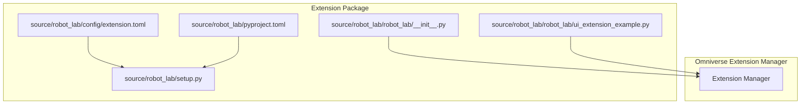
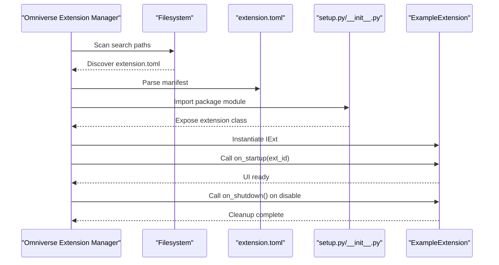
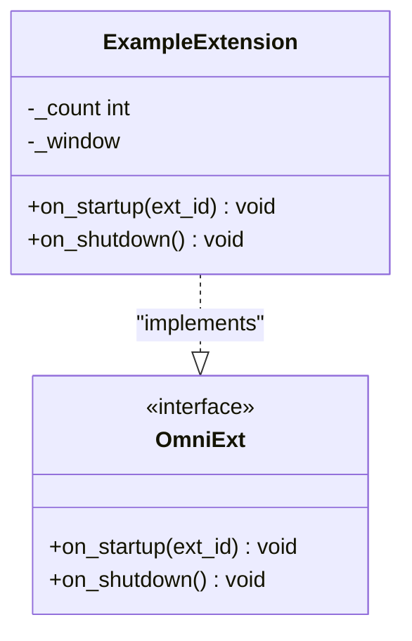
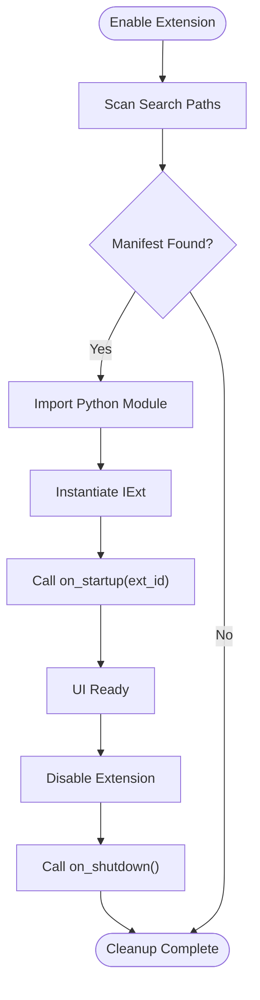
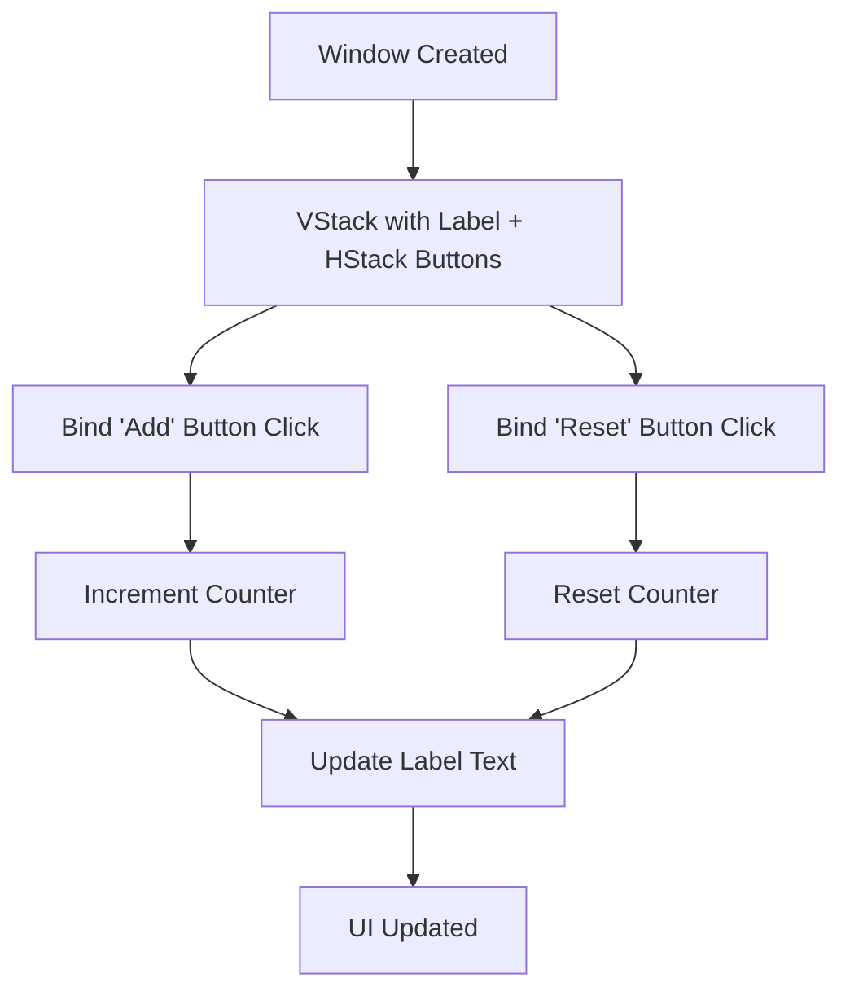
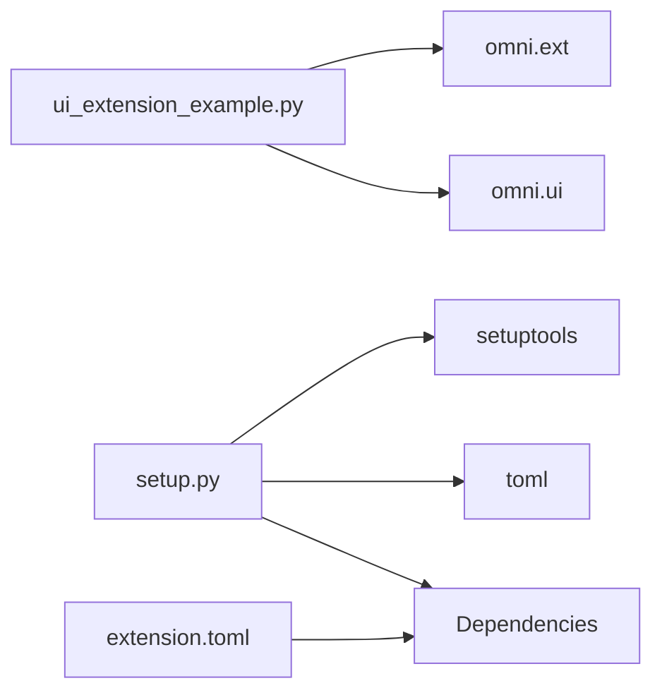

# UI Extension System

<cite>
**Referenced Files in This Document**
- [README.md](file://README.md)
- [extension.toml](file://source/robot_lab/config/extension.toml)
- [setup.py](file://source/robot_lab/setup.py)
- [pyproject.toml](file://source/robot_lab/pyproject.toml)
- [ui_extension_example.py](file://source/robot_lab/robot_lab/ui_extension_example.py)
- [__init__.py](file://source/robot_lab/robot_lab/__init__.py)
- [list_envs.py](file://scripts/tools/list_envs.py)
- [velocity_env_cfg.py](file://source/robot_lab/robot_lab/tasks/manager_based/locomotion/velocity/velocity_env_cfg.py)
</cite>

## Table of Contents
1. [Introduction](#introduction)
2. [Project Structure](#project-structure)
3. [Core Components](#core-components)
4. [Architecture Overview](#architecture-overview)
5. [Detailed Component Analysis](#detailed-component-analysis)
6. [Dependency Analysis](#dependency-analysis)
7. [Performance Considerations](#performance-considerations)
8. [Troubleshooting Guide](#troubleshooting-guide)
9. [Conclusion](#conclusion)
10. [Appendices](#appendices)

## Introduction
This document explains the UI extension system for integrating custom user interfaces into Omniverse and Isaac Lab environments. It covers the extension configuration model using extension.toml, the example UI extension implementation, and how extensions are discovered and loaded by the Omniverse extension manager. It also describes the extension lifecycle, UI component creation patterns, event handling, and practical guidance for developing, testing, debugging, and deploying UI extensions tailored to robot visualization, training monitoring, and interactive control.

## Project Structure
The UI extension system centers around a small example extension packaged as a Python package with an extension manifest. The key elements are:
- Extension manifest defining metadata, dependencies, and Python module entry
- Package setup that reads the manifest to configure installation and metadata
- A minimal UI extension example that creates a window and handles button clicks
- Registration hook that exposes the extension to Omniverse

**Diagram sources**
- [extension.toml](file://source/robot_lab/config/extension.toml#L1-L36)
- [setup.py](file://source/robot_lab/setup.py#L1-L54)
- [pyproject.toml](file://source/robot_lab/pyproject.toml#L1-L4)
- [ui_extension_example.py](file://source/robot_lab/robot_lab/ui_extension_example.py#L1-L49)
- [__init__.py](file://source/robot_lab/robot_lab/__init__.py#L1-L13)

**Section sources**
- [extension.toml](file://source/robot_lab/config/extension.toml#L1-L36)
- [setup.py](file://source/robot_lab/setup.py#L1-L54)
- [pyproject.toml](file://source/robot_lab/pyproject.toml#L1-L4)
- [ui_extension_example.py](file://source/robot_lab/robot_lab/ui_extension_example.py#L1-L49)
- [__init__.py](file://source/robot_lab/robot_lab/__init__.py#L1-L13)

## Core Components
- Extension manifest (extension.toml): Defines package metadata, dependencies, and the Python module that contains the extension entry point.
- Package setup (setup.py): Reads the manifest to populate package metadata and install_requires, and ensures the extension is discoverable.
- UI extension example (ui_extension_example.py): Implements an omni.ext.IExt-derived class with on_startup/on_shutdown hooks, creates a window, and wires simple button events.
- Registration hook (__init__.py): Exposes the extension to Omniverse by importing the extension class from the package’s init module.

Key responsibilities:
- Manifest defines discovery and dependency boundaries for the extension.
- Setup ensures correct packaging and metadata for installation and indexing.
- Example extension demonstrates lifecycle hooks, UI construction, and event handling.
- Registration hook integrates the extension into Omniverse’s extension loading pipeline.

**Section sources**
- [extension.toml](file://source/robot_lab/config/extension.toml#L1-L36)
- [setup.py](file://source/robot_lab/setup.py#L11-L43)
- [ui_extension_example.py](file://source/robot_lab/robot_lab/ui_extension_example.py#L18-L49)
- [__init__.py](file://source/robot_lab/robot_lab/__init__.py#L11-L12)

## Architecture Overview
The UI extension architecture follows Omniverse’s extension model:
- The extension manager scans configured search paths for extensions.
- The extension manifest declares the Python module entry point.
- The package’s init module registers the extension class so Omniverse can instantiate it.
- During enablement, Omniverse calls on_startup to initialize UI components.
- On disablement, on_shutdown is invoked to release resources.

**Diagram sources**
- [extension.toml](file://source/robot_lab/config/extension.toml#L25-L27)
- [setup.py](file://source/robot_lab/setup.py#L32-L33)
- [__init__.py](file://source/robot_lab/robot_lab/__init__.py#L11-L12)
- [ui_extension_example.py](file://source/robot_lab/robot_lab/ui_extension_example.py#L21-L49)

## Detailed Component Analysis

### Extension Configuration System (extension.toml)
The extension manifest defines:
- Package metadata (version, title, author, repository, keywords)
- Dependencies (Isaac Lab ecosystem packages)
- Python module entry point for the extension
- Optional settings for external dependencies

How it supports UI extensions:
- Declares the Python module that contains the extension class, enabling Omniverse to import and instantiate it.
- Provides dependency declarations to ensure runtime compatibility with Isaac Lab and related assets.

Practical implications:
- Keep versioning aligned with Isaac Lab releases.
- List any additional Python dependencies in install_requires via setup.py.
- Ensure the declared module path matches the package layout.

**Section sources**
- [extension.toml](file://source/robot_lab/config/extension.toml#L1-L36)
- [setup.py](file://source/robot_lab/setup.py#L17-L28)

### Package Setup and Metadata (setup.py)
The setup script:
- Loads the extension manifest to extract package metadata.
- Defines install_requires for runtime dependencies.
- Configures package name, version, author, and classifiers indicating supported Isaac Sim versions.

Integration with UI extensions:
- Ensures the extension package is installable and recognized by Python tooling.
- Enables proper indexing and discovery by IDEs and Omniverse.

**Section sources**
- [setup.py](file://source/robot_lab/setup.py#L11-L43)
- [pyproject.toml](file://source/robot_lab/pyproject.toml#L1-L4)

### UI Extension Example Implementation (ui_extension_example.py)
The example demonstrates:
- Lifecycle hooks: on_startup and on_shutdown
- UI construction: creating a window and laying out widgets
- Event handling: binding button clicks to handlers that mutate internal state and update labels

Key patterns:
- Use omni.ui.Window to create a top-level UI container.
- Compose UI with stacks and widgets; bind clicked_fn callbacks to handle user interactions.
- Manage state within the extension instance and update UI text dynamically.

**Diagram sources**
- [ui_extension_example.py](file://source/robot_lab/robot_lab/ui_extension_example.py#L21-L49)

**Section sources**
- [ui_extension_example.py](file://source/robot_lab/robot_lab/ui_extension_example.py#L18-L49)

### Extension Registration Hook (__init__.py)
The package init module:
- Imports the extension class from the package module.
- Exposes it so Omniverse can discover and instantiate it when the extension is enabled.

Impact:
- Without this import, the extension would not be visible to Omniverse even if the manifest and setup are correct.

**Section sources**
- [__init__.py](file://source/robot_lab/robot_lab/__init__.py#L11-L12)

### Omniverse Extension Manager Integration and Lifecycle
The README outlines the steps to add the repository path to the extension manager and enable the extension. The lifecycle is controlled by Omniverse:
- Discovery: The extension manager scans configured search paths for manifests.
- Enable: Omniverse imports the declared module and instantiates the IExt-derived class, invoking on_startup.
- Disable: Omniverse invokes on_shutdown to release resources.

**Diagram sources**
- [README.md](file://README.md#L96-L111)
- [ui_extension_example.py](file://source/robot_lab/robot_lab/ui_extension_example.py#L24-L49)

**Section sources**
- [README.md](file://README.md#L96-L111)
- [ui_extension_example.py](file://source/robot_lab/robot_lab/ui_extension_example.py#L24-L49)

### UI Extension Architecture: Widgets, Events, and State
The example extension illustrates:
- Widget creation: A window containing a vertical stack with a label and horizontal buttons.
- Event propagation: Button clicks trigger handler functions that update internal state and refresh the label.
- State management: The extension maintains a counter and resets it on demand.

**Diagram sources**
- [ui_extension_example.py](file://source/robot_lab/robot_lab/ui_extension_example.py#L29-L47)

**Section sources**
- [ui_extension_example.py](file://source/robot_lab/robot_lab/ui_extension_example.py#L29-L47)

### Integration with Robot Lab Environments
While the UI extension example is standalone, Robot Lab environments are registered via the tasks module and environment configuration classes. The extension system can complement these environments by providing:
- Visualization overlays or control panels integrated into the Omniverse UI
- Monitoring panels that display metrics from training sessions
- Interactive controls to influence simulation parameters or agent behaviors

Registration and discovery:
- Environments are registered through the tasks module and Gym registry.
- The list_envs tool enumerates available environments, demonstrating how extensions and environments are exposed to users.

**Section sources**
- [list_envs.py](file://scripts/tools/list_envs.py#L42-L74)
- [velocity_env_cfg.py](file://source/robot_lab/robot_lab/tasks/manager_based/locomotion/velocity/velocity_env_cfg.py#L42-L95)

## Dependency Analysis
The extension depends on:
- Omniverse extension APIs (omni.ext, omni.ui)
- Python packaging and configuration (setuptools, toml)
- Optional runtime dependencies declared in setup.py

**Diagram sources**
- [ui_extension_example.py](file://source/robot_lab/robot_lab/ui_extension_example.py#L9-L10)
- [setup.py](file://source/robot_lab/setup.py#L17-L28)
- [extension.toml](file://source/robot_lab/config/extension.toml#L17-L23)

**Section sources**
- [ui_extension_example.py](file://source/robot_lab/robot_lab/ui_extension_example.py#L9-L10)
- [setup.py](file://source/robot_lab/setup.py#L17-L28)
- [extension.toml](file://source/robot_lab/config/extension.toml#L17-L23)

## Performance Considerations
- Keep UI updates minimal and batched to avoid frequent redraws.
- Avoid heavy computations in event handlers; defer to background threads if needed.
- Reuse UI components and avoid recreating windows frequently.
- Monitor memory usage of persistent state and clear references in on_shutdown.

## Troubleshooting Guide
Common issues and resolutions:
- Extension not visible in the extension manager:
  - Ensure the repository path is added to Extension Search Paths and the manager is refreshed.
  - Confirm the manifest is valid and the Python module path matches the package structure.
- UI not appearing after enabling:
  - Verify on_startup is reached by checking logs printed from the extension.
  - Confirm the extension class is imported in the package init module.
- Lifecycle cleanup:
  - Implement on_shutdown to release resources and avoid dangling references.

**Section sources**
- [README.md](file://README.md#L96-L111)
- [ui_extension_example.py](file://source/robot_lab/robot_lab/ui_extension_example.py#L24-L49)

## Conclusion
The UI extension system leverages Omniverse’s extension model and a simple example to demonstrate how to build interactive UIs for Robot Lab environments. By defining a manifest, packaging the extension correctly, exposing an IExt-derived class, and wiring UI components and events, developers can create custom visualization panels, monitoring dashboards, and interactive controls. Following the lifecycle and dependency patterns outlined here enables robust, maintainable UI extensions that integrate seamlessly with Omniverse and Isaac Lab.

## Appendices

### Extension Development Workflow
- Author the extension class and UI components in the designated Python module.
- Define metadata and dependencies in the manifest and setup script.
- Register the extension class in the package init module.
- Test locally by enabling the extension in the extension manager.
- Debug by inspecting logs and verifying lifecycle hooks.
- Package and distribute the extension for broader use.

**Section sources**
- [extension.toml](file://source/robot_lab/config/extension.toml#L1-L36)
- [setup.py](file://source/robot_lab/setup.py#L11-L43)
- [__init__.py](file://source/robot_lab/robot_lab/__init__.py#L11-L12)
- [README.md](file://README.md#L96-L111)