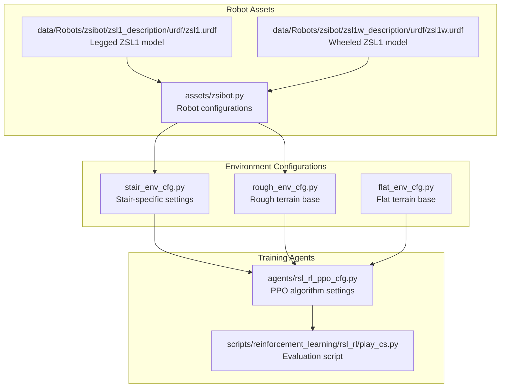
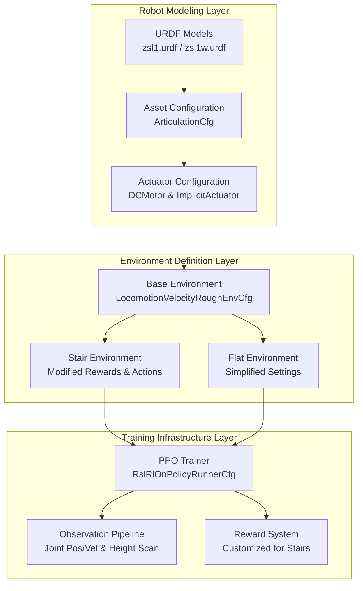
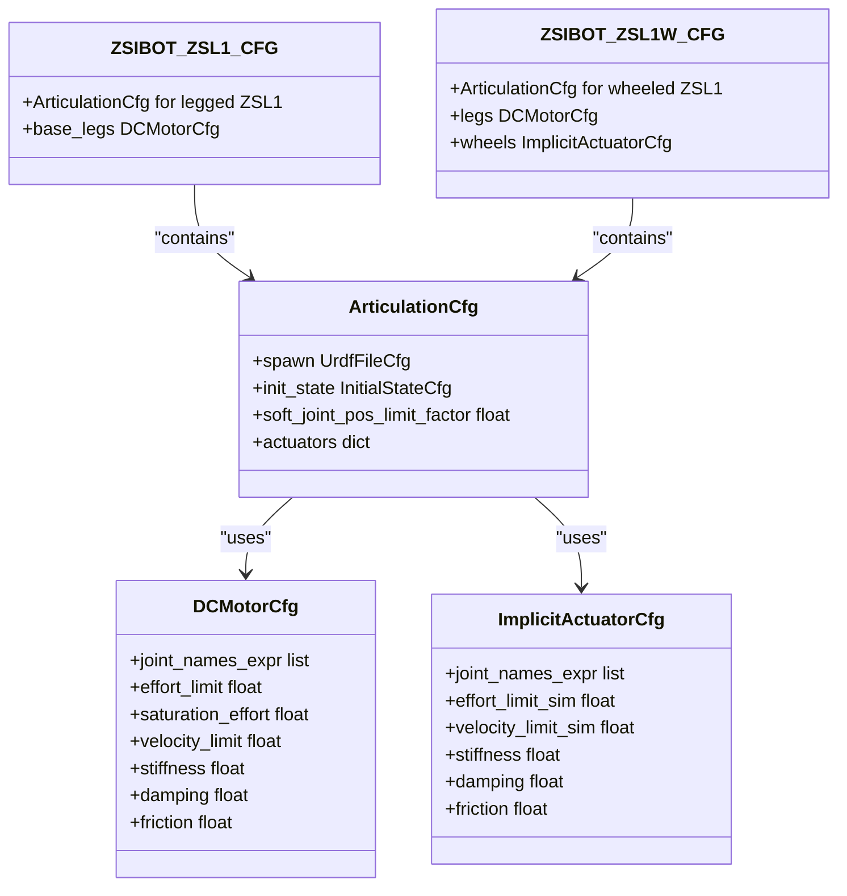
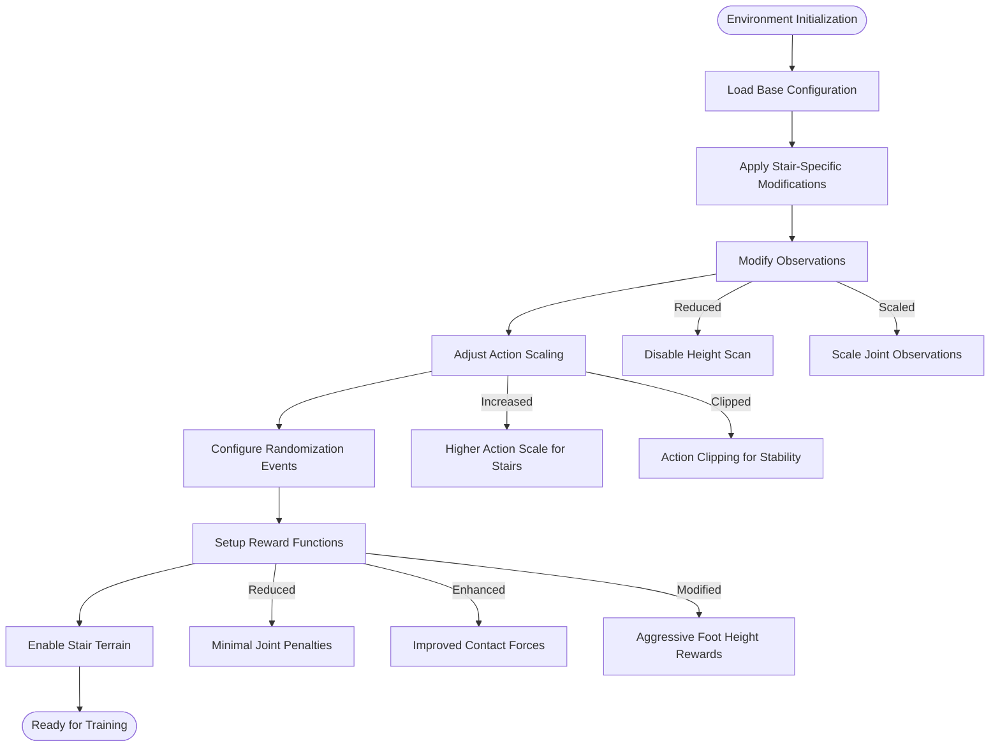
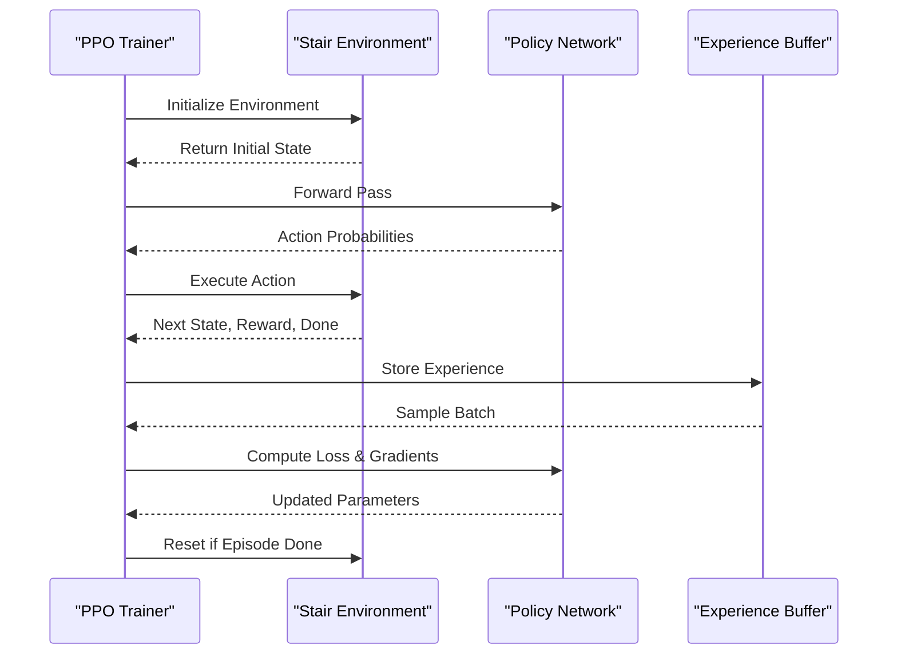
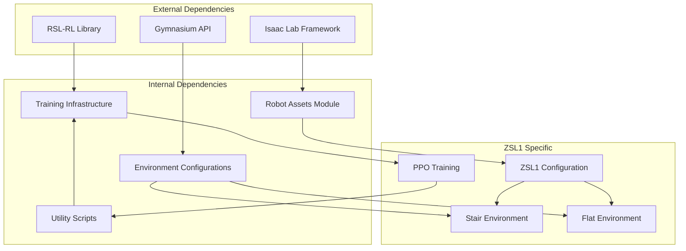

# ZSIBOT ZSL1 Stair Climbing Configuration

<cite>
**Referenced Files in This Document**
- [README.md](file://README.md)
- [zsibot.py](file://source/robot_lab/robot_lab/assets/zsibot.py)
- [stair_env_cfg.py](file://source/robot_lab/robot_lab/tasks/manager_based/locomotion/velocity/config/quadruped/zsibot_zsl1/stair_env_cfg.py)
- [rough_env_cfg.py](file://source/robot_lab/robot_lab/tasks/manager_based/locomotion/velocity/config/quadruped/zsibot_zsl1/rough_env_cfg.py)
- [flat_env_cfg.py](file://source/robot_lab/robot_lab/tasks/manager_based/locomotion/velocity/config/quadruped/zsibot_zsl1/flat_env_cfg.py)
- [rsl_rl_ppo_cfg.py](file://source/robot_lab/robot_lab/tasks/manager_based/locomotion/velocity/config/quadruped/zsibot_zsl1/agents/rsl_rl_ppo_cfg.py)
- [play_cs.py](file://scripts/reinforcement_learning/rsl_rl/play_cs.py)
- [zsl1.urdf](file://source/robot_lab/data/Robots/zsibot/zsl1_description/urdf/zsl1.urdf)
- [zsl1w.urdf](file://source/robot_lab/data/Robots/zsibot/zsl1w_description/urdf/zsl1w.urdf)
</cite>

## Table of Contents
1. [Introduction](#introduction)
2. [Project Structure](#project-structure)
3. [Core Components](#core-components)
4. [Architecture Overview](#architecture-overview)
5. [Detailed Component Analysis](#detailed-component-analysis)
6. [Dependency Analysis](#dependency-analysis)
7. [Performance Considerations](#performance-considerations)
8. [Troubleshooting Guide](#troubleshooting-guide)
9. [Conclusion](#conclusion)

## Introduction
This document provides a comprehensive analysis of the ZSIBOT ZSL1 Stair Climbing Configuration within the robot_lab repository. The ZSL1 is a quadruped robot designed for stair navigation, featuring articulated legs and optional wheel attachments for enhanced mobility. The configuration leverages Isaac Lab's reinforcement learning framework to enable stair climbing capabilities through carefully tuned environment settings, reward functions, and actuator configurations.

The repository integrates the ZSL1 robot model with RSL-RL training and evaluation pipelines, providing both flat and rough terrain variants, with specialized stair-climbing configurations optimized for step negotiation and stability.

**Section sources**
- [README.md:1-512](file://README.md#L1-L512)

## Project Structure
The ZSL1 stair climbing configuration is organized within the robot_lab extension, following a modular structure that separates robot assets, environment configurations, and training agents:

**Diagram sources**
- [zsibot.py:1-115](file://source/robot_lab/robot_lab/assets/zsibot.py#L1-L115)
- [stair_env_cfg.py:1-219](file://source/robot_lab/robot_lab/tasks/manager_based/locomotion/velocity/config/quadruped/zsibot_zsl1/stair_env_cfg.py#L1-L219)
- [rough_env_cfg.py:1-188](file://source/robot_lab/robot_lab/tasks/manager_based/locomotion/velocity/config/quadruped/zsibot_zsl1/rough_env_cfg.py#L1-L188)
- [flat_env_cfg.py:1-30](file://source/robot_lab/robot_lab/tasks/manager_based/locomotion/velocity/config/quadruped/zsibot_zsl1/flat_env_cfg.py#L1-L30)
- [rsl_rl_ppo_cfg.py:1-74](file://source/robot_lab/robot_lab/tasks/manager_based/locomotion/velocity/config/quadruped/zsibot_zsl1/agents/rsl_rl_ppo_cfg.py#L1-L74)

**Section sources**
- [README.md:360-411](file://README.md#L360-L411)

## Core Components
The ZSL1 stair climbing configuration consists of several interconnected components that work together to enable effective stair navigation:

### Robot Configuration
The robot configuration defines the physical properties, actuator specifications, and initial conditions for the ZSL1:

- **Articulation Configuration**: Defines the robot as an articulated body with collision detection and contact sensors
- **Actuator Setup**: Includes DCMotorCfg for leg joints and ImplicitActuatorCfg for wheel joints
- **Initial State**: Sets default joint positions and velocities for stable starting conditions
- **Joint Limits**: Specifies effort and velocity limits based on motor specifications

### Environment Configurations
Three primary environment configurations provide different training scenarios:

- **Stair Environment**: Specialized for step negotiation with modified reward functions
- **Rough Terrain**: Base configuration for general quadruped locomotion
- **Flat Terrain**: Simplified environment for baseline performance testing

### Training Pipeline
The reinforcement learning pipeline utilizes PPO (Proximal Policy Optimization) with custom hyperparameters optimized for stair climbing:

- **Policy Network**: Multi-layer perceptron with ELU activation
- **Hyperparameters**: Carefully tuned learning rates, entropy coefficients, and gradient clipping
- **Training Iterations**: Configured for efficient convergence on stair climbing tasks

**Section sources**
- [zsibot.py:14-115](file://source/robot_lab/robot_lab/assets/zsibot.py#L14-L115)
- [stair_env_cfg.py:50-219](file://source/robot_lab/robot_lab/tasks/manager_based/locomotion/velocity/config/quadruped/zsibot_zsl1/stair_env_cfg.py#L50-L219)
- [rough_env_cfg.py:16-188](file://source/robot_lab/robot_lab/tasks/manager_based/locomotion/velocity/config/quadruped/zsibot_zsl1/rough_env_cfg.py#L16-L188)
- [rsl_rl_ppo_cfg.py:9-74](file://source/robot_lab/robot_lab/tasks/manager_based/locomotion/velocity/config/quadruped/zsibot_zsl1/agents/rsl_rl_ppo_cfg.py#L9-L74)

## Architecture Overview
The ZSL1 stair climbing system follows a layered architecture that separates concerns between robot modeling, environment definition, and reinforcement learning:

**Diagram sources**
- [zsl1.urdf:1-951](file://source/robot_lab/data/Robots/zsibot/zsl1_description/urdf/zsl1.urdf#L1-L951)
- [zsl1w.urdf:1-959](file://source/robot_lab/data/Robots/zsibot/zsl1w_description/urdf/zsl1w.urdf#L1-L959)
- [zsibot.py:14-115](file://source/robot_lab/robot_lab/assets/zsibot.py#L14-L115)
- [stair_env_cfg.py:50-219](file://source/robot_lab/robot_lab/tasks/manager_based/locomotion/velocity/config/quadruped/zsibot_zsl1/stair_env_cfg.py#L50-L219)

## Detailed Component Analysis

### Robot Configuration Analysis
The ZSL1 robot configuration establishes the foundation for stair climbing capabilities through careful engineering of physical properties and actuator characteristics:

**Diagram sources**
- [zsibot.py:14-115](file://source/robot_lab/robot_lab/assets/zsibot.py#L14-L115)

The configuration demonstrates several key design decisions for stair climbing:

- **Joint Specifications**: Leg joints utilize DCMotorCfg with torque limits of 28 N⋅m, providing sufficient power for step negotiation
- **Wheel Actuation**: Wheeled variant includes ImplicitActuatorCfg for smooth rolling motion
- **Initial Positioning**: Conservative joint angles (hip at 0.8 rad, knee at -1.5 rad) ensure stability during training
- **Contact Sensing**: Enabled contact sensors improve foothold detection and stability feedback

**Section sources**
- [zsibot.py:14-115](file://source/robot_lab/robot_lab/assets/zsibot.py#L14-L115)

### Environment Configuration Analysis
The stair climbing environment builds upon the base locomotion configuration with specialized modifications:

**Diagram sources**
- [stair_env_cfg.py:75-219](file://source/robot_lab/robot_lab/tasks/manager_based/locomotion/velocity/config/quadruped/zsibot_zsl1/stair_env_cfg.py#L75-L219)

Key environmental modifications for stair climbing include:

- **Observation Space**: Reduced dimensionality by disabling height scanning to focus computational resources on essential locomotion signals
- **Action Scaling**: Increased scaling factors for stair-specific joint groups to enable powerful climbing motions
- **Reward Function**: Enhanced contact force rewards and modified foot height targets to encourage proper stair negotiation
- **Terrain Generation**: Custom stair terrain configuration with controlled step heights and widths

**Section sources**
- [stair_env_cfg.py:50-219](file://source/robot_lab/robot_lab/tasks/manager_based/locomotion/velocity/config/quadruped/zsibot_zsl1/stair_env_cfg.py#L50-L219)

### Training Configuration Analysis
The reinforcement learning configuration employs PPO with hyperparameters optimized for stair climbing performance:

**Diagram sources**
- [rsl_rl_ppo_cfg.py:9-74](file://source/robot_lab/robot_lab/tasks/manager_based/locomotion/velocity/config/quadruped/zsibot_zsl1/agents/rsl_rl_ppo_cfg.py#L9-L74)

The training configuration emphasizes:

- **Network Architecture**: Multi-layer perceptrons with 512-256-128 hidden units and ELU activation for nonlinear policy representation
- **Learning Parameters**: Adaptive learning rate scheduling with entropy regularization to balance exploration and exploitation
- **Optimization**: Gradient clipping and mini-batch training for stable convergence on challenging stair tasks

**Section sources**
- [rsl_rl_ppo_cfg.py:9-74](file://source/robot_lab/robot_lab/tasks/manager_based/locomotion/velocity/config/quadruped/zsibot_zsl1/agents/rsl_rl_ppo_cfg.py#L9-L74)

## Dependency Analysis
The ZSL1 stair climbing configuration exhibits a well-structured dependency hierarchy that enables modular development and testing:

**Diagram sources**
- [README.md:360-411](file://README.md#L360-L411)
- [stair_env_cfg.py:13-13](file://source/robot_lab/robot_lab/tasks/manager_based/locomotion/velocity/config/quadruped/zsibot_zsl1/stair_env_cfg.py#L13-L13)

The dependency structure supports:

- **Modular Design**: Clear separation between robot modeling, environment configuration, and training infrastructure
- **Extensibility**: Easy addition of new robots or environments through consistent configuration patterns
- **Maintainability**: Well-defined interfaces between components facilitate debugging and updates

**Section sources**
- [README.md:360-411](file://README.md#L360-L411)

## Performance Considerations
Several factors influence the performance of ZSL1 stair climbing:

### Computational Efficiency
- **Observation Reduction**: Disabling height scanning reduces computational overhead during training
- **Action Clipping**: Prevents excessive joint velocities that could destabilize stair negotiation
- **Memory Management**: Optimized experience buffer sizing for efficient training cycles

### Training Stability
- **Reward Engineering**: Balanced reward functions prevent overfitting to specific stair configurations
- **Randomization**: Controlled environmental randomization improves generalization across different stair types
- **Convergence Monitoring**: Regular evaluation metrics track progress toward stair climbing objectives

### Hardware Considerations
- **Actuator Limits**: Respect motor torque and velocity limits to prevent damage during aggressive stair climbing
- **Safety Margins**: Conservative joint position limits protect hardware during training
- **Power Management**: Efficient motor control reduces heat generation and power consumption

## Troubleshooting Guide
Common issues and solutions for ZSL1 stair climbing configuration:

### Training Issues
- **Poor Convergence**: Verify reward function balance and ensure adequate exploration through entropy regularization
- **Instability**: Check action clipping parameters and reduce learning rate if oscillations occur
- **Slow Learning**: Confirm proper randomization settings and sufficient training iterations

### Simulation Problems
- **Contact Detection**: Enable contact sensors and verify collision geometry for accurate foothold detection
- **Joint Limits**: Monitor joint position and velocity limits to prevent violations
- **Terrain Generation**: Validate stair terrain parameters and ensure proper mesh generation

### Hardware Safety
- **Torque Limits**: Monitor actuator efforts to prevent exceeding motor specifications
- **Temperature Monitoring**: Track motor temperatures during intensive stair climbing training
- **Mechanical Integrity**: Regular inspection of links and joints for wear during repetitive stair negotiation

**Section sources**
- [stair_env_cfg.py:118-219](file://source/robot_lab/robot_lab/tasks/manager_based/locomotion/velocity/config/quadruped/zsibot_zsl1/stair_env_cfg.py#L118-L219)
- [zsibot.py:47-115](file://source/robot_lab/robot_lab/assets/zsibot.py#L47-L115)

## Conclusion
The ZSIBOT ZSL1 Stair Climbing Configuration represents a comprehensive approach to quadruped stair navigation within the Isaac Lab framework. Through careful engineering of robot dynamics, environment design, and reinforcement learning parameters, the system achieves robust stair climbing capabilities while maintaining training efficiency and safety.

The modular architecture enables easy adaptation for different stair configurations and robot variants, while the well-tuned reward functions and actuator specifications provide the foundation for successful stair negotiation. Future enhancements could include dynamic stair height adjustment, multi-modal terrain adaptation, and advanced gait pattern learning for improved stair climbing performance.