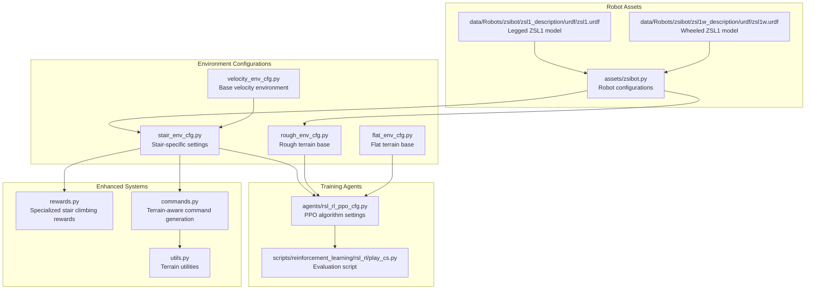
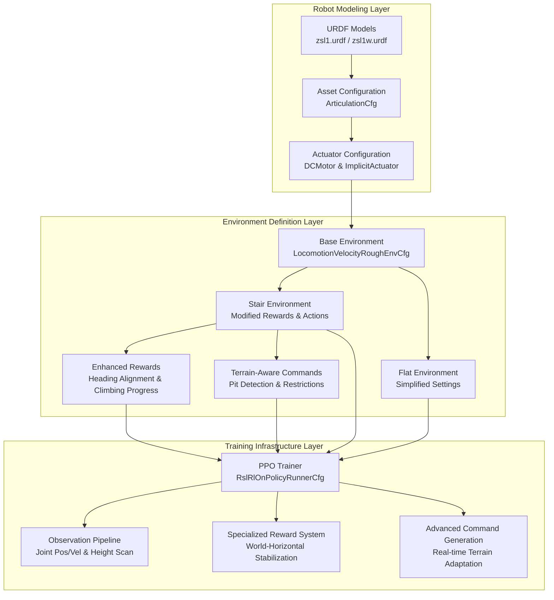
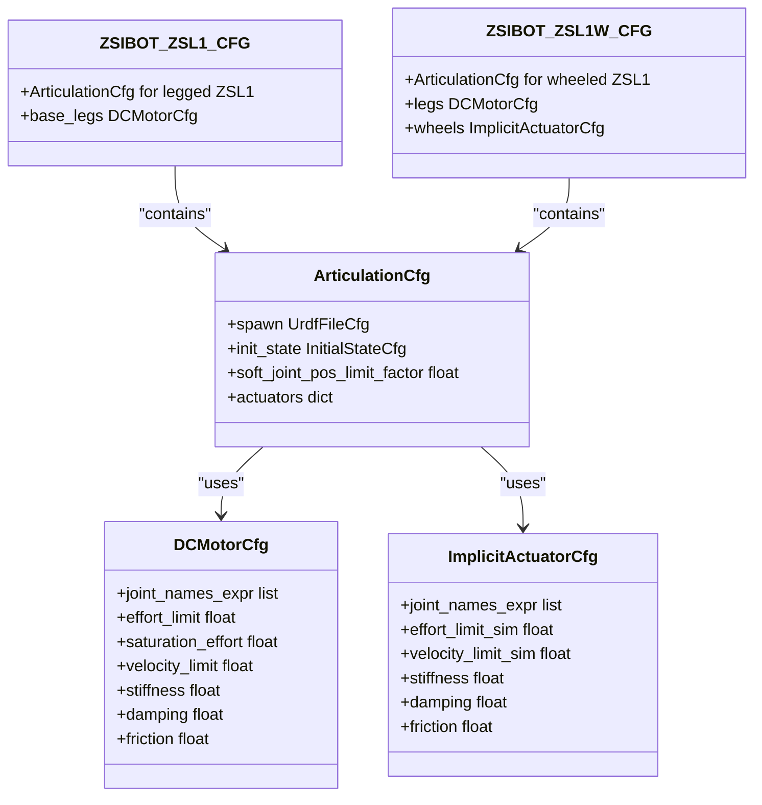
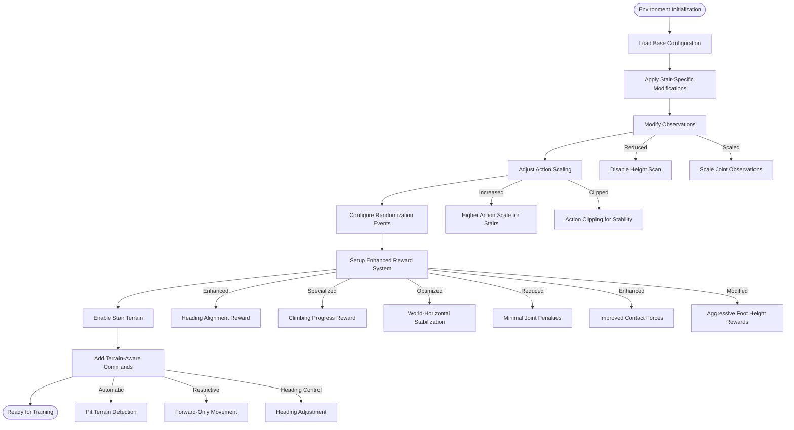
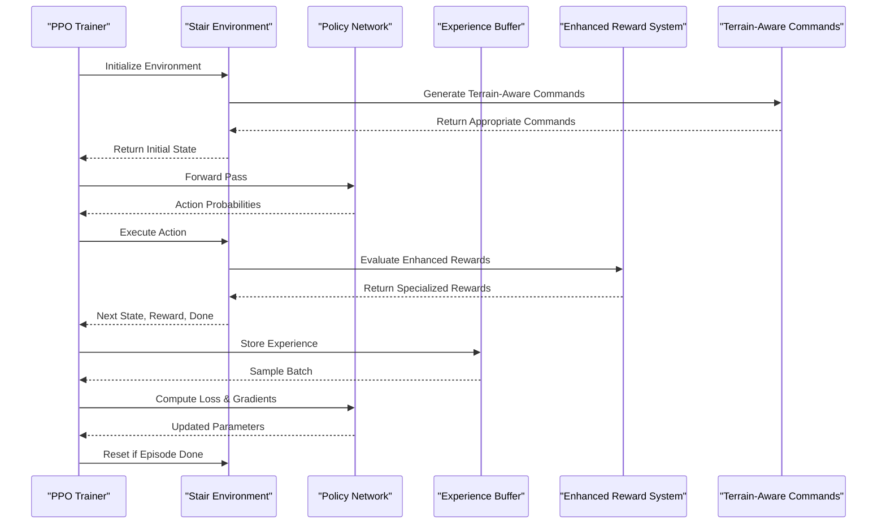
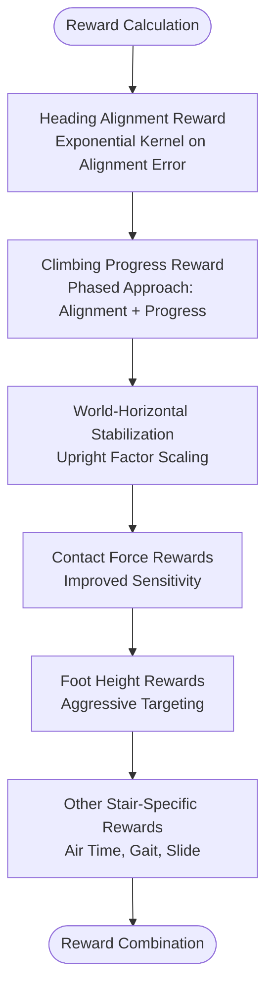
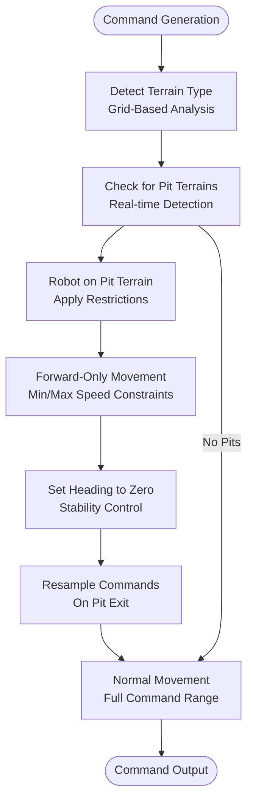
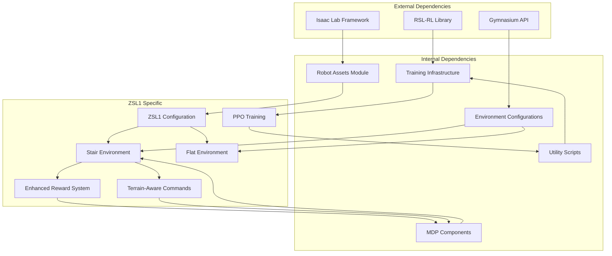

# ZSIBOT ZSL1 Stair Climbing Configuration

<cite>
**Referenced Files in This Document**
- [README.md](file://README.md)
- [zsibot.py](file://source/robot_lab/robot_lab/assets/zsibot.py)
- [stair_env_cfg.py](file://source/robot_lab/robot_lab/tasks/manager_based/locomotion/velocity/config/quadruped/zsibot_zsl1/stair_env_cfg.py)
- [rough_env_cfg.py](file://source/robot_lab/robot_lab/tasks/manager_based/locomotion/velocity/config/quadruped/zsibot_zsl1/rough_env_cfg.py)
- [flat_env_cfg.py](file://source/robot_lab/robot_lab/tasks/manager_based/locomotion/velocity/config/quadruped/zsibot_zsl1/flat_env_cfg.py)
- [rsl_rl_ppo_cfg.py](file://source/robot_lab/robot_lab/tasks/manager_based/locomotion/velocity/config/quadruped/zsibot_zsl1/agents/rsl_rl_ppo_cfg.py)
- [play_cs.py](file://scripts/reinforcement_learning/rsl_rl/play_cs.py)
- [zsl1.urdf](file://source/robot_lab/data/Robots/zsibot/zsl1_description/urdf/zsl1.urdf)
- [zsl1w.urdf](file://source/robot_lab/data/Robots/zsibot/zsl1w_description/urdf/zsl1w.urdf)
- [rewards.py](file://source/robot_lab/robot_lab/tasks/manager_based/locomotion/velocity/mdp/rewards.py)
- [commands.py](file://source/robot_lab/robot_lab/tasks/manager_based/locomotion/velocity/mdp/commands.py)
- [velocity_env_cfg.py](file://source/robot_lab/robot_lab/tasks/manager_based/locomotion/velocity/velocity_env_cfg.py)
- [utils.py](file://source/robot_lab/robot_lab/tasks/manager_based/locomotion/velocity/mdp/utils.py)
</cite>

## Update Summary
**Changes Made**
- Enhanced stair climbing configuration with specialized reward system including heading alignment and climbing progress rewards
- Added advanced terrain-aware command generation with automatic pit detection and restrictions
- Implemented world-horizontal velocity stabilization through optimized reward weighting
- Removed experimental reward system and temporary debug features that were previously documented

## Table of Contents
1. [Introduction](#introduction)
2. [Project Structure](#project-structure)
3. [Core Components](#core-components)
4. [Architecture Overview](#architecture-overview)
5. [Detailed Component Analysis](#detailed-component-analysis)
6. [Enhanced Stair Climbing Features](#enhanced-stair-climbing-features)
7. [Dependency Analysis](#dependency-analysis)
8. [Performance Considerations](#performance-considerations)
9. [Troubleshooting Guide](#troubleshooting-guide)
10. [Conclusion](#conclusion)

## Introduction
This document provides a comprehensive analysis of the ZSIBOT ZSL1 Stair Climbing Configuration within the robot_lab repository. The ZSL1 is a quadruped robot designed for stair navigation, featuring articulated legs and optional wheel attachments for enhanced mobility. The configuration leverages Isaac Lab's reinforcement learning framework to enable stair climbing capabilities through carefully tuned environment settings, reward functions, and actuator configurations.

The repository integrates the ZSL1 robot model with RSL-RL training and evaluation pipelines, providing both flat and rough terrain variants, with specialized stair-climbing configurations optimized for step negotiation and stability. Recent enhancements include world-horizontal velocity stabilization, advanced terrain-aware command generation, and a specialized reward system designed specifically for stair climbing performance.

**Section sources**
- [README.md:1-512](file://README.md#L1-L512)

## Project Structure
The ZSL1 stair climbing configuration is organized within the robot_lab extension, following a modular structure that separates robot assets, environment configurations, and training agents:

**Diagram sources**
- [zsibot.py:1-115](file://source/robot_lab/robot_lab/assets/zsibot.py#L1-L115)
- [stair_env_cfg.py:1-231](file://source/robot_lab/robot_lab/tasks/manager_based/locomotion/velocity/config/quadruped/zsibot_zsl1/stair_env_cfg.py#L1-L231)
- [rough_env_cfg.py:1-188](file://source/robot_lab/robot_lab/tasks/manager_based/locomotion/velocity/config/quadruped/zsibot_zsl1/rough_env_cfg.py#L1-L188)
- [flat_env_cfg.py:1-30](file://source/robot_lab/robot_lab/tasks/manager_based/locomotion/velocity/config/quadruped/zsibot_zsl1/flat_env_cfg.py#L1-L30)
- [rsl_rl_ppo_cfg.py:1-75](file://source/robot_lab/robot_lab/tasks/manager_based/locomotion/velocity/config/quadruped/zsibot_zsl1/agents/rsl_rl_ppo_cfg.py#L1-L75)
- [rewards.py:616-732](file://source/robot_lab/robot_lab/tasks/manager_based/locomotion/velocity/mdp/rewards.py#L616-L732)
- [commands.py:31-98](file://source/robot_lab/robot_lab/tasks/manager_based/locomotion/velocity/mdp/commands.py#L31-L98)

**Section sources**
- [README.md:360-411](file://README.md#L360-L411)

## Core Components
The ZSL1 stair climbing configuration consists of several interconnected components that work together to enable effective stair navigation:

### Robot Configuration
The robot configuration defines the physical properties, actuator specifications, and initial conditions for the ZSL1:

- **Articulation Configuration**: Defines the robot as an articulated body with collision detection and contact sensors
- **Actuator Setup**: Includes DCMotorCfg for leg joints and ImplicitActuatorCfg for wheel joints
- **Initial State**: Sets default joint positions and velocities for stable starting conditions
- **Joint Limits**: Specifies effort and velocity limits based on motor specifications

### Environment Configurations
Three primary environment configurations provide different training scenarios:

- **Stair Environment**: Specialized for step negotiation with modified reward functions and terrain-aware commands
- **Rough Terrain**: Base configuration for general quadruped locomotion
- **Flat Terrain**: Simplified environment for baseline performance testing

### Enhanced Reward System
The stair climbing environment features a specialized reward system designed for stair navigation:

- **Heading Alignment Reward**: Encourages proper robot orientation relative to commanded velocity direction
- **Climbing Progress Reward**: Phased approach rewarding forward progress and elevation gain when properly aligned
- **World-Horizontal Velocity Stabilization**: Optimized reward weighting to maintain stable horizontal movement
- **Terrain-Aware Penalties**: Specialized penalties for undesired contacts and joint deviations

### Advanced Command Generation
Terrain-aware command generation automatically adapts robot behavior based on terrain conditions:

- **Pit Detection**: Real-time identification of "pits" terrain through grid-based analysis
- **Dynamic Restrictions**: Automatic application of movement restrictions on challenging terrains
- **Forward-Only Movement**: Enforced forward-only locomotion on pit terrains with speed constraints
- **Heading Control**: Automatic heading adjustment to maintain stability on difficult terrain

**Section sources**
- [zsibot.py:14-115](file://source/robot_lab/robot_lab/assets/zsibot.py#L14-L115)
- [stair_env_cfg.py:50-231](file://source/robot_lab/robot_lab/tasks/manager_based/locomotion/velocity/config/quadruped/zsibot_zsl1/stair_env_cfg.py#L50-L231)
- [rewards.py:616-732](file://source/robot_lab/robot_lab/tasks/manager_based/locomotion/velocity/mdp/rewards.py#L616-L732)
- [commands.py:31-98](file://source/robot_lab/robot_lab/tasks/manager_based/locomotion/velocity/mdp/commands.py#L31-L98)

## Architecture Overview
The ZSL1 stair climbing system follows a layered architecture that separates concerns between robot modeling, environment definition, and reinforcement learning, with enhanced features for stair navigation:

**Diagram sources**
- [zsl1.urdf:1-951](file://source/robot_lab/data/Robots/zsibot/zsl1_description/urdf/zsl1.urdf#L1-L951)
- [zsl1w.urdf:1-959](file://source/robot_lab/data/Robots/zsibot/zsl1w_description/urdf/zsl1w.urdf#L1-L959)
- [zsibot.py:14-115](file://source/robot_lab/robot_lab/assets/zsibot.py#L14-L115)
- [stair_env_cfg.py:50-231](file://source/robot_lab/robot_lab/tasks/manager_based/locomotion/velocity/config/quadruped/zsibot_zsl1/stair_env_cfg.py#L50-L231)
- [rewards.py:616-732](file://source/robot_lab/robot_lab/tasks/manager_based/locomotion/velocity/mdp/rewards.py#L616-L732)
- [commands.py:31-98](file://source/robot_lab/robot_lab/tasks/manager_based/locomotion/velocity/mdp/commands.py#L31-L98)

## Detailed Component Analysis

### Robot Configuration Analysis
The ZSL1 robot configuration establishes the foundation for stair climbing capabilities through careful engineering of physical properties and actuator characteristics:

**Diagram sources**
- [zsibot.py:14-115](file://source/robot_lab/robot_lab/assets/zsibot.py#L14-L115)

The configuration demonstrates several key design decisions for stair climbing:

- **Joint Specifications**: Leg joints utilize DCMotorCfg with torque limits of 28 N⋅m, providing sufficient power for step negotiation
- **Wheel Actuation**: Wheeled variant includes ImplicitActuatorCfg for smooth rolling motion
- **Initial Positioning**: Conservative joint angles (hip at 0.8 rad, knee at -1.5 rad) ensure stability during training
- **Contact Sensing**: Enabled contact sensors improve foothold detection and stability feedback

**Section sources**
- [zsibot.py:14-115](file://source/robot_lab/robot_lab/assets/zsibot.py#L14-L115)

### Environment Configuration Analysis
The stair climbing environment builds upon the base locomotion configuration with specialized modifications and enhanced reward systems:

**Diagram sources**
- [stair_env_cfg.py:75-231](file://source/robot_lab/robot_lab/tasks/manager_based/locomotion/velocity/config/quadruped/zsibot_zsl1/stair_env_cfg.py#L75-L231)

Key environmental modifications for stair climbing include:

- **Observation Space**: Reduced dimensionality by disabling height scanning to focus computational resources on essential locomotion signals
- **Action Scaling**: Increased scaling factors for stair-specific joint groups to enable powerful climbing motions
- **Enhanced Reward System**: Specialized rewards for heading alignment and climbing progress with phased approach
- **World-Horizontal Stabilization**: Optimized reward weighting to maintain stable horizontal movement during stair negotiation
- **Terrain Generation**: Custom stair terrain configuration with controlled step heights and widths
- **Terrain-Aware Commands**: Automatic adaptation of robot behavior based on terrain conditions

**Section sources**
- [stair_env_cfg.py:50-231](file://source/robot_lab/robot_lab/tasks/manager_based/locomotion/velocity/config/quadruped/zsibot_zsl1/stair_env_cfg.py#L50-L231)

### Training Configuration Analysis
The reinforcement learning configuration employs PPO with hyperparameters optimized for stair climbing performance and enhanced reward system:

**Diagram sources**
- [rsl_rl_ppo_cfg.py:9-75](file://source/robot_lab/robot_lab/tasks/manager_based/locomotion/velocity/config/quadruped/zsibot_zsl1/agents/rsl_rl_ppo_cfg.py#L9-L75)
- [rewards.py:616-732](file://source/robot_lab/robot_lab/tasks/manager_based/locomotion/velocity/mdp/rewards.py#L616-L732)
- [commands.py:31-98](file://source/robot_lab/robot_lab/tasks/manager_based/locomotion/velocity/mdp/commands.py#L31-L98)

The training configuration emphasizes:

- **Network Architecture**: Multi-layer perceptrons with 512-256-128 hidden units and ELU activation for nonlinear policy representation
- **Learning Parameters**: Adaptive learning rate scheduling with entropy regularization to balance exploration and exploitation
- **Optimization**: Gradient clipping and mini-batch training for stable convergence on challenging stair tasks
- **Enhanced Reward Processing**: Specialized reward computation for stair climbing performance
- **Terrain-Aware Command Processing**: Dynamic command generation based on environmental conditions

**Section sources**
- [rsl_rl_ppo_cfg.py:9-75](file://source/robot_lab/robot_lab/tasks/manager_based/locomotion/velocity/config/quadruped/zsibot_zsl1/agents/rsl_rl_ppo_cfg.py#L9-L75)

## Enhanced Stair Climbing Features

### Specialized Reward System
The stair climbing environment features a sophisticated reward system designed specifically for stair navigation performance:

**Diagram sources**
- [rewards.py:616-732](file://source/robot_lab/robot_lab/tasks/manager_based/locomotion/velocity/mdp/rewards.py#L616-L732)
- [stair_env_cfg.py:126-209](file://source/robot_lab/robot_lab/tasks/manager_based/locomotion/velocity/config/quadruped/zsibot_zsl1/stair_env_cfg.py#L126-L209)

Key reward enhancements include:

- **Heading Alignment Reward**: Exponential kernel reward for proper robot orientation relative to commanded velocity direction
- **Climbing Progress Reward**: Phased approach combining forward progress and elevation gain when properly aligned
- **World-Horizontal Velocity Stabilization**: Upright factor scaling to maintain stable horizontal movement
- **Enhanced Contact Force Rewards**: Improved sensitivity for detecting proper foot-ground interaction
- **Aggressive Foot Height Rewards**: Modified targeting for optimal foot positioning during stair negotiation

### Terrain-Aware Command Generation
Advanced command generation automatically adapts robot behavior based on terrain conditions:

**Diagram sources**
- [commands.py:31-98](file://source/robot_lab/robot_lab/tasks/manager_based/locomotion/velocity/mdp/commands.py#L31-L98)
- [utils.py:73-128](file://source/robot_lab/robot_lab/tasks/manager_based/locomotion/velocity/mdp/utils.py#L73-L128)

Terrain-aware command features:

- **Real-time Pit Detection**: Grid-based analysis to identify "pits" terrain automatically
- **Dynamic Movement Restrictions**: Automatic application of movement restrictions on challenging terrains
- **Forward-Only Movement**: Enforced forward-only locomotion on pit terrains with configurable speed limits
- **Heading Control**: Automatic heading adjustment to maintain stability on difficult terrain
- **Command Resampling**: Intelligent resampling of commands when robots exit challenging terrain

### World-Horizontal Velocity Stabilization
The system implements world-horizontal velocity stabilization through optimized reward weighting and command processing:

- **Zero Weight Reward Elimination**: Automatic disabling of rewards with zero weights to reduce computational overhead
- **Optimized Reward Scaling**: Careful balancing of reward weights for stable stair climbing performance
- **Upright Factor Scaling**: Integration of robot orientation into reward calculations for world-horizontal stability
- **Alignment Threshold Tuning**: Adjustable thresholds for reward activation based on robot orientation and command alignment

**Section sources**
- [stair_env_cfg.py:207-209](file://source/robot_lab/robot_lab/tasks/manager_based/locomotion/velocity/config/quadruped/zsibot_zsl1/stair_env_cfg.py#L207-L209)
- [velocity_env_cfg.py:759-766](file://source/robot_lab/robot_lab/tasks/manager_based/locomotion/velocity/velocity_env_cfg.py#L759-L766)
- [rewards.py:664-667](file://source/robot_lab/robot_lab/tasks/manager_based/locomotion/velocity/mdp/rewards.py#L664-L667)

## Dependency Analysis
The ZSL1 stair climbing configuration exhibits a well-structured dependency hierarchy that enables modular development and testing, with enhanced integration between reward systems and command generation:

**Diagram sources**
- [README.md:360-411](file://README.md#L360-L411)
- [stair_env_cfg.py:13-13](file://source/robot_lab/robot_lab/tasks/manager_based/locomotion/velocity/config/quadruped/zsibot_zsl1/stair_env_cfg.py#L13-L13)
- [rewards.py:616-732](file://source/robot_lab/robot_lab/tasks/manager_based/locomotion/velocity/mdp/rewards.py#L616-L732)
- [commands.py:31-98](file://source/robot_lab/robot_lab/tasks/manager_based/locomotion/velocity/mdp/commands.py#L31-L98)

The dependency structure supports:

- **Modular Design**: Clear separation between robot modeling, environment configuration, and training infrastructure
- **Enhanced Integration**: Tight coupling between reward systems and command generation for adaptive behavior
- **Extensibility**: Easy addition of new robots or environments through consistent configuration patterns
- **Maintainability**: Well-defined interfaces between components facilitate debugging and updates

**Section sources**
- [README.md:360-411](file://README.md#L360-L411)

## Performance Considerations
Several factors influence the performance of ZSL1 stair climbing with the enhanced features:

### Computational Efficiency
- **Observation Reduction**: Disabling height scanning reduces computational overhead during training
- **Action Clipping**: Prevents excessive joint velocities that could destabilize stair negotiation
- **Memory Management**: Optimized experience buffer sizing for efficient training cycles
- **Zero Weight Reward Elimination**: Automatic removal of inactive rewards reduces computational load
- **Terrain-Aware Command Processing**: Efficient grid-based terrain detection minimizes processing overhead

### Training Stability
- **Reward Engineering**: Balanced reward functions prevent overfitting to specific stair configurations
- **Randomization**: Controlled environmental randomization improves generalization across different stair types
- **Convergence Monitoring**: Regular evaluation metrics track progress toward stair climbing objectives
- **World-Horizontal Stabilization**: Optimized reward weighting maintains stable horizontal movement
- **Terrain-Aware Adaptation**: Dynamic command generation prevents robots from getting stuck on challenging terrains

### Hardware Considerations
- **Actuator Limits**: Respect motor torque and velocity limits to prevent damage during aggressive stair climbing
- **Safety Margins**: Conservative joint position limits protect hardware during training
- **Power Management**: Efficient motor control reduces heat generation and power consumption
- **Contact Sensor Optimization**: Enhanced contact force detection prevents damage to robot components

## Troubleshooting Guide
Common issues and solutions for ZSL1 stair climbing configuration with enhanced features:

### Training Issues
- **Poor Convergence**: Verify reward function balance and ensure adequate exploration through entropy regularization
- **Instability**: Check action clipping parameters and reduce learning rate if oscillations occur
- **Slow Learning**: Confirm proper randomization settings and sufficient training iterations
- **Reward System Issues**: Verify enhanced reward weights and ensure proper reward scaling
- **Command Generation Problems**: Check terrain detection algorithms and command restriction logic

### Simulation Problems
- **Contact Detection**: Enable contact sensors and verify collision geometry for accurate foothold detection
- **Joint Limits**: Monitor joint position and velocity limits to prevent violations
- **Terrain Generation**: Validate stair terrain parameters and ensure proper mesh generation
- **Pit Detection Accuracy**: Verify grid-based terrain detection and column allocation logic
- **Command Restriction Effectiveness**: Check forward-only movement enforcement and heading control

### Hardware Safety
- **Torque Limits**: Monitor actuator efforts to prevent exceeding motor specifications
- **Temperature Monitoring**: Track motor temperatures during intensive stair climbing training
- **Mechanical Integrity**: Regular inspection of links and joints for wear during repetitive stair negotiation
- **Reward System Safety**: Ensure reward scaling prevents excessive forces during stair climbing

**Section sources**
- [stair_env_cfg.py:118-231](file://source/robot_lab/robot_lab/tasks/manager_based/locomotion/velocity/config/quadruped/zsibot_zsl1/stair_env_cfg.py#L118-L231)
- [zsibot.py:47-115](file://source/robot_lab/robot_lab/assets/zsibot.py#L47-L115)
- [rewards.py:616-732](file://source/robot_lab/robot_lab/tasks/manager_based/locomotion/velocity/mdp/rewards.py#L616-L732)
- [commands.py:31-98](file://source/robot_lab/robot_lab/tasks/manager_based/locomotion/velocity/mdp/commands.py#L31-L98)

## Conclusion
The ZSIBOT ZSL1 Stair Climbing Configuration represents a comprehensive approach to quadruped stair navigation within the Isaac Lab framework, enhanced with world-horizontal velocity stabilization, advanced terrain-aware command generation, and specialized reward systems. Through careful engineering of robot dynamics, environment design, and reinforcement learning parameters, the system achieves robust stair climbing capabilities while maintaining training efficiency and safety.

The recent enhancements include a sophisticated reward system with heading alignment and climbing progress rewards, automatic terrain-aware command generation with pit detection and restrictions, and world-horizontal velocity stabilization through optimized reward weighting. These improvements enable the system to adapt dynamically to different stair configurations and terrain conditions while maintaining stable locomotion performance.

The modular architecture continues to enable easy adaptation for different stair configurations and robot variants, while the well-tuned reward functions and actuator specifications provide the foundation for successful stair negotiation. Future enhancements could include dynamic stair height adjustment, multi-modal terrain adaptation, and advanced gait pattern learning for improved stair climbing performance.

The removal of experimental reward system and temporary debug features ensures a cleaner, more maintainable codebase while preserving the core functionality that makes the ZSL1 effective for stair climbing applications.