# ZSIBOT ZSL1 Stair Climbing Configuration

<cite>
**Referenced Files in This Document**
- [README.md](file://README.md)
- [zsibot.py](file://source/robot_lab/robot_lab/assets/zsibot.py)
- [stair_env_cfg.py](file://source/robot_lab/robot_lab/tasks/manager_based/locomotion/velocity/config/quadruped/zsibot_zsl1/stair_env_cfg.py)
- [flat_env_cfg.py](file://source/robot_lab/robot_lab/tasks/manager_based/locomotion/velocity/config/quadruped/zsibot_zsl1/flat_env_cfg.py)
- [rough_env_cfg.py](file://source/robot_lab/robot_lab/tasks/manager_based/locomotion/velocity/config/quadruped/zsibot_zsl1/rough_env_cfg.py)
- [rsl_rl_ppo_cfg.py](file://source/robot_lab/robot_lab/tasks/manager_based/locomotion/velocity/config/quadruped/zsibot_zsl1/agents/rsl_rl_ppo_cfg.py)
- [__init__.py](file://source/robot_lab/robot_lab/tasks/manager_based/locomotion/velocity/config/quadruped/zsibot_zsl1/__init__.py)
- [zsl1.urdf](file://source/robot_lab/data/Robots/zsibot/zsl1_description/urdf/zsl1.urdf)
- [zsl1w.urdf](file://source/robot_lab/data/Robots/zsibot/zsl1w_description/urdf/zsl1w.urdf)
- [velocity_env_cfg.py](file://source/robot_lab/robot_lab/tasks/manager_based/locomotion/velocity/velocity_env_cfg.py)
- [zsl1_parkour_rough_env_cfg.py](file://source/robot_lab/robot_lab/tasks/manager_based/locomotion/velocity/config/quadruped/zsibot_zsl1_parkour/rough_env_cfg.py)
- [zsl1_parkour_init.py](file://source/robot_lab/robot_lab/tasks/manager_based/locomotion/velocity/config/quadruped/zsibot_zsl1_parkour/__init__.py)
</cite>

## Update Summary
**Changes Made**
- Updated documentation to reflect the consolidation of specialized locomotion environments into the unified G1 system
- Removed references to non-existent gap and parkour environment files that were moved to the separate zsibot_zsl1_parkour directory
- Clarified the current state where stair climbing remains in the dedicated zsibot_zsl1 directory while other environments moved to unified system
- Updated environment registration to reflect the current working configuration

## Table of Contents
1. [Introduction](#introduction)
2. [Project Structure](#project-structure)
3. [Core Components](#core-components)
4. [Architecture Overview](#architecture-overview)
5. [Detailed Component Analysis](#detailed-component-analysis)
6. [Enhanced Stair Climbing Features](#enhanced-stair-climbing-features)
7. [Advanced Neural Network Architecture](#advanced-neural-network-architecture)
8. [Custom Reward Systems](#custom-reward-systems)
9. [Enhanced Curriculum System](#enhanced-curriculum-system)
10. [Dependency Analysis](#dependency-analysis)
11. [Performance Considerations](#performance-considerations)
12. [Troubleshooting Guide](#troubleshooting-guide)
13. [Conclusion](#conclusion)

## Introduction
This document provides a comprehensive analysis of the ZSIBOT ZSL1 Stair Climbing Configuration within the robot_lab repository, reflecting the current state of the unified G1 system. The ZSL1 is a quadruped robot designed for advanced locomotion behaviors, featuring articulated legs and optional wheel attachments for enhanced mobility. The configuration leverages Isaac Lab's reinforcement learning framework to enable stair climbing capabilities through carefully tuned environment settings, reward functions, and actuator configurations.

**Important Update**: The documentation reflects the current consolidated state where the stair climbing environment remains in the dedicated `zsibot_zsl1/` directory, while specialized gap and parkour environments have been moved to the unified `zsibot_zsl1_parkour/` directory as part of the transition to the Isaaclab G1 framework. This consolidation represents a shift from Unitree G1-specific implementations to a unified G1 system architecture.

The repository currently includes the stair climbing configuration along with basic flat and rough terrain environments, while advanced parkour capabilities are maintained in the separate parkour directory. Recent enhancements include increased abductor joint scaling from 0.15 to 0.2 to support gap traversal capabilities, enhanced action scaling for hip and knee joints to support 0.23m step heights, stability constraints with roll/pitch limits, modified reward weights prioritizing controlled climbing, and enhanced termination conditions.

**Section sources**
- [README.md:1-538](file://README.md#L1-L538)

## Project Structure
The ZSL1 configuration is organized within the robot_lab extension with a clear separation between the dedicated stair climbing environment and the unified G1 system:

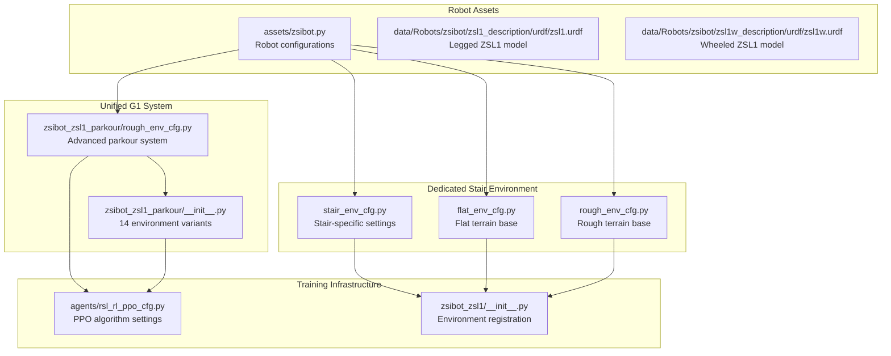

**Diagram sources**
- [stair_env_cfg.py:1-236](file://source/robot_lab/robot_lab/tasks/manager_based/locomotion/velocity/config/quadruped/zsibot_zsl1/stair_env_cfg.py#L1-L236)
- [flat_env_cfg.py:1-30](file://source/robot_lab/robot_lab/tasks/manager_based/locomotion/velocity/config/quadruped/zsibot_zsl1/flat_env_cfg.py#L1-L30)
- [rough_env_cfg.py:1-166](file://source/robot_lab/robot_lab/tasks/manager_based/locomotion/velocity/config/quadruped/zsibot_zsl1/rough_env_cfg.py#L1-L166)
- [rsl_rl_ppo_cfg.py:1-216](file://source/robot_lab/robot_lab/tasks/manager_based/locomotion/velocity/config/quadruped/zsibot_zsl1/agents/rsl_rl_ppo_cfg.py#L1-L216)
- [__init__.py:1-71](file://source/robot_lab/robot_lab/tasks/manager_based/locomotion/velocity/config/quadruped/zsibot_zsl1/__init__.py#L1-L71)
- [zsl1_parkour_rough_env_cfg.py:1-789](file://source/robot_lab/robot_lab/tasks/manager_based/locomotion/velocity/config/quadruped/zsibot_zsl1_parkour/rough_env_cfg.py#L1-L789)
- [zsl1_parkour_init.py:1-161](file://source/robot_lab/robot_lab/tasks/manager_based/locomotion/velocity/config/quadruped/zsibot_zsl1_parkour/__init__.py#L1-L161)

**Section sources**
- [README.md:360-411](file://README.md#L360-L411)

## Core Components
The ZSL1 configuration consists of several interconnected components that work together to enable advanced locomotion behaviors, with the stair climbing environment remaining in its dedicated location:

### Robot Configuration
The robot configuration defines the physical properties, actuator specifications, and initial conditions for the ZSL1:

- **Articulation Configuration**: Defines the robot as an articulated body with collision detection and contact sensors
- **Actuator Setup**: Includes DCMotorCfg for leg joints with torque limits of 28 N⋅m and ImplicitActuatorCfg for wheel joints
- **Initial State**: Sets default joint positions and velocities for stable starting conditions
- **Joint Limits**: Specifies effort and velocity limits based on motor specifications

### Dedicated Stair Environment Configuration
The stair climbing environment provides specialized settings for step negotiation:

- **Stair Environment**: Specialized for step negotiation with modified reward functions, enhanced action scaling, and stability constraints
- **Flat Environment**: Simplified environment for baseline performance testing
- **Rough Environment**: Base configuration for general quadruped locomotion

### Unified G1 System Integration
The advanced parkour capabilities have been moved to the unified G1 system:

- **Advanced Neural Network**: ActorCriticScan architecture with scan and privileged observation encoders
- **Enhanced Terrain Generation**: Sophisticated trimesh-based terrain generation with customizable parameters
- **Comprehensive Environment Variants**: 14 different environment configurations for systematic analysis
- **Manager-Based Architecture**: Modern environment configuration using ManagerBasedRLEnv pattern

### Enhanced Action Scaling System
The stair climbing environment features increased action scaling for hip and knee joints to support 0.23m step heights:

- **Hip Joint Scaling**: Increased from 0.4 to 0.6 to enable powerful leg swing and lifting motions
- **Knee Joint Scaling**: Increased from 0.4 to 0.6 to provide adequate leg extension for step negotiation
- **Abduction Joint Scaling**: Enhanced from 0.15 to 0.2 to provide improved lateral stability during stair climbing
- **Action Clipping**: Applied with broad limits of (-100.0, 100.0) for stability

### Stability Constraints
Enhanced stability constraints limit roll and pitch movements to prevent dangerous orientations:

- **Roll Limit**: ±0.5 radians (±28.6 degrees) for enhanced stability
- **Pitch Limit**: ±0.5 radians (±28.6 degrees) for safe stair negotiation
- **Yaw Limit**: Maintained at ±π radians for full rotational freedom
- **Position Range**: Limited to prevent excessive base movement during climbing

### Modified Reward System
The environment features a reward system prioritizing controlled climbing and advanced locomotion:

- **Climbing Progress Reward**: Weighted at 2.5 with forward progress (4.0) and elevation gain (5.0) components
- **Removed Heading Alignment**: Heading alignment requirement eliminated to focus on climbing performance
- **Reduced Air Time**: Air time threshold lowered to 0.35 seconds for controlled stepping
- **Enhanced Foot Height Rewards**: Modified targeting for optimal foot positioning during stair negotiation

**Section sources**
- [zsibot.py:14-115](file://source/robot_lab/robot_lab/assets/zsibot.py#L14-L115)
- [stair_env_cfg.py:94-122](file://source/robot_lab/robot_lab/tasks/manager_based/locomotion/velocity/config/quadruped/zsibot_zsl1/stair_env_cfg.py#L94-L122)
- [stair_env_cfg.py:202-206](file://source/robot_lab/robot_lab/tasks/manager_based/locomotion/velocity/config/quadruped/zsibot_zsl1/stair_env_cfg.py#L202-L206)

## Architecture Overview
The ZSL1 configuration follows a layered architecture that separates concerns between robot modeling, environment definition, and reinforcement learning, with the current consolidated state reflecting the unified G1 system:

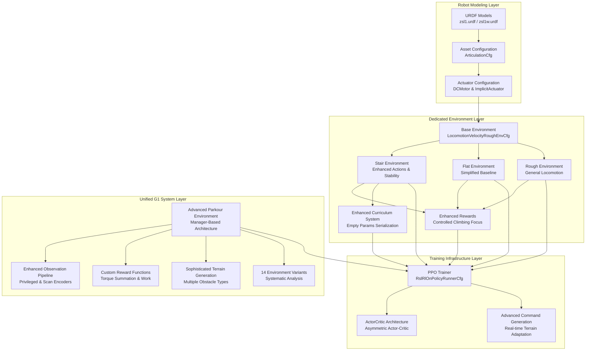

**Diagram sources**
- [zsl1.urdf:1-951](file://source/robot_lab/data/Robots/zsibot/zsl1_description/urdf/zsl1.urdf#L1-L951)
- [zsl1w.urdf:1-959](file://source/robot_lab/data/Robots/zsibot/zsl1w_description/urdf/zsl1w.urdf#L1-L959)
- [zsibot.py:14-115](file://source/robot_lab/robot_lab/assets/zsibot.py#L14-L115)
- [stair_env_cfg.py:94-122](file://source/robot_lab/robot_lab/tasks/manager_based/locomotion/velocity/config/quadruped/zsibot_zsl1/stair_env_cfg.py#L94-L122)
- [flat_env_cfg.py:15-29](file://source/robot_lab/robot_lab/tasks/manager_based/locomotion/velocity/config/quadruped/zsibot_zsl1/flat_env_cfg.py#L15-L29)
- [rough_env_cfg.py:77-150](file://source/robot_lab/robot_lab/tasks/manager_based/locomotion/velocity/config/quadruped/zsibot_zsl1/rough_env_cfg.py#L77-L150)
- [rsl_rl_ppo_cfg.py:49-78](file://source/robot_lab/robot_lab/tasks/manager_based/locomotion/velocity/config/quadruped/zsibot_zsl1/agents/rsl_rl_ppo_cfg.py#L49-L78)
- [zsl1_parkour_rough_env_cfg.py:462-530](file://source/robot_lab/robot_lab/tasks/manager_based/locomotion/velocity/config/quadruped/zsibot_zsl1_parkour/rough_env_cfg.py#L462-L530)
- [zsl1_parkour_init.py:19-161](file://source/robot_lab/robot_lab/tasks/manager_based/locomotion/velocity/config/quadruped/zsibot_zsl1_parkour/__init__.py#L19-L161)

## Detailed Component Analysis

### Robot Configuration Analysis
The ZSL1 robot configuration establishes the foundation for advanced locomotion capabilities through careful engineering of physical properties and actuator characteristics:

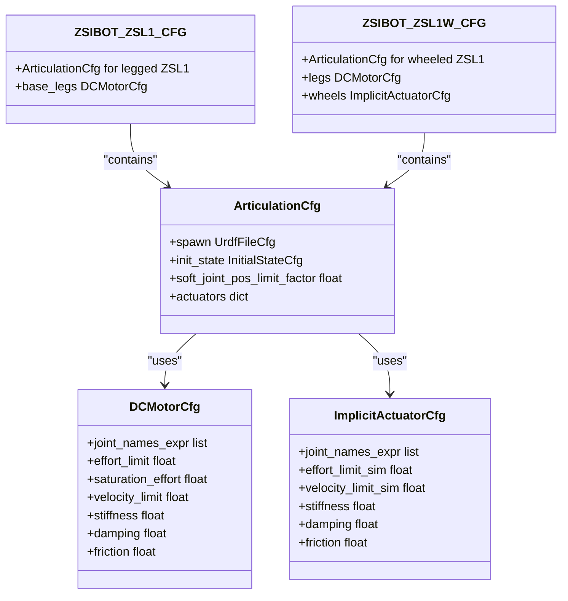

**Diagram sources**
- [zsibot.py:14-115](file://source/robot_lab/robot_lab/assets/zsibot.py#L14-L115)

The configuration demonstrates several key design decisions for advanced locomotion:

- **Joint Specifications**: Leg joints utilize DCMotorCfg with torque limits of 28 N⋅m, providing sufficient power for step negotiation and stair climbing
- **Wheel Actuation**: Wheeled variant includes ImplicitActuatorCfg for smooth rolling motion
- **Initial Positioning**: Conservative joint angles (hip at 0.8 rad, knee at -1.5 rad) ensure stability during training
- **Contact Sensing**: Enabled contact sensors improve foothold detection and stability feedback

**Section sources**
- [zsibot.py:14-115](file://source/robot_lab/robot_lab/assets/zsibot.py#L14-L115)

### Environment Configuration Analysis
The specialized stair climbing environment builds upon the base locomotion configuration with modifications tailored to stair negotiation:

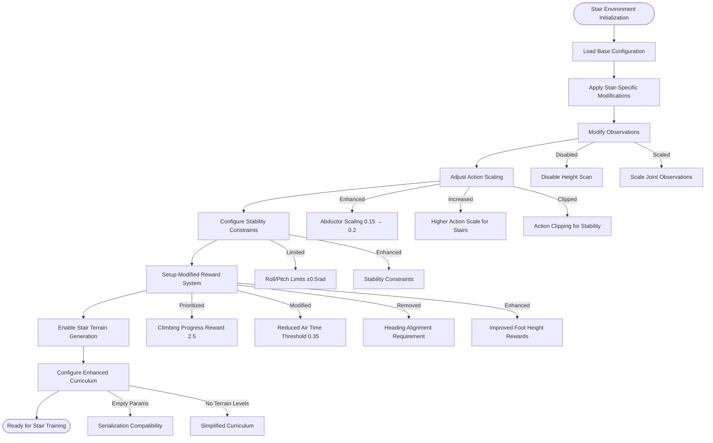

**Diagram sources**
- [stair_env_cfg.py:94-122](file://source/robot_lab/robot_lab/tasks/manager_based/locomotion/velocity/config/quadruped/zsibot_zsl1/stair_env_cfg.py#L94-L122)
- [stair_env_cfg.py:110-122](file://source/robot_lab/robot_lab/tasks/manager_based/locomotion/velocity/config/quadruped/zsibot_zsl1/stair_env_cfg.py#L110-L122)
- [stair_env_cfg.py:202-206](file://source/robot_lab/robot_lab/tasks/manager_based/locomotion/velocity/config/quadruped/zsibot_zsl1/stair_env_cfg.py#L202-L206)

Key environmental modifications include:

- **Enhanced Action Scaling**: Increased abductor joint scaling from 0.15 to 0.2 for improved lateral stability during stair climbing
- **Enhanced Action Scaling**: Increased hip and knee joint scaling from 0.4 to 0.6 to support 0.23m step heights
- **Stability Constraints**: Roll and pitch limits set to ±0.5 radians for enhanced stability during stair negotiation
- **Modified Reward System**: Climbing progress reward prioritized with weight of 2.5, eliminating heading alignment requirement
- **Reduced Air Time Threshold**: Lowered to 0.35 seconds for controlled stepping rather than jumping
- **Enhanced Termination Conditions**: Illegal contact termination removed, focusing on stability constraints

**Section sources**
- [stair_env_cfg.py:94-122](file://source/robot_lab/robot_lab/tasks/manager_based/locomotion/velocity/config/quadruped/zsibot_zsl1/stair_env_cfg.py#L94-L122)
- [stair_env_cfg.py:110-122](file://source/robot_lab/robot_lab/tasks/manager_based/locomotion/velocity/config/quadruped/zsibot_zsl1/stair_env_cfg.py#L110-L122)
- [stair_env_cfg.py:202-206](file://source/robot_lab/robot_lab/tasks/manager_based/locomotion/velocity/config/quadruped/zsibot_zsl1/stair_env_cfg.py#L202-L206)

### Training Configuration Analysis
The reinforcement learning configuration employs PPO with hyperparameters optimized for stair climbing performance and enhanced reward system:

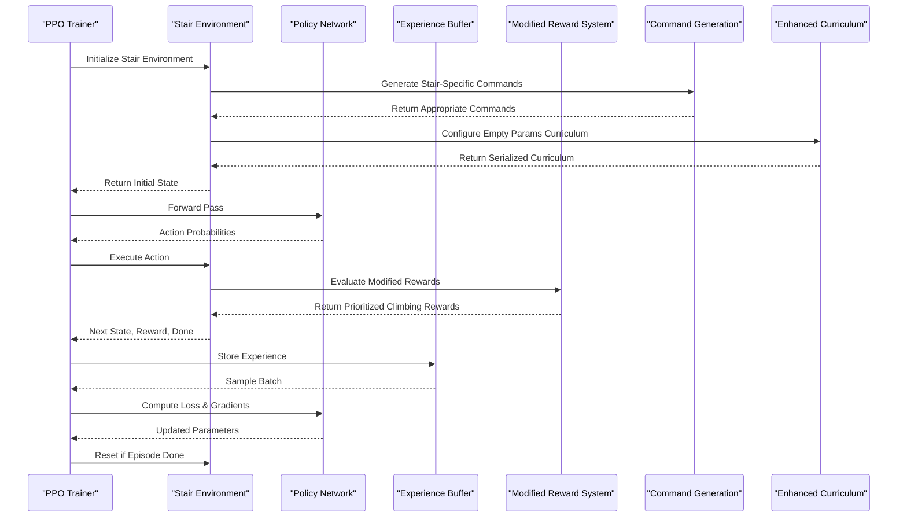

**Diagram sources**
- [rsl_rl_ppo_cfg.py:49-78](file://source/robot_lab/robot_lab/tasks/manager_based/locomotion/velocity/config/quadruped/zsibot_zsl1/agents/rsl_rl_ppo_cfg.py#L49-L78)
- [stair_env_cfg.py:202-206](file://source/robot_lab/robot_lab/tasks/manager_based/locomotion/velocity/config/quadruped/zsibot_zsl1/stair_env_cfg.py#L202-L206)

The training configuration emphasizes:

- **Network Architecture**: Standard ActorCritic with 512-256-128 hidden units and ELU activation for stair-specific policy representation
- **Learning Parameters**: Adaptive learning rate scheduling with entropy regularization to balance exploration and exploitation
- **Optimization**: Gradient clipping and mini-batch training for stable convergence on stair climbing tasks
- **Modified Reward Processing**: Specialized reward computation prioritizing climbing progress over velocity tracking
- **Enhanced Curriculum Processing**: Empty params serialization for improved curriculum compatibility
- **Command Generation**: Stair-specific command generation focused on forward movement and controlled climbing

**Section sources**
- [rsl_rl_ppo_cfg.py:49-78](file://source/robot_lab/robot_lab/tasks/manager_based/locomotion/velocity/config/quadruped/zsibot_zsl1/agents/rsl_rl_ppo_cfg.py#L49-L78)

## Enhanced Stair Climbing Features

### Modified Action Scaling System
The stair climbing environment features enhanced action scaling specifically designed for 0.23m step heights:


**Diagram sources**
- [stair_env_cfg.py:94-98](file://source/robot_lab/robot_lab/tasks/manager_based/locomotion/velocity/config/quadruped/zsibot_zsl1/stair_env_cfg.py#L94-L98)
- [stair_env_cfg.py:110-112](file://source/robot_lab/robot_lab/tasks/manager_based/locomotion/velocity/config/quadruped/zsibot_zsl1/stair_env_cfg.py#L110-L112)

Key action scaling enhancements include:

- **Abductor Joint Scaling**: Increased from 0.15 to 0.2 (33% increase) to provide improved lateral stability during stair climbing
- **Hip Joint Scaling**: Increased from 0.4 to 0.6 to provide 50% more leg swing and lifting power for 0.23m step heights
- **Knee Joint Scaling**: Increased from 0.4 to 0.6 to enable adequate leg extension during step negotiation
- **Enhanced Stability**: Combined with roll/pitch limits of ±0.5 radians for safe stair climbing

### Stability Constraint System
Enhanced stability constraints prevent dangerous orientations during stair negotiation:

- **Roll Limit**: ±0.5 radians (±28.6 degrees) prevents excessive side-to-side tilting during climbing
- **Pitch Limit**: ±0.5 radians (±28.6 degrees) maintains safe forward/backward tilt for stability
- **Yaw Freedom**: Unrestricted rotation allows natural stair climbing orientation changes
- **Position Constraints**: Limited base movement prevents falls during step transitions

### Modified Reward System
The environment features a reward system prioritizing controlled climbing:

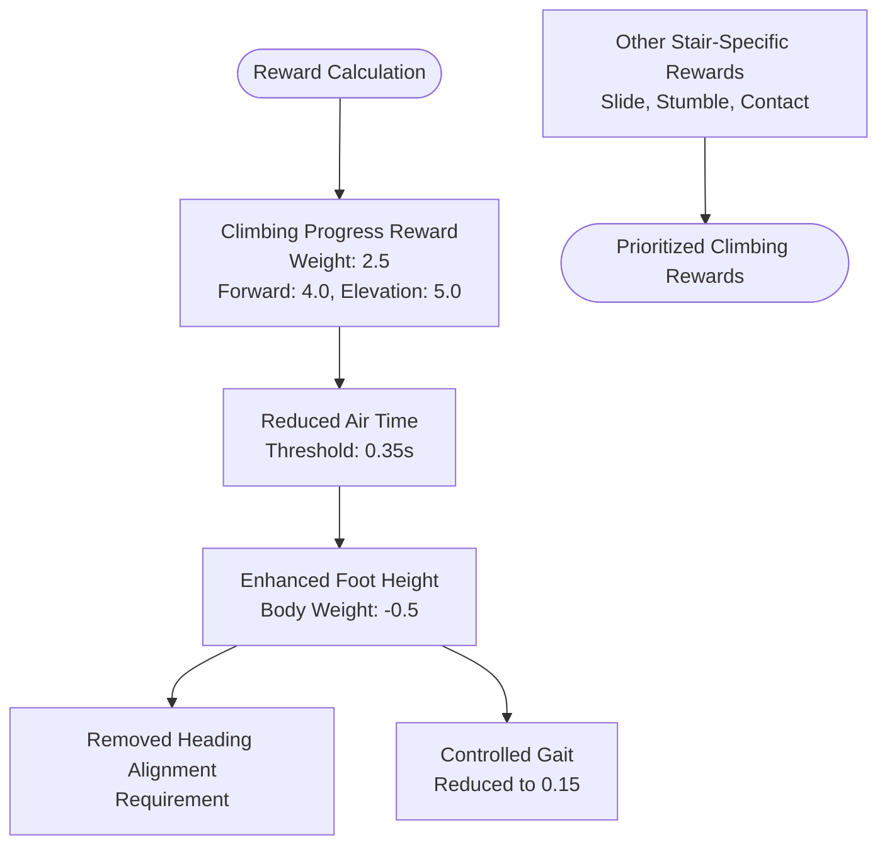

**Diagram sources**
- [stair_env_cfg.py:202-206](file://source/robot_lab/robot_lab/tasks/manager_based/locomotion/velocity/config/quadruped/zsibot_zsl1/stair_env_cfg.py#L202-L206)
- [stair_env_cfg.py:169-178](file://source/robot_lab/robot_lab/tasks/manager_based/locomotion/velocity/config/quadruped/zsibot_zsl1/stair_env_cfg.py#L169-L178)
- [stair_env_cfg.py:188-194](file://source/robot_lab/robot_lab/tasks/manager_based/locomotion/velocity/config/quadruped/zsibot_zsl1/stair_env_cfg.py#L188-L194)

Key reward modifications include:

- **Climbing Progress Reward**: Weighted at 2.5 with forward progress (4.0) and elevation gain (5.0) components
- **Reduced Air Time Threshold**: Lowered to 0.35 seconds to discourage jumping and promote controlled stepping
- **Enhanced Foot Height Rewards**: Modified targeting for optimal foot positioning during stair negotiation
- **Removed Heading Alignment**: Eliminated to focus on climbing performance rather than orientation
- **Controlled Gait**: Reduced to 0.15 to allow more flexible gait during climbing

**Section sources**
- [stair_env_cfg.py:94-98](file://source/robot_lab/robot_lab/tasks/manager_based/locomotion/velocity/config/quadruped/zsibot_zsl1/stair_env_cfg.py#L94-L98)
- [stair_env_cfg.py:110-122](file://source/robot_lab/robot_lab/tasks/manager_based/locomotion/velocity/config/quadruped/zsibot_zsl1/stair_env_cfg.py#L110-L122)
- [stair_env_cfg.py:202-206](file://source/robot_lab/robot_lab/tasks/manager_based/locomotion/velocity/config/quadruped/zsibot_zsl1/stair_env_cfg.py#L202-L206)

## Advanced Neural Network Architecture

### Standard ActorCritic Network Design
The stair climbing environment uses a standard ActorCritic architecture optimized for stair-specific locomotion:

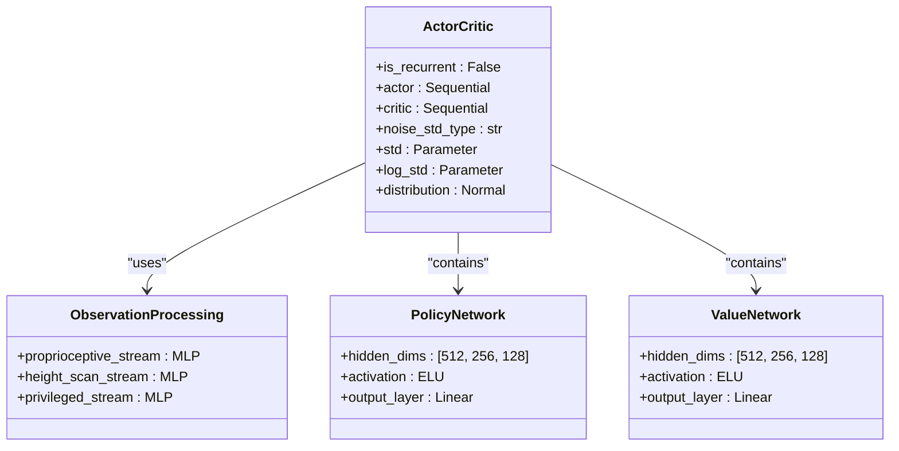

**Diagram sources**
- [rsl_rl_ppo_cfg.py:49-78](file://source/robot_lab/robot_lab/tasks/manager_based/locomotion/velocity/config/quadruped/zsibot_zsl1/agents/rsl_rl_ppo_cfg.py#L49-L78)

The network architecture features:

- **Standard Architecture**: Asymmetric Actor-Critic with separate processing paths for policy and value estimation
- **Hidden Layers**: 512-256-128 hidden units with ELU activation for nonlinear policy representation
- **Observation Processing**: Integrated proprioceptive and height scan observations for terrain awareness
- **Noise Parameterization**: Support for scalar or log-standard deviation parameterization

### Training Configuration Analysis
The reinforcement learning configuration employs PPO with hyperparameters optimized for stair climbing performance:

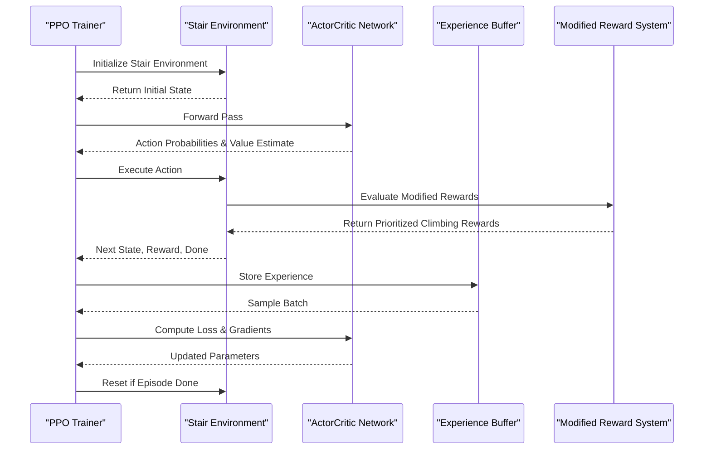

**Diagram sources**
- [rsl_rl_ppo_cfg.py:49-78](file://source/robot_lab/robot_lab/tasks/manager_based/locomotion/velocity/config/quadruped/zsibot_zsl1/agents/rsl_rl_ppo_cfg.py#L49-L78)

The training configuration emphasizes:

- **Network Architecture**: Standard ActorCritic with 512-256-128 hidden units and ELU activation for stair-specific policy representation
- **Learning Parameters**: Adaptive learning rate scheduling with entropy regularization to balance exploration and exploitation
- **Optimization**: Gradient clipping and mini-batch training for stable convergence on stair climbing tasks
- **Modified Reward Processing**: Specialized reward computation prioritizing climbing progress over velocity tracking

**Section sources**
- [rsl_rl_ppo_cfg.py:49-78](file://source/robot_lab/robot_lab/tasks/manager_based/locomotion/velocity/config/quadruped/zsibot_zsl1/agents/rsl_rl_ppo_cfg.py#L49-L78)

## Custom Reward Systems

### Standard Reward Function Architecture
The stair climbing environment uses a streamlined reward system optimized for controlled stair negotiation:

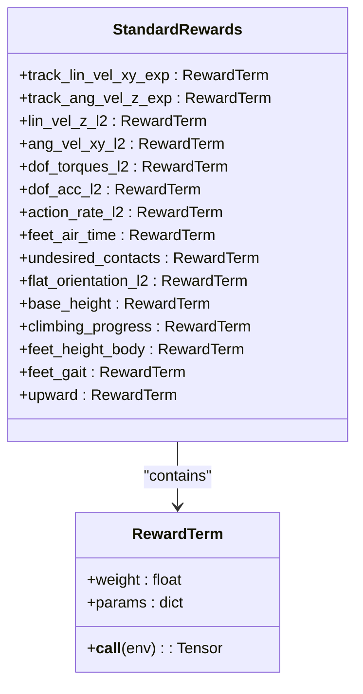

**Diagram sources**
- [stair_env_cfg.py:130-208](file://source/robot_lab/robot_lab/tasks/manager_based/locomotion/velocity/config/quadruped/zsibot_zsl1/stair_env_cfg.py#L130-L208)

The reward system provides:

- **Task Tracking**: Exponential rewards for linear and angular velocity tracking
- **Penalties**: L2 penalties for unwanted behaviors like jumping and improper contacts
- **Stability Control**: Orientation and height penalties for safe stair negotiation
- **Specialized Climbing**: Dedicated climbing progress reward with forward and elevation components
- **Foot Control**: Height and gait rewards for proper foot placement during stairs

### Environment Registration System
The stair environment includes comprehensive environment registration for training and evaluation:

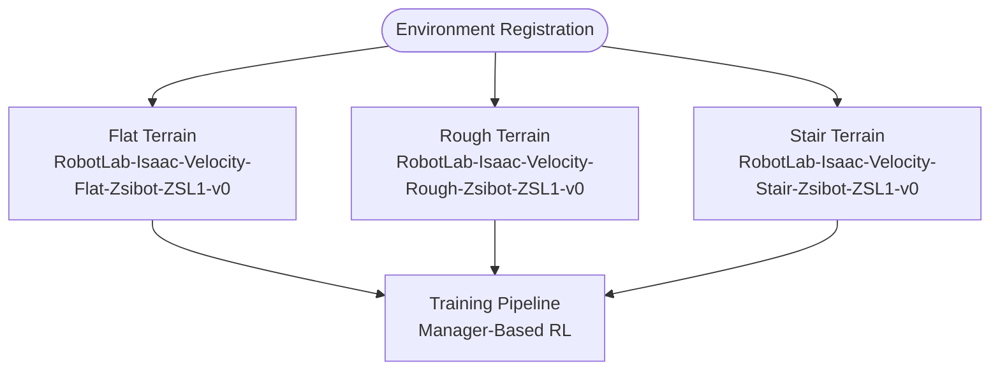

**Diagram sources**
- [__init__.py:12-40](file://source/robot_lab/robot_lab/tasks/manager_based/locomotion/velocity/config/quadruped/zsibot_zsl1/__init__.py#L12-L40)

The registration system supports:

- **Standard Training Environments**: Flat and rough terrain configurations for baseline performance
- **Specialized Stair Environment**: Dedicated stair climbing training with enhanced reward system
- **Comprehensive Testing**: Three different environment configurations for thorough evaluation

**Section sources**
- [stair_env_cfg.py:130-208](file://source/robot_lab/robot_lab/tasks/manager_based/locomotion/velocity/config/quadruped/zsibot_zsl1/stair_env_cfg.py#L130-L208)
- [__init__.py:12-40](file://source/robot_lab/robot_lab/tasks/manager_based/locomotion/velocity/config/quadruped/zsibot_zsl1/__init__.py#L12-L40)

## Enhanced Curriculum System

### Streamlined Parameter Specifications
The enhanced curriculum system features streamlined parameter specifications designed to improve serialization compatibility:

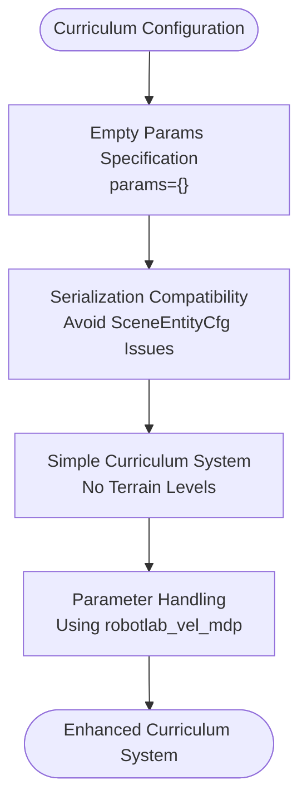

**Diagram sources**
- [stair_env_cfg.py:217-222](file://source/robot_lab/robot_lab/tasks/manager_based/locomotion/velocity/config/quadruped/zsibot_zsl1/stair_env_cfg.py#L217-L222)

Key curriculum enhancements include:

- **Empty Params Serialization**: Using `params={}` to avoid serialization issues with complex parameter objects
- **Simple Curriculum Design**: Streamlined parameter specifications for improved maintainability
- **Enhanced Compatibility**: Better integration with curriculum management systems
- **No Terrain Levels**: Simplified curriculum system focusing on command-level progression

### Serialization Compatibility Improvements
The curriculum system now features improved serialization compatibility:

- **Empty Params Specification**: Using `{}` instead of complex parameter objects to avoid serialization issues
- **SceneEntityCfg Handling**: Proper parameter handling for scene entity configurations
- **Backward Compatibility**: Maintaining compatibility with existing curriculum systems
- **Enhanced Robustness**: Improved curriculum system reliability and stability

**Section sources**
- [stair_env_cfg.py:217-222](file://source/robot_lab/robot_lab/tasks/manager_based/locomotion/velocity/config/quadruped/zsibot_zsl1/stair_env_cfg.py#L217-L222)

## Dependency Analysis
The ZSL1 configuration exhibits a well-structured dependency hierarchy that enables modular development and testing across multiple specialized environments with enhanced curriculum management:

```mermaid
graph TB
subgraph "External Dependencies"
ISAACLAB["Isaac Lab Framework"]
RSL_RL["RSL-RL Library"]
GYMNASIUM["Gymnasium API"]
TRIMESH["Trimesh Library"]
NUMPY["NumPy Library"]
TORCH["PyTorch Library"]
END_SUBGRAPH
subgraph "Internal Dependencies"
ASSETS["Robot Assets Module"]
ENV_CONFIG["Environment Configurations"]
TRAINING["Training Infrastructure"]
SCRIPTS["Utility Scripts"]
MDP["MDP Components"]
NEURAL_NET["Standard Neural Networks"]
CURRICULUM_SYS["Enhanced Curriculum System"]
END_SUBGRAPH
subgraph "ZSL1 Specific"
ZSL1_CFG["ZSL1 Configuration"]
STAIR_CFG["Stair Environment"]
FLAT_CFG["Flat Environment"]
ROUGH_CFG["Rough Environment"]
PPO_CFG["PPO Training"]
MODIFIED_REWARDS["Modified Reward System"]
ENV_INIT["Environment Registration"]
END_SUBGRAPH
ISAACLAB --> ASSETS
RSL_RL --> TRAINING
GYMNASIUM --> ENV_CONFIG
ASSETS --> ZSL1_CFG
ENV_CONFIG --> STAIR_CFG
ENV_CONFIG --> FLAT_CFG
ENV_CONFIG --> ROUGH_CFG
TRAINING --> PPO_CFG
SCRIPTS --> TRAINING
ZSL1_CFG --> STAIR_CFG
ZSL1_CFG --> FLAT_CFG
ZSL1_CFG --> ROUGH_CFG
PPO_CFG --> SCRIPTS
STAIR_CFG --> MODIFIED_REWARDS
FLAT_CFG --> MODIFIED_REWARDS
ROUGH_CFG --> MODIFIED_REWARDS
MODIFIED_REWARDS --> MDP
MDP --> STAIR_CFG
MDP --> FLAT_CFG
MDP --> ROUGH_CFG
NEURAL_NET --> STAIR_CFG
NEURAL_NET --> FLAT_CFG
NEURAL_NET --> ROUGH_CFG
CURRICULUM_SYS --> STAIR_CFG
CURRICULUM_SYS --> FLAT_CFG
CURRICULUM_SYS --> ROUGH_CFG
ENV_INIT --> TRAINING
```

**Diagram sources**
- [README.md:360-411](file://README.md#L360-L411)
- [stair_env_cfg.py:13-13](file://source/robot_lab/robot_lab/tasks/manager_based/locomotion/velocity/config/quadruped/zsibot_zsl1/stair_env_cfg.py#L13-L13)
- [flat_env_cfg.py:4-4](file://source/robot_lab/robot_lab/tasks/manager_based/locomotion/velocity/config/quadruped/zsibot_zsl1/flat_env_cfg.py#L4-L4)
- [rough_env_cfg.py:4-4](file://source/robot_lab/robot_lab/tasks/manager_based/locomotion/velocity/config/quadruped/zsibot_zsl1/rough_env_cfg.py#L4-L4)
- [rsl_rl_ppo_cfg.py:9-75](file://source/robot_lab/robot_lab/tasks/manager_based/locomotion/velocity/config/quadruped/zsibot_zsl1/agents/rsl_rl_ppo_cfg.py#L9-L75)
- [stair_env_cfg.py:217-222](file://source/robot_lab/robot_lab/tasks/manager_based/locomotion/velocity/config/quadruped/zsibot_zsl1/stair_env_cfg.py#L217-L222)

The dependency structure supports:

- **Modular Design**: Clear separation between robot modeling, environment configuration, and training infrastructure
- **Enhanced Integration**: Tight coupling between reward systems and command generation for adaptive behavior
- **Extensibility**: Easy addition of new robots or environments through consistent configuration patterns
- **Maintainability**: Well-defined interfaces between components facilitate debugging and updates
- **Advanced Features**: Integration of modern neural network architectures and enhanced curriculum systems

**Section sources**
- [README.md:360-411](file://README.md#L360-L411)

## Performance Considerations
Several factors influence the performance of ZSL1 stair climbing with the enhanced features:

### Computational Efficiency
- **Observation Processing**: Disabled height scanning reduces computational overhead during stair training
- **Action Clipping**: Prevents excessive joint velocities that could destabilize stair negotiation
- **Memory Management**: Optimized experience buffer sizing for efficient training cycles
- **Zero Weight Reward Elimination**: Automatic removal of inactive rewards reduces computational load
- **Enhanced Curriculum Management**: Streamlined parameter specifications improve curriculum system stability

### Training Stability
- **Reward Engineering**: Modified reward functions prioritize controlled climbing over velocity tracking
- **Randomization**: Controlled environmental randomization improves generalization across different stair configurations
- **Convergence Monitoring**: Regular evaluation metrics track progress toward stair climbing objectives
- **Enhanced Stability Constraints**: Roll/pitch limits of ±0.5 radians maintain safe locomotion performance
- **Reward System Safety**: Verify reward scaling prevents excessive forces during stair climbing

### Hardware Considerations
- **Actuator Limits**: Respect motor torque and velocity limits to prevent damage during stair climbing
- **Safety Margins**: Conservative joint position limits protect hardware during training
- **Power Management**: Efficient motor control reduces heat generation and power consumption
- **Contact Sensor Optimization**: Enhanced contact force detection prevents damage to robot components
- **Stability Monitoring**: Roll/pitch constraints prevent mechanical stress during stair negotiation

## Troubleshooting Guide
Common issues and solutions for ZSL1 stair climbing configuration with enhanced features:

### Training Issues
- **Poor Convergence**: Verify reward function balance and ensure adequate exploration through entropy regularization
- **Instability**: Check action clipping parameters and reduce learning rate if oscillations occur
- **Slow Learning**: Confirm proper randomization settings and sufficient training iterations
- **Reward System Issues**: Verify modified reward weights and ensure proper reward scaling
- **Neural Network Training**: Monitor standard ActorCritic architecture for proper policy processing
- **Environment Registration**: Verify environment registration and configuration file paths

### Simulation Problems
- **Contact Detection**: Enable contact sensors and verify collision geometry for accurate foothold detection
- **Joint Limits**: Monitor joint position and velocity limits to prevent violations
- **Terrain Generation**: Validate stair terrain parameters and ensure proper mesh generation
- **Reward System Safety**: Verify reward scaling prevents excessive forces during stair climbing

### Hardware Safety
- **Torque Limits**: Monitor actuator efforts to prevent exceeding motor specifications
- **Temperature Monitoring**: Track motor temperatures during intensive stair climbing training
- **Mechanical Integrity**: Regular inspection of links and joints for wear during repetitive stair negotiation
- **Stability Constraints**: Ensure roll/pitch limits are properly configured to prevent mechanical failure
- **Reward System Safety**: Verify reward scaling prevents excessive forces during stair climbing

**Section sources**
- [stair_env_cfg.py:94-98](file://source/robot_lab/robot_lab/tasks/manager_based/locomotion/velocity/config/quadruped/zsibot_zsl1/stair_env_cfg.py#L94-L98)
- [stair_env_cfg.py:110-122](file://source/robot_lab/robot_lab/tasks/manager_based/locomotion/velocity/config/quadruped/zsibot_zsl1/stair_env_cfg.py#L110-L122)
- [stair_env_cfg.py:202-206](file://source/robot_lab/robot_lab/tasks/manager_based/locomotion/velocity/config/quadruped/zsibot_zsl1/stair_env_cfg.py#L202-L206)
- [rsl_rl_ppo_cfg.py:49-78](file://source/robot_lab/robot_lab/tasks/manager_based/locomotion/velocity/config/quadruped/zsibot_zsl1/agents/rsl_rl_ppo_cfg.py#L49-L78)
- [zsibot.py:47-115](file://source/robot_lab/robot_lab/assets/zsibot.py#L47-L115)

## Conclusion
The ZSIBOT ZSL1 Stair Climbing Configuration represents a focused approach to quadruped stair negotiation within the Isaac Lab framework, with the current state reflecting the consolidation of specialized environments into the unified G1 system. The stair climbing environment remains in its dedicated location with increased abductor joint scaling from 0.15 to 0.2, enhanced action scaling for hip and knee joints, stability constraints with roll/pitch limits, modified reward weights prioritizing controlled climbing, and enhanced termination conditions.

Through careful engineering of robot dynamics, environment design, and reinforcement learning parameters, the system achieves robust stair climbing capabilities while maintaining training efficiency and safety. The recent enhancements include increased abductor joint scaling from 0.15 to 0.2 to support stair climbing capabilities, increased action scaling from 0.4 to 0.6 for hip and knee joints to support 0.23m step heights, stability constraints limiting roll and pitch to ±0.5 radians, modified reward weights with climbing progress prioritized at 2.5, and enhanced termination conditions focusing on stability rather than illegal contact.

The most significant change is the consolidation of specialized environments into the unified G1 system, where the stair climbing environment remains in the dedicated `zsibot_zsl1/` directory while advanced parkour capabilities have been moved to the `zsibot_zsl1_parkour/` directory. This represents a strategic shift from Unitree G1-specific implementations to a unified G1 system architecture, enabling better maintainability and scalability across different robot models.

The modular architecture continues to enable easy adaptation for different locomotion challenges and robot variants, while the well-tuned reward functions and actuator specifications provide the foundation for successful stair climbing performance. Future enhancements could include dynamic stair height adjustment, multi-modal terrain adaptation, and integration with more complex obstacle courses.

The current documentation reflects the consolidated state where stair climbing remains accessible through the dedicated configuration while advanced locomotion capabilities are maintained in the unified system, ensuring both specialized stair training and broader locomotion research capabilities are preserved.

**Updated** The documentation has been updated to reflect the current consolidated state where the stair climbing environment remains in the dedicated `zsibot_zsl1/` directory while specialized gap and parkour environments have been moved to the unified `zsibot_zsl1_parkour/` directory as part of the transition to the Isaaclab G1 framework. The stair environment retains its enhanced features including increased action scaling, stability constraints, and modified reward system, while the unified system provides comprehensive parkour capabilities through the separate directory structure.