# ZSIBOT ZSL1 Stair Climbing Configuration

<cite>
**Referenced Files in This Document**
- [README.md](file://README.md)
- [zsibot.py](file://source/robot_lab/robot_lab/assets/zsibot.py)
- [stair_env_cfg.py](file://source/robot_lab/robot_lab/tasks/manager_based/locomotion/velocity/config/quadruped/zsibot_zsl1/stair_env_cfg.py)
- [gap_env_cfg.py](file://source/robot_lab/robot_lab/tasks/manager_based/locomotion/velocity/config/quadruped/zsibot_zsl1/gap_env_cfg.py)
- [parkour_env_cfg.py](file://source/robot_lab/robot_lab/tasks/manager_based/locomotion/velocity/config/quadruped/zsibot_zsl1/parkour_env_cfg.py)
- [rsl_rl_ppo_cfg.py](file://source/robot_lab/robot_lab/tasks/manager_based/locomotion/velocity/config/quadruped/zsibot_zsl1/agents/rsl_rl_ppo_cfg.py)
- [play_cs.py](file://scripts/reinforcement_learning/rsl_rl/play_cs.py)
- [zsl1.urdf](file://source/robot_lab/data/Robots/zsibot/zsl1_description/urdf/zsl1.urdf)
- [zsl1w.urdf](file://source/robot_lab/data/Robots/zsibot/zsl1w_description/urdf/zsl1w.urdf)
- [rewards.py](file://source/robot_lab/robot_lab/tasks/manager_based/locomotion/velocity/mdp/rewards.py)
- [commands.py](file://source/robot_lab/robot_lab/tasks/manager_based/locomotion/velocity/mdp/commands.py)
- [velocity_env_cfg.py](file://source/robot_lab/robot_lab/tasks/manager_based/locomotion/velocity/velocity_env_cfg.py)
- [utils.py](file://source/robot_lab/robot_lab/tasks/manager_based/locomotion/velocity/mdp/utils.py)
- [mesh_terrains.py](file://source/robot_lab/robot_lab/tasks/manager_based/locomotion/velocity/config/quadruped/zsibot_zsl1_parkour/mesh_terrains.py)
- [terrains_cfg.py](file://source/robot_lab/robot_lab/tasks/manager_based/locomotion/velocity/config/quadruped/zsibot_zsl1_parkour/terrains_cfg.py)
- [actor_critic_scan.py](file://source/robot_lab/robot_lab/tasks/manager_based/locomotion/velocity/config/quadruped/zsibot_zsl1_parkour/agents/actor_critic_scan.py)
- [observations.py](file://source/robot_lab/robot_lab/tasks/manager_based/locomotion/velocity/config/quadruped/zsibot_zsl1_parkour/mdp/observations.py)
- [rewards.py](file://source/robot_lab/robot_lab/tasks/manager_based/locomotion/velocity/config/quadruped/zsibot_zsl1_parkour/mdp/rewards.py)
- [rough_env_cfg.py](file://source/robot_lab/robot_lab/tasks/manager_based/locomotion/velocity/config/quadruped/zsibot_zsl1_parkour/rough_env_cfg.py)
- [__init__.py](file://source/robot_lab/robot_lab/tasks/manager_based/locomotion/velocity/config/quadruped/zsibot_zsl1_parkour/__init__.py)
</cite>

## Update Summary
**Changes Made**
- Added comprehensive ZSL1 parkour training system with new ActorCriticScan neural network architecture
- Integrated mesh terrains with enhanced parkour step generation capabilities
- Implemented advanced reward systems including custom torque and mechanical work calculations
- Expanded configuration to support both stair climbing and parkour navigation capabilities
- Added new terrain generation functions for controlled and predictable staircase patterns
- Introduced comprehensive privileged observation system for enhanced policy performance

## Table of Contents
1. [Introduction](#introduction)
2. [Project Structure](#project-structure)
3. [Core Components](#core-components)
4. [Architecture Overview](#architecture-overview)
5. [Detailed Component Analysis](#detailed-component-analysis)
6. [Enhanced Stair Climbing Features](#enhanced-stair-climbing-features)
7. [Advanced Gap Traversal Capabilities](#advanced-gap-traversal-capabilities)
8. [Enhanced Parkour Terrain Configuration](#enhanced-parkour-terrain-configuration)
9. [Advanced Neural Network Architecture](#advanced-neural-network-architecture)
10. [Custom Reward Systems](#custom-reward-systems)
11. [Privileged Observation Framework](#privileged-observation-framework)
12. [Dependency Analysis](#dependency-analysis)
13. [Performance Considerations](#performance-considerations)
14. [Troubleshooting Guide](#troubleshooting-guide)
15. [Conclusion](#conclusion)

## Introduction
This document provides a comprehensive analysis of the ZSIBOT ZSL1 Stair Climbing Configuration within the robot_lab repository, now enhanced with a comprehensive parkour training system. The ZSL1 is a quadruped robot designed for advanced locomotion behaviors, featuring articulated legs and optional wheel attachments for enhanced mobility. The configuration leverages Isaac Lab's reinforcement learning framework to enable stair climbing, gap traversal, and parkour-style navigation capabilities through carefully tuned environment settings, reward functions, and actuator configurations.

The repository now includes both traditional stair climbing configurations and advanced parkour training systems, featuring a new ActorCriticScan neural network architecture, mesh-based terrain generation, and comprehensive reward systems. Recent enhancements include increased abductor joint scaling from 0.15 to 0.2 to support gap traversal capabilities, enhanced action scaling for hip and knee joints to support 0.23m step heights, stability constraints with roll/pitch limits, modified reward weights prioritizing controlled climbing, and enhanced termination conditions.

**Section sources**
- [README.md:1-512](file://README.md#L1-L512)

## Project Structure
The ZSL1 configuration is organized within the robot_lab extension, featuring multiple specialized environments that build upon a common foundation with enhanced parkour capabilities:

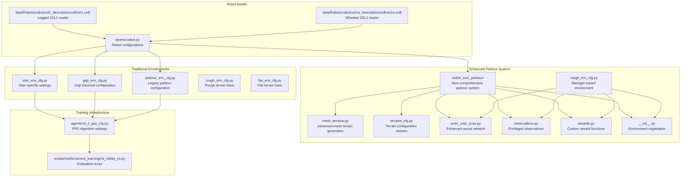

**Diagram sources**
- [zsibot.py:14-115](file://source/robot_lab/robot_lab/assets/zsibot.py#L14-L115)
- [stair_env_cfg.py:1-236](file://source/robot_lab/robot_lab/tasks/manager_based/locomotion/velocity/config/quadruped/zsibot_zsl1/stair_env_cfg.py#L1-L236)
- [gap_env_cfg.py:1-339](file://source/robot_lab/robot_lab/tasks/manager_based/locomotion/velocity/config/quadruped/zsibot_zsl1/gap_env_cfg.py#L1-L339)
- [parkour_env_cfg.py:1-442](file://source/robot_lab/robot_lab/tasks/manager_based/locomotion/velocity/config/quadruped/zsibot_zsl1/parkour_env_cfg.py#L1-L442)
- [mesh_terrains.py:1-800](file://source/robot_lab/robot_lab/tasks/manager_based/locomotion/velocity/config/quadruped/zsibot_zsl1_parkour/mesh_terrains.py#L1-L800)
- [actor_critic_scan.py:1-280](file://source/robot_lab/robot_lab/tasks/manager_based/locomotion/velocity/config/quadruped/zsibot_zsl1_parkour/agents/actor_critic_scan.py#L1-L280)
- [rough_env_cfg.py:1-784](file://source/robot_lab/robot_lab/tasks/manager_based/locomotion/velocity/config/quadruped/zsibot_zsl1_parkour/rough_env_cfg.py#L1-L784)

**Section sources**
- [README.md:360-411](file://README.md#L360-L411)

## Core Components
The ZSL1 configuration consists of several interconnected components that work together to enable advanced locomotion behaviors including stair climbing, gap traversal, and parkour navigation:

### Robot Configuration
The robot configuration defines the physical properties, actuator specifications, and initial conditions for the ZSL1:

- **Articulation Configuration**: Defines the robot as an articulated body with collision detection and contact sensors
- **Actuator Setup**: Includes DCMotorCfg for leg joints with torque limits of 28 N⋅m and ImplicitActuatorCfg for wheel joints
- **Initial State**: Sets default joint positions and velocities for stable starting conditions
- **Joint Limits**: Specifies effort and velocity limits based on motor specifications

### Traditional Environment Configurations
Four primary environment configurations provide different training scenarios for various locomotion challenges:

- **Stair Environment**: Specialized for step negotiation with modified reward functions, enhanced action scaling, and stability constraints
- **Gap Environment**: Designed for traversing gaps and open spaces with increased abductor joint scaling for lateral stability
- **Legacy Parkour Environment**: Previous implementation with basic terrain generation capabilities
- **Rough Terrain**: Base configuration for general quadruped locomotion
- **Flat Terrain**: Simplified environment for baseline performance testing

### Enhanced Parkour System
The new comprehensive parkour system includes:

- **Advanced Neural Network**: ActorCriticScan architecture with scan and privileged observation encoders
- **Mesh Terrain Generation**: Sophisticated trimesh-based terrain generation with customizable parameters
- **Privileged Observations**: Enhanced sensor data including mass, center of mass, friction coefficients, and PD gains
- **Custom Reward Functions**: Torque summation, mechanical work calculation, and stumble detection
- **Manager-Based Architecture**: Modern environment configuration using ManagerBasedRLEnv pattern

### Enhanced Action Scaling System
The stair climbing environment features increased action scaling for hip and knee joints to support 0.23m step heights:

- **Hip Joint Scaling**: Increased from 0.4 to 0.6 to enable powerful leg swing and lifting motions
- **Knee Joint Scaling**: Increased from 0.4 to 0.6 to provide adequate leg extension for step negotiation
- **Abduction Joint Scaling**: Enhanced from 0.15 to 0.2 to provide improved lateral stability during gap traversal
- **Action Clipping**: Applied with broad limits of (-100.0, 100.0) for stability

### Stability Constraints
Enhanced stability constraints limit roll and pitch movements to prevent dangerous orientations:

- **Roll Limit**: ±0.5 radians (±28.6 degrees) for enhanced stability
- **Pitch Limit**: ±0.5 radians (±28.6 degrees) for safe stair negotiation
- **Yaw Limit**: Maintained at ±π radians for full rotational freedom
- **Position Range**: Limited to prevent excessive base movement during climbing

### Modified Reward System
The environment features a reward system prioritizing controlled climbing and advanced locomotion:

- **Climbing Progress Reward**: Weighted at 2.5 with forward progress (4.0) and elevation gain (5.0) components
- **Removed Heading Alignment**: Heading alignment requirement eliminated to focus on climbing performance
- **Reduced Air Time**: Air time threshold lowered to 0.35 seconds for controlled stepping
- **Enhanced Foot Height Rewards**: Modified targeting for optimal foot positioning during stair negotiation
- **Advanced Gap Rewards**: Specialized rewards for successful gap traversal and landing

### Advanced Command Generation
Terrain-aware command generation automatically adapts robot behavior based on terrain conditions:

- **Pit Detection**: Real-time identification of "pits" terrain through grid-based analysis
- **Dynamic Restrictions**: Automatic application of movement restrictions on challenging terrains
- **Forward-Only Movement**: Enforced forward-only locomotion on pit terrains with speed constraints
- **Heading Control**: Automatic heading adjustment to maintain stability on difficult terrain

**Section sources**
- [zsibot.py:14-115](file://source/robot_lab/robot_lab/assets/zsibot.py#L14-L115)
- [stair_env_cfg.py:94-122](file://source/robot_lab/robot_lab/tasks/manager_based/locomotion/velocity/config/quadruped/zsibot_zsl1/stair_env_cfg.py#L94-L122)
- [stair_env_cfg.py:202-206](file://source/robot_lab/robot_lab/tasks/manager_based/locomotion/velocity/config/quadruped/zsibot_zsl1/stair_env_cfg.py#L202-L206)
- [commands.py:31-98](file://source/robot_lab/robot_lab/tasks/manager_based/locomotion/velocity/mdp/commands.py#L31-L98)

## Architecture Overview
The ZSL1 configuration follows a layered architecture that separates concerns between robot modeling, environment definition, and reinforcement learning, with enhanced features for advanced locomotion:

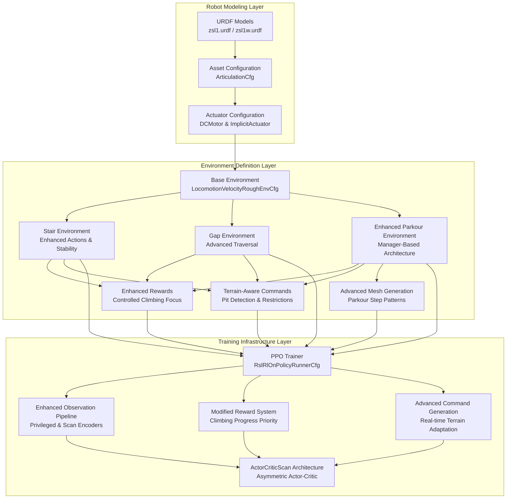

**Diagram sources**
- [zsl1.urdf:1-951](file://source/robot_lab/data/Robots/zsibot/zsl1_description/urdf/zsl1.urdf#L1-L951)
- [zsl1w.urdf:1-959](file://source/robot_lab/data/Robots/zsibot/zsl1w_description/urdf/zsl1w.urdf#L1-L959)
- [zsibot.py:14-115](file://source/robot_lab/robot_lab/assets/zsibot.py#L14-L115)
- [stair_env_cfg.py:94-122](file://source/robot_lab/robot_lab/tasks/manager_based/locomotion/velocity/config/quadruped/zsibot_zsl1/stair_env_cfg.py#L94-L122)
- [gap_env_cfg.py:198-204](file://source/robot_lab/robot_lab/tasks/manager_based/locomotion/velocity/config/quadruped/zsibot_zsl1/gap_env_cfg.py#L198-L204)
- [parkour_env_cfg.py:208-214](file://source/robot_lab/robot_lab/tasks/manager_based/locomotion/velocity/config/quadruped/zsibot_zsl1/parkour_env_cfg.py#L208-L214)
- [rewards.py:616-732](file://source/robot_lab/robot_lab/tasks/manager_based/locomotion/velocity/mdp/rewards.py#L616-L732)
- [commands.py:31-98](file://source/robot_lab/robot_lab/tasks/manager_based/locomotion/velocity/mdp/commands.py#L31-L98)
- [actor_critic_scan.py:20-150](file://source/robot_lab/robot_lab/tasks/manager_based/locomotion/velocity/config/quadruped/zsibot_zsl1_parkour/agents/actor_critic_scan.py#L20-L150)
- [mesh_terrains.py:25-208](file://source/robot_lab/robot_lab/tasks/manager_based/locomotion/velocity/config/quadruped/zsibot_zsl1_parkour/mesh_terrains.py#L25-L208)

## Detailed Component Analysis

### Robot Configuration Analysis
The ZSL1 robot configuration establishes the foundation for advanced locomotion capabilities through careful engineering of physical properties and actuator characteristics:

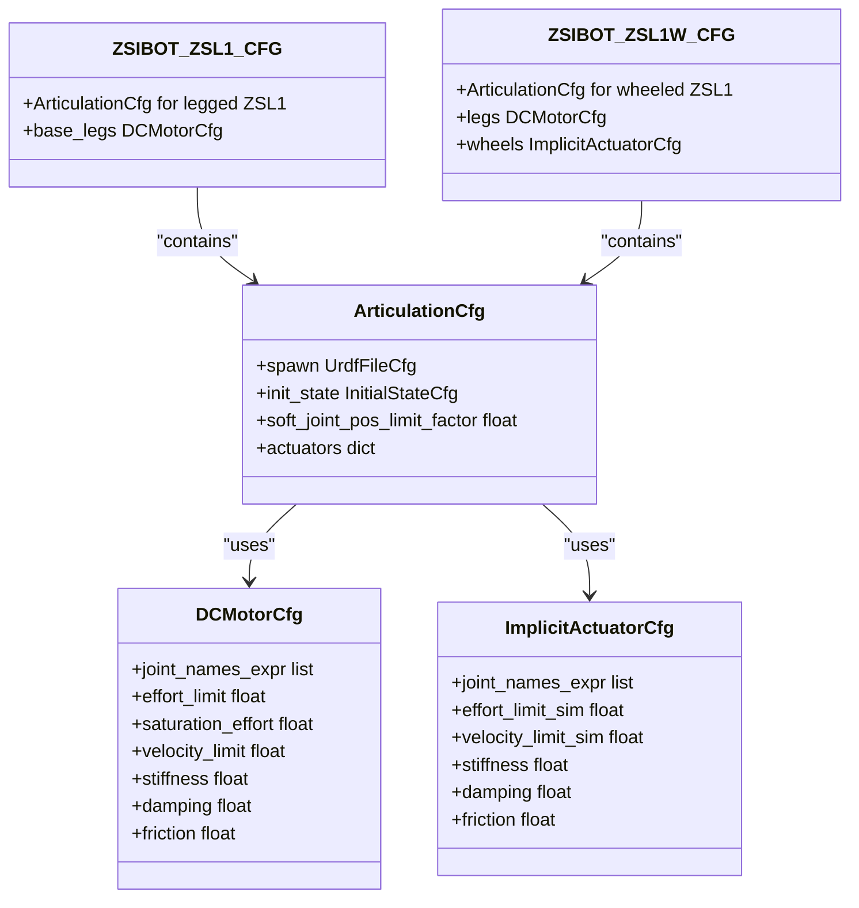

**Diagram sources**
- [zsibot.py:14-115](file://source/robot_lab/robot_lab/assets/zsibot.py#L14-L115)

The configuration demonstrates several key design decisions for advanced locomotion:

- **Joint Specifications**: Leg joints utilize DCMotorCfg with torque limits of 28 N⋅m, providing sufficient power for step negotiation and gap traversal
- **Wheel Actuation**: Wheeled variant includes ImplicitActuatorCfg for smooth rolling motion
- **Initial Positioning**: Conservative joint angles (hip at 0.8 rad, knee at -1.5 rad) ensure stability during training
- **Contact Sensing**: Enabled contact sensors improve foothold detection and stability feedback

**Section sources**
- [zsibot.py:14-115](file://source/robot_lab/robot_lab/assets/zsibot.py#L14-L115)

### Environment Configuration Analysis
The specialized environments build upon the base locomotion configuration with modifications tailored to specific locomotion challenges:

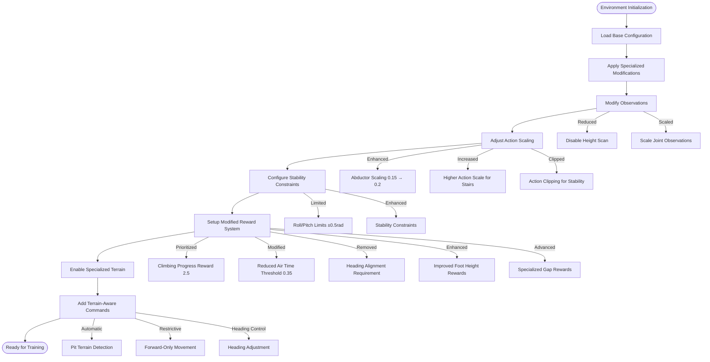

**Diagram sources**
- [stair_env_cfg.py:94-122](file://source/robot_lab/robot_lab/tasks/manager_based/locomotion/velocity/config/quadruped/zsibot_zsl1/stair_env_cfg.py#L94-L122)
- [stair_env_cfg.py:110-122](file://source/robot_lab/robot_lab/tasks/manager_based/locomotion/velocity/config/quadruped/zsibot_zsl1/stair_env_cfg.py#L110-L122)
- [stair_env_cfg.py:202-206](file://source/robot_lab/robot_lab/tasks/manager_based/locomotion/velocity/config/quadruped/zsibot_zsl1/stair_env_cfg.py#L202-L206)
- [gap_env_cfg.py:198-204](file://source/robot_lab/robot_lab/tasks/manager_based/locomotion/velocity/config/quadruped/zsibot_zsl1/gap_env_cfg.py#L198-L204)
- [parkour_env_cfg.py:208-214](file://source/robot_lab/robot_lab/tasks/manager_based/locomotion/velocity/config/quadruped/zsibot_zsl1/parkour_env_cfg.py#L208-L214)

Key environmental modifications include:

- **Enhanced Action Scaling**: Increased abductor joint scaling from 0.15 to 0.2 for improved lateral stability during gap traversal
- **Enhanced Action Scaling**: Increased hip and knee joint scaling from 0.4 to 0.6 to support 0.23m step heights
- **Stability Constraints**: Roll and pitch limits set to ±0.5 radians for enhanced stability during complex maneuvers
- **Modified Reward System**: Climbing progress reward prioritized with weight of 2.5, eliminating heading alignment requirement
- **Reduced Air Time Threshold**: Lowered to 0.35 seconds for controlled stepping rather than jumping
- **Enhanced Termination Conditions**: Illegal contact termination removed, focusing on stability constraints

**Section sources**
- [stair_env_cfg.py:94-122](file://source/robot_lab/robot_lab/tasks/manager_based/locomotion/velocity/config/quadruped/zsibot_zsl1/stair_env_cfg.py#L94-L122)
- [stair_env_cfg.py:110-122](file://source/robot_lab/robot_lab/tasks/manager_based/locomotion/velocity/config/quadruped/zsibot_zsl1/stair_env_cfg.py#L110-L122)
- [stair_env_cfg.py:202-206](file://source/robot_lab/robot_lab/tasks/manager_based/locomotion/velocity/config/quadruped/zsibot_zsl1/stair_env_cfg.py#L202-L206)
- [gap_env_cfg.py:198-204](file://source/robot_lab/robot_lab/tasks/manager_based/locomotion/velocity/config/quadruped/zsibot_zsl1/gap_env_cfg.py#L198-L204)
- [parkour_env_cfg.py:208-214](file://source/robot_lab/robot_lab/tasks/manager_based/locomotion/velocity/config/quadruped/zsibot_zsl1/parkour_env_cfg.py#L208-L214)

### Training Configuration Analysis
The reinforcement learning configuration employs PPO with hyperparameters optimized for advanced locomotion performance and enhanced reward system:

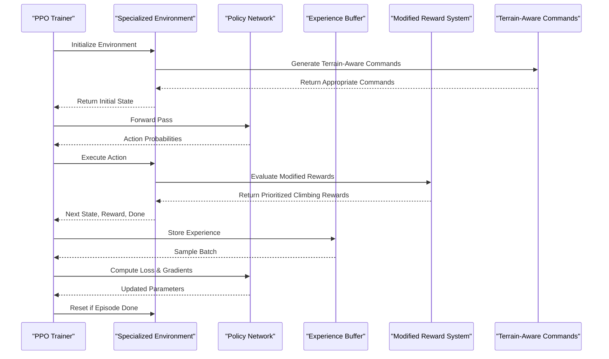

**Diagram sources**
- [rsl_rl_ppo_cfg.py:9-75](file://source/robot_lab/robot_lab/tasks/manager_based/locomotion/velocity/config/quadruped/zsibot_zsl1/agents/rsl_rl_ppo_cfg.py#L9-L75)
- [rewards.py:616-732](file://source/robot_lab/robot_lab/tasks/manager_based/locomotion/velocity/mdp/rewards.py#L616-L732)
- [commands.py:31-98](file://source/robot_lab/robot_lab/tasks/manager_based/locomotion/velocity/mdp/commands.py#L31-L98)

The training configuration emphasizes:

- **Network Architecture**: Multi-layer perceptrons with 512-256-128 hidden units and ELU activation for nonlinear policy representation
- **Learning Parameters**: Adaptive learning rate scheduling with entropy regularization to balance exploration and exploitation
- **Optimization**: Gradient clipping and mini-batch training for stable convergence on challenging stair tasks
- **Modified Reward Processing**: Specialized reward computation prioritizing climbing progress over velocity tracking
- **Terrain-Aware Command Processing**: Dynamic command generation based on environmental conditions

**Section sources**
- [rsl_rl_ppo_cfg.py:9-75](file://source/robot_lab/robot_lab/tasks/manager_based/locomotion/velocity/config/quadruped/zsibot_zsl1/agents/rsl_rl_ppo_cfg.py#L9-L75)

## Enhanced Stair Climbing Features

### Modified Action Scaling System
The stair climbing environment features enhanced action scaling specifically designed for 0.23m step heights:

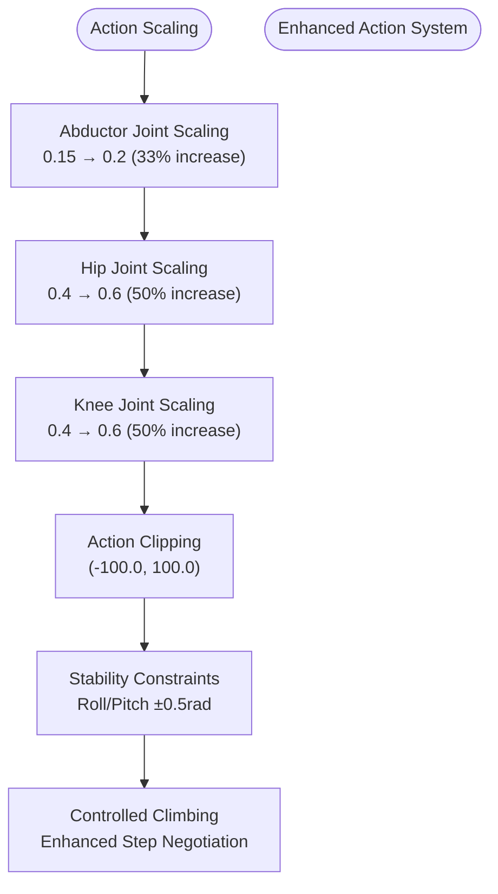

**Diagram sources**
- [stair_env_cfg.py:94-98](file://source/robot_lab/robot_lab/tasks/manager_based/locomotion/velocity/config/quadruped/zsibot_zsl1/stair_env_cfg.py#L94-L98)
- [stair_env_cfg.py:110-112](file://source/robot_lab/robot_lab/tasks/manager_based/locomotion/velocity/config/quadruped/zsibot_zsl1/stair_env_cfg.py#L110-L112)
- [gap_env_cfg.py:198-202](file://source/robot_lab/robot_lab/tasks/manager_based/locomotion/velocity/config/quadruped/zsibot_zsl1/gap_env_cfg.py#L198-L202)

Key action scaling enhancements include:

- **Abductor Joint Scaling**: Increased from 0.15 to 0.2 (33% increase) to provide improved lateral stability during gap traversal and complex maneuvers
- **Hip Joint Scaling**: Increased from 0.4 to 0.6 to provide 50% more leg swing and lifting power for 0.23m step heights
- **Knee Joint Scaling**: Increased from 0.4 to 0.6 to enable adequate leg extension during step negotiation
- **Enhanced Stability**: Combined with roll/pitch limits of ±0.5 radians for safe stair climbing and gap traversal

### Stability Constraint System
Enhanced stability constraints prevent dangerous orientations during stair negotiation and gap traversal:

- **Roll Limit**: ±0.5 radians (±28.6 degrees) prevents excessive side-to-side tilting during climbing and gap crossing
- **Pitch Limit**: ±0.5 radians (±28.6 degrees) maintains safe forward/backward tilt for stability
- **Yaw Freedom**: Unrestricted rotation allows natural stair climbing and parkour-style orientation changes
- **Position Constraints**: Limited base movement prevents falls during step transitions and gap crossings

### Modified Reward System
The environment features a reward system prioritizing controlled climbing and advanced locomotion:

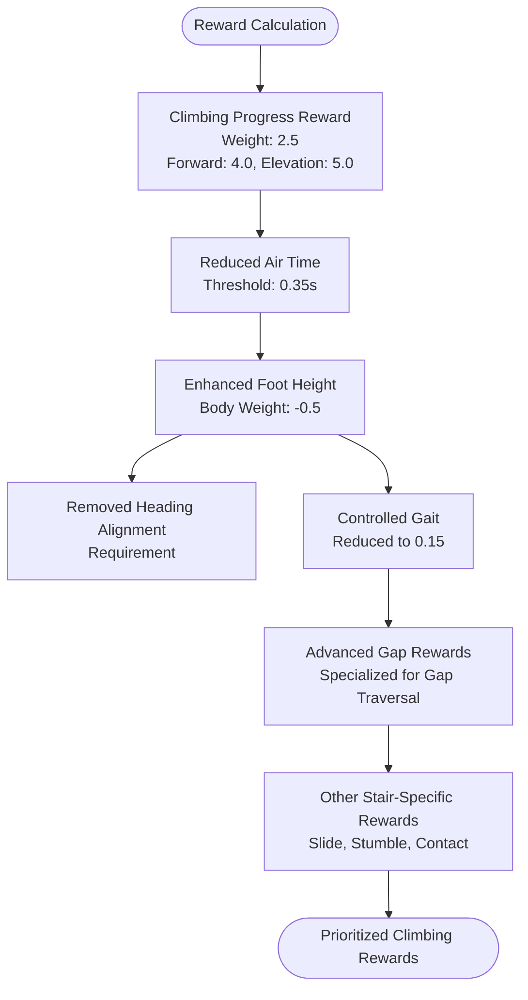

**Diagram sources**
- [stair_env_cfg.py:202-206](file://source/robot_lab/robot_lab/tasks/manager_based/locomotion/velocity/config/quadruped/zsibot_zsl1/stair_env_cfg.py#L202-L206)
- [stair_env_cfg.py:169-178](file://source/robot_lab/robot_lab/tasks/manager_based/locomotion/velocity/config/quadruped/zsibot_zsl1/stair_env_cfg.py#L169-L178)
- [stair_env_cfg.py:188-194](file://source/robot_lab/robot_lab/tasks/manager_based/locomotion/velocity/config/quadruped/zsibot_zsl1/stair_env_cfg.py#L188-L194)
- [gap_env_cfg.py:305-311](file://source/robot_lab/robot_lab/tasks/manager_based/locomotion/velocity/config/quadruped/zsibot_zsl1/gap_env_cfg.py#L305-L311)

Key reward modifications include:

- **Climbing Progress Reward**: Weighted at 2.5 with forward progress (4.0) and elevation gain (5.0) components
- **Reduced Air Time Threshold**: Lowered to 0.35 seconds to discourage jumping and promote controlled stepping
- **Enhanced Foot Height Rewards**: Modified targeting for optimal foot positioning during stair negotiation
- **Removed Heading Alignment**: Eliminated to focus on climbing performance rather than orientation
- **Controlled Gait**: Reduced to 0.15 to allow more flexible gait during climbing
- **Advanced Gap Rewards**: Specialized rewards for successful gap traversal and landing

### Terrain-Aware Command Generation
Advanced command generation automatically adapts robot behavior based on terrain conditions:


**Diagram sources**
- [commands.py:31-98](file://source/robot_lab/robot_lab/tasks/manager_based/locomotion/velocity/mdp/commands.py#L31-L98)
- [utils.py:73-128](file://source/robot_lab/robot_lab/tasks/manager_based/locomotion/velocity/mdp/utils.py#L73-L128)

Terrain-aware command features:

- **Real-time Pit Detection**: Grid-based analysis to identify "pits" terrain automatically
- **Dynamic Movement Restrictions**: Automatic application of movement restrictions on challenging terrains
- **Forward-Only Movement**: Enforced forward-only locomotion on pit terrains with configurable speed limits
- **Heading Control**: Automatic heading adjustment to maintain stability on difficult terrain
- **Command Resampling**: Intelligent resampling of commands when robots exit challenging terrain

**Section sources**
- [stair_env_cfg.py:94-98](file://source/robot_lab/robot_lab/tasks/manager_based/locomotion/velocity/config/quadruped/zsibot_zsl1/stair_env_cfg.py#L94-L98)
- [stair_env_cfg.py:110-122](file://source/robot_lab/robot_lab/tasks/manager_based/locomotion/velocity/config/quadruped/zsibot_zsl1/stair_env_cfg.py#L110-L122)
- [stair_env_cfg.py:202-206](file://source/robot_lab/robot_lab/tasks/manager_based/locomotion/velocity/config/quadruped/zsibot_zsl1/stair_env_cfg.py#L202-L206)

## Advanced Gap Traversal Capabilities

### Enhanced Abductor Joint Scaling
The gap traversal environment features significantly enhanced abductor joint scaling to support advanced locomotion behaviors:

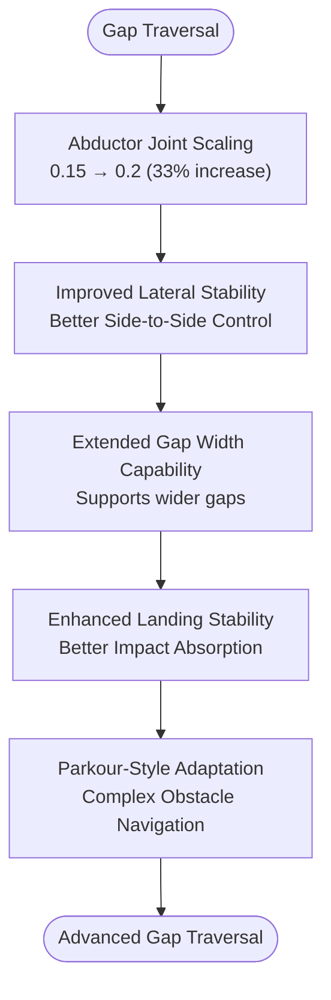

**Diagram sources**
- [gap_env_cfg.py:198-202](file://source/robot_lab/robot_lab/tasks/manager_based/locomotion/velocity/config/quadruped/zsibot_zsl1/gap_env_cfg.py#L198-L202)
- [parkour_env_cfg.py:208-214](file://source/robot_lab/robot_lab/tasks/manager_based/locomotion/velocity/config/quadruped/zsibot_zsl1/parkour_env_cfg.py#L208-L214)

Key gap traversal enhancements include:

- **Abductor Joint Scaling**: Increased from 0.15 to 0.2 (33% increase) to provide improved lateral stability during gap traversal
- **Lateral Stability**: Better side-to-side control for navigating gaps and maintaining balance during landing
- **Extended Gap Width**: Support for wider gaps compared to traditional stair climbing scenarios
- **Enhanced Landing Stability**: Improved impact absorption and landing mechanics for safe gap crossing
- **Parkour-Style Adaptation**: Complex obstacle navigation capabilities for advanced locomotion behaviors

### Parkour-Style Navigation
The parkour environment extends gap traversal capabilities to include complex obstacle courses:

- **Varied Step Heights**: Step height range from 0.1m to 0.45m for diverse challenge scenarios
- **Complex Terrain Patterns**: Ascending and descending step combinations for realistic parkour challenges
- **Enhanced Reward System**: Specialized rewards for successful obstacle navigation and landing
- **Enhanced Termination Conditions**: Focused on stability and safe landing rather than illegal contacts

### Specialized Gap Terrain Generation
Advanced terrain generation creates realistic gap traversal scenarios:

- **Gap Strip Terrains**: Repeated gap and landing strips for continuous traversal training
- **Variable Gap Widths**: Adjustable gap widths from 0.1m to 0.8m for progressive difficulty
- **Run-Up Platforms**: Longer run-up platforms for complex gap traversal scenarios
- **Landing Surfaces**: Dedicated landing platforms between gaps for safe landings

**Section sources**
- [gap_env_cfg.py:198-202](file://source/robot_lab/robot_lab/tasks/manager_based/locomotion/velocity/config/quadruped/zsibot_zsl1/gap_env_cfg.py#L198-L202)
- [gap_env_cfg.py:148-155](file://source/robot_lab/robot_lab/tasks/manager_based/locomotion/velocity/config/quadruped/zsibot_zsl1/gap_env_cfg.py#L148-L155)
- [parkour_env_cfg.py:157-165](file://source/robot_lab/robot_lab/tasks/manager_based/locomotion/velocity/config/quadruped/zsibot_zsl1/parkour_env_cfg.py#L157-L165)

## Enhanced Parkour Terrain Configuration

### New Simple Step Terrain Generation
The parkour environment now features a new `parkour_step_simple_terrain` function that provides more controlled and predictable staircase patterns:

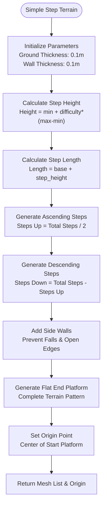

**Diagram sources**
- [parkour_env_cfg.py:118-208](file://source/robot_lab/robot_lab/tasks/manager_based/locomotion/velocity/config/quadruped/zsibot_zsl1/parkour_env_cfg.py#L118-L208)

Key features of the new simple terrain generation:

- **Predictable Step Patterns**: Controlled step heights and lengths for consistent training
- **Enhanced Safety**: Side walls prevent falls and close open edges
- **Configurable Parameters**: Adjustable step height range (0.1-0.45m), step length range (0.3-1.5m), and total steps (6)
- **Consistent Origin**: Centralized origin point for robot spawning and navigation
- **Simplified Algorithm**: Streamlined generation process replacing complex terrain algorithms

### MeshParkourStepTerrainCfg Configuration
The new terrain configuration class provides comprehensive control over parkour step generation:

- **Function Assignment**: Uses `parkour_step_simple_terrain` as the generation function
- **Start Platform**: 3.0m run-up length for approach preparation
- **Step Parameters**: Configurable step height and length ranges for progressive difficulty
- **Step Distribution**: Balanced ascending and descending steps for realistic parkour challenges
- **Terrain Dimensions**: 23.0m × 6.0m size with 2.0m border for safe boundaries

### Enhanced Terrain Generation Process
The new terrain generation process offers several advantages over previous implementations:

- **Improved Predictability**: Consistent step patterns enable reliable training outcomes
- **Enhanced Safety**: Comprehensive side wall coverage prevents robot falls
- **Configurable Complexity**: Adjustable difficulty levels through step height and length parameters
- **Streamlined Implementation**: Simplified codebase reduces maintenance overhead
- **Better Performance**: Optimized mesh generation for faster simulation startup

**Section sources**
- [parkour_env_cfg.py:118-208](file://source/robot_lab/robot_lab/tasks/manager_based/locomotion/velocity/config/quadruped/zsibot_zsl1/parkour_env_cfg.py#L118-L208)
- [parkour_env_cfg.py:210-250](file://source/robot_lab/robot_lab/tasks/manager_based/locomotion/velocity/config/quadruped/zsibot_zsl1/parkour_env_cfg.py#L210-L250)

## Advanced Neural Network Architecture

### ActorCriticScan Network Design
The new ActorCriticScan neural network architecture represents a significant advancement in policy representation for quadruped locomotion:

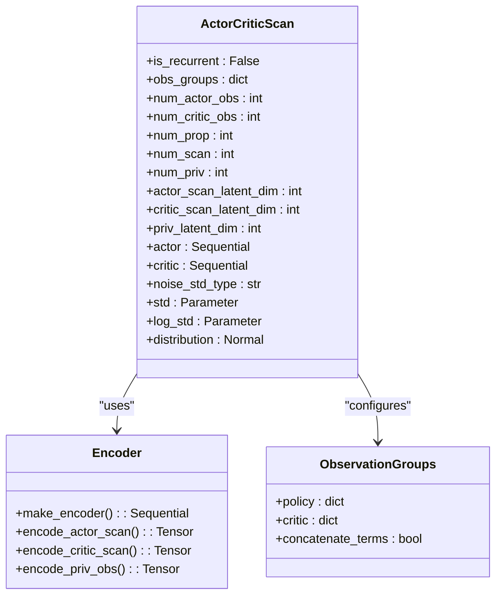

**Diagram sources**
- [actor_critic_scan.py:20-150](file://source/robot_lab/robot_lab/tasks/manager_based/locomotion/velocity/config/quadruped/zsibot_zsl1_parkour/agents/actor_critic_scan.py#L20-L150)

The network architecture features:

- **Asymmetric Actor-Critic**: Separate processing paths for actor and critic networks
- **Scan Encoding**: Optional height scan encoding for enhanced terrain perception
- **Privileged Observation Integration**: Dedicated encoder for robot state information
- **Flexible Architecture**: Configurable hidden dimensions and activation functions
- **Noise Parameterization**: Support for scalar or log-standard deviation parameterization

### Observation Processing Pipeline
The enhanced observation system processes multiple data streams for comprehensive policy representation:

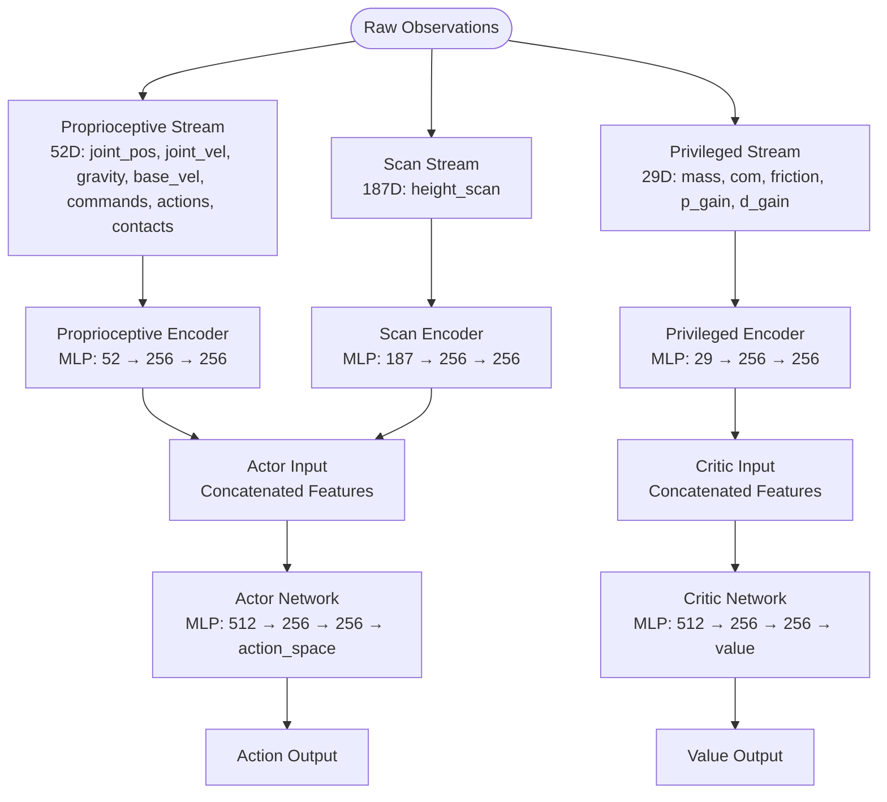

**Diagram sources**
- [actor_critic_scan.py:150-280](file://source/robot_lab/robot_lab/tasks/manager_based/locomotion/velocity/config/quadruped/zsibot_zsl1_parkour/agents/actor_critic_scan.py#L150-L280)

Key observation processing features:

- **Multi-Modal Input**: Integration of proprioceptive, scan, and privileged observations
- **Independent Encoding**: Separate encoders for different observation modalities
- **Asymmetric Processing**: Different processing paths for actor and critic networks
- **Configurable Dimensions**: Flexible input/output dimensions for different robot configurations
- **Efficient Memory Usage**: Optimized tensor operations for real-time inference

### Training Configuration Analysis
The reinforcement learning configuration employs PPO with hyperparameters optimized for advanced locomotion performance and enhanced reward system:

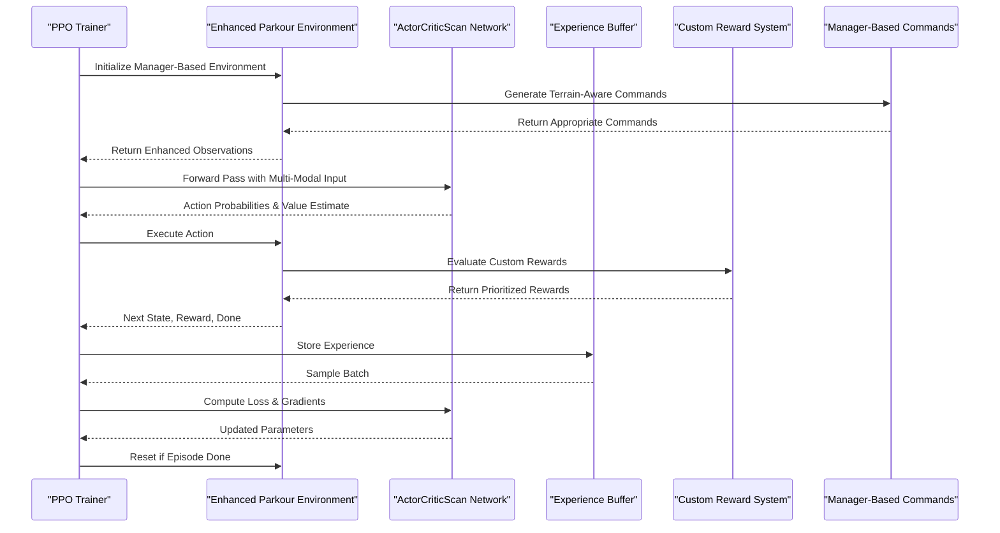

**Diagram sources**
- [actor_critic_scan.py:20-150](file://source/robot_lab/robot_lab/tasks/manager_based/locomotion/velocity/config/quadruped/zsibot_zsl1_parkour/agents/actor_critic_scan.py#L20-L150)
- [rough_env_cfg.py:456-526](file://source/robot_lab/robot_lab/tasks/manager_based/locomotion/velocity/config/quadruped/zsibot_zsl1_parkour/rough_env_cfg.py#L456-L526)

The training configuration emphasizes:

- **Advanced Network Architecture**: ActorCriticScan with scan and privileged observation encoders
- **Manager-Based Environment**: Modern environment configuration using ManagerBasedRLEnv pattern
- **Multi-Modal Observations**: Integration of proprioceptive, scan, and privileged data streams
- **Custom Reward Processing**: Specialized reward computation for parkour locomotion
- **Terrain-Aware Command Processing**: Dynamic command generation based on environmental conditions

**Section sources**
- [actor_critic_scan.py:1-280](file://source/robot_lab/robot_lab/tasks/manager_based/locomotion/velocity/config/quadruped/zsibot_zsl1_parkour/agents/actor_critic_scan.py#L1-L280)
- [rough_env_cfg.py:1-784](file://source/robot_lab/robot_lab/tasks/manager_based/locomotion/velocity/config/quadruped/zsibot_zsl1_parkour/rough_env_cfg.py#L1-L784)

## Custom Reward Systems

### Advanced Reward Function Architecture
The enhanced reward system introduces custom reward functions specifically designed for parkour locomotion:

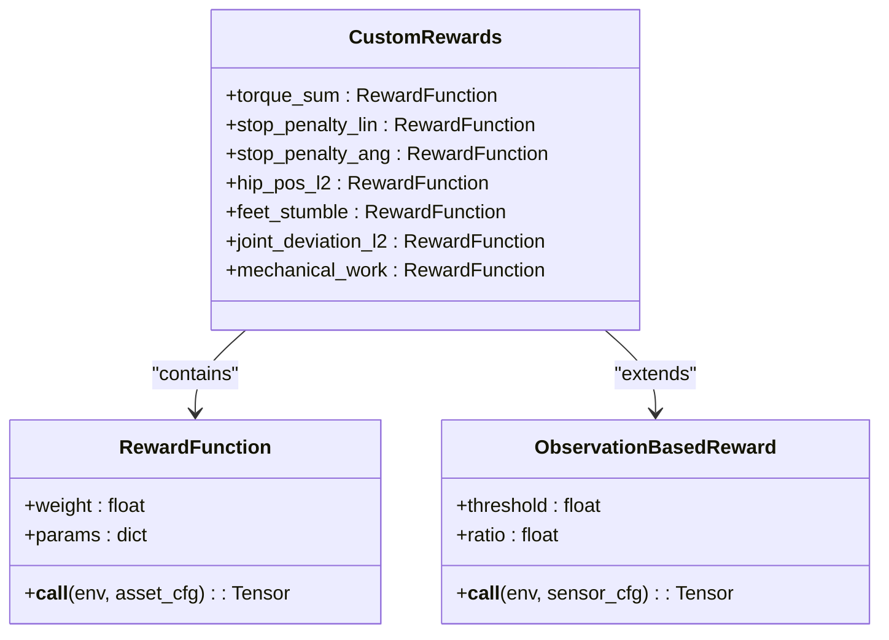

**Diagram sources**
- [rewards.py:35-131](file://source/robot_lab/robot_lab/tasks/manager_based/locomotion/velocity/config/quadruped/zsibot_zsl1_parkour/mdp/rewards.py#L35-L131)

The custom reward functions provide:

- **Torque Summation**: Direct measurement of applied joint torques for mechanical efficiency
- **Stop Penalties**: Exponential penalties for linear and angular velocity to encourage continuous motion
- **Hip Position Control**: L2 penalty for hip joint deviations from default positions
- **Stumble Detection**: Contact force analysis to detect unstable foot placements
- **Joint Deviation**: L2 kernel for measuring joint position deviations from defaults
- **Mechanical Work**: Positive work calculation with regeneration clamping

### Privileged Observation Framework
The privileged observation system provides enhanced sensor data for improved policy performance:

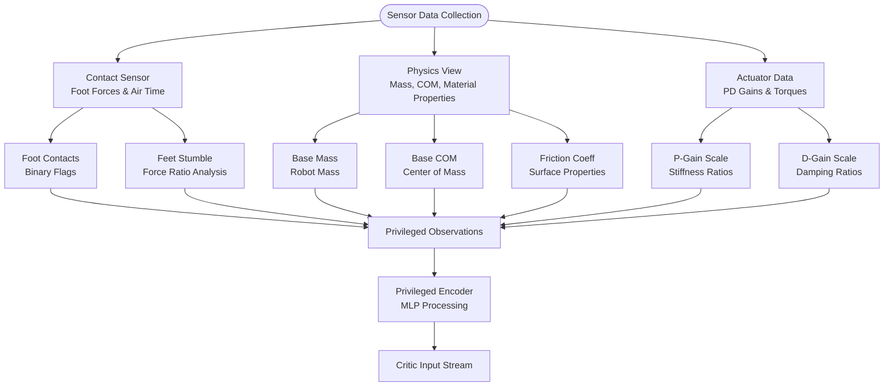

**Diagram sources**
- [observations.py:33-111](file://source/robot_lab/robot_lab/tasks/manager_based/locomotion/velocity/config/quadruped/zsibot_zsl1_parkour/mdp/observations.py#L33-L111)

Key privileged observation features:

- **Contact Force Analysis**: Binary foot contact flags with configurable thresholds
- **Robot State Information**: Base mass, center of mass, and material properties
- **Actuator Performance**: Current PD gains compared to default values
- **Dynamic Properties**: Friction coefficients across all robot contact surfaces
- **Integration with Network**: Dedicated encoder for privileged observation processing

### Environment Registration System
The enhanced parkour system includes comprehensive environment registration for multiple training scenarios:

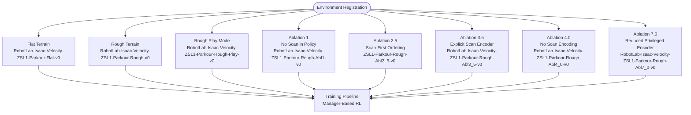

**Diagram sources**
- [__init__.py:21-161](file://source/robot_lab/robot_lab/tasks/manager_based/locomotion/velocity/config/quadruped/zsibot_zsl1_parkour/__init__.py#L21-L161)

The registration system supports:

- **Standard Training Environments**: Flat and rough terrain configurations
- **Play/Evaluation Modes**: Human-playable versions for demonstration
- **Ablation Studies**: Multiple variants for systematic analysis of observation modalities
- **Comprehensive Testing**: 14 different environment configurations for thorough evaluation

**Section sources**
- [rewards.py:1-131](file://source/robot_lab/robot_lab/tasks/manager_based/locomotion/velocity/config/quadruped/zsibot_zsl1_parkour/mdp/rewards.py#L1-L131)
- [observations.py:1-111](file://source/robot_lab/robot_lab/tasks/manager_based/locomotion/velocity/config/quadruped/zsibot_zsl1_parkour/mdp/observations.py#L1-L111)
- [__init__.py:1-161](file://source/robot_lab/robot_lab/tasks/manager_based/locomotion/velocity/config/quadruped/zsibot_zsl1_parkour/__init__.py#L1-L161)

## Dependency Analysis
The ZSL1 configuration exhibits a well-structured dependency hierarchy that enables modular development and testing across multiple specialized environments:

```mermaid
graph TB
subgraph "External Dependencies"
ISAACLAB["Isaac Lab Framework"]
RSL_RL["RSL-RL Library"]
GYMNASIUM["Gymnasium API"]
TRIMESH["Trimesh Library"]
NUMPY["NumPy Library"]
TORCH["PyTorch Library"]
END_SUBGRAPH
subgraph "Internal Dependencies"
ASSETS["Robot Assets Module"]
ENV_CONFIG["Environment Configurations"]
TRAINING["Training Infrastructure"]
SCRIPTS["Utility Scripts"]
MDP["MDP Components"]
TERRAIN_GEN["Enhanced Terrain Generation"]
NEURAL_NET["Advanced Neural Networks"]
OBSERVATION_SYS["Privileged Observation System"]
REWARD_SYS["Custom Reward Functions"]
END_SUBGRAPH
subgraph "ZSL1 Specific"
ZSL1_CFG["ZSL1 Configuration"]
STAIR_CFG["Stair Environment"]
GAP_CFG["Gap Environment"]
PARKOUR_OLD["Legacy Parkour Environment"]
PARKOUR_NEW["Enhanced Parkour System"]
FLAT_CFG["Flat Environment"]
PPO_CFG["PPO Training"]
MODIFIED_REWARDS["Modified Reward System"]
TERRAIN_COMMANDS["Terrain-Aware Commands"]
END_SUBGRAPH
ISAACLAB --> ASSETS
RSL_RL --> TRAINING
GYMNASIUM --> ENV_CONFIG
ASSETS --> ZSL1_CFG
ENV_CONFIG --> STAIR_CFG
ENV_CONFIG --> GAP_CFG
ENV_CONFIG --> PARKOUR_OLD
ENV_CONFIG --> PARKOUR_NEW
ENV_CONFIG --> FLAT_CFG
TRAINING --> PPO_CFG
SCRIPTS --> TRAINING
ZSL1_CFG --> STAIR_CFG
ZSL1_CFG --> GAP_CFG
ZSL1_CFG --> PARKOUR_OLD
ZSL1_CFG --> PARKOUR_NEW
ZSL1_CFG --> FLAT_CFG
PPO_CFG --> SCRIPTS
STAIR_CFG --> MODIFIED_REWARDS
GAP_CFG --> MODIFIED_REWARDS
PARKOUR_OLD --> MODIFIED_REWARDS
PARKOUR_NEW --> MODIFIED_REWARDS
STAIR_CFG --> TERRAIN_COMMANDS
GAP_CFG --> TERRAIN_COMMANDS
PARKOUR_OLD --> TERRAIN_COMMANDS
PARKOUR_NEW --> TERRAIN_COMMANDS
MODIFIED_REWARDS --> MDP
TERRAIN_COMMANDS --> MDP
MDP --> STAIR_CFG
MDP --> GAP_CFG
MDP --> PARKOUR_OLD
MDP --> PARKOUR_NEW
TERRAIN_GEN --> PARKOUR_NEW
NEURAL_NET --> PARKOUR_NEW
OBSERVATION_SYS --> PARKOUR_NEW
REWARD_SYS --> PARKOUR_NEW
TRIMESH --> TERRAIN_GEN
NUMPY --> TERRAIN_GEN
TORCH --> NEURAL_NET
TORCH --> OBSERVATION_SYS
TORCH --> REWARD_SYS
```

**Diagram sources**
- [README.md:360-411](file://README.md#L360-L411)
- [stair_env_cfg.py:13-13](file://source/robot_lab/robot_lab/tasks/manager_based/locomotion/velocity/config/quadruped/zsibot_zsl1/stair_env_cfg.py#L13-L13)
- [gap_env_cfg.py:15-15](file://source/robot_lab/robot_lab/tasks/manager_based/locomotion/velocity/config/quadruped/zsibot_zsl1/gap_env_cfg.py#L15-L15)
- [parkour_env_cfg.py:15-15](file://source/robot_lab/robot_lab/tasks/manager_based/locomotion/velocity/config/quadruped/zsibot_zsl1/parkour_env_cfg.py#L15-L15)
- [rewards.py:616-732](file://source/robot_lab/robot_lab/tasks/manager_based/locomotion/velocity/mdp/rewards.py#L616-L732)
- [commands.py:31-98](file://source/robot_lab/robot_lab/tasks/manager_based/locomotion/velocity/mdp/commands.py#L31-L98)
- [actor_critic_scan.py:13-18](file://source/robot_lab/robot_lab/tasks/manager_based/locomotion/velocity/config/quadruped/zsibot_zsl1_parkour/agents/actor_critic_scan.py#L13-L18)
- [mesh_terrains.py:10-18](file://source/robot_lab/robot_lab/tasks/manager_based/locomotion/velocity/config/quadruped/zsibot_zsl1_parkour/mesh_terrains.py#L10-L18)
- [observations.py:13-19](file://source/robot_lab/robot_lab/tasks/manager_based/locomotion/velocity/config/quadruped/zsibot_zsl1_parkour/mdp/observations.py#L13-L19)
- [rewards.py:14-20](file://source/robot_lab/robot_lab/tasks/manager_based/locomotion/velocity/config/quadruped/zsibot_zsl1_parkour/mdp/rewards.py#L14-L20)

The dependency structure supports:

- **Modular Design**: Clear separation between robot modeling, environment configuration, and training infrastructure
- **Enhanced Integration**: Tight coupling between reward systems and command generation for adaptive behavior
- **Extensibility**: Easy addition of new robots or environments through consistent configuration patterns
- **Maintainability**: Well-defined interfaces between components facilitate debugging and updates
- **Advanced Features**: Integration of modern neural network architectures and manager-based environment patterns

**Section sources**
- [README.md:360-411](file://README.md#L360-L411)

## Performance Considerations
Several factors influence the performance of ZSL1 advanced locomotion with the enhanced features:

### Computational Efficiency
- **Observation Reduction**: Disabling height scanning reduces computational overhead during training
- **Action Clipping**: Prevents excessive joint velocities that could destabilize stair negotiation and gap traversal
- **Memory Management**: Optimized experience buffer sizing for efficient training cycles across multiple environments
- **Zero Weight Reward Elimination**: Automatic removal of inactive rewards reduces computational load
- **Terrain-Aware Command Processing**: Efficient grid-based terrain detection minimizes processing overhead
- **Enhanced Terrain Generation**: Simplified mesh generation algorithms improve simulation startup performance
- **Neural Network Optimization**: ActorCriticScan architecture designed for efficient multi-modal observation processing

### Training Stability
- **Reward Engineering**: Modified reward functions prioritize controlled climbing and gap traversal over velocity tracking
- **Randomization**: Controlled environmental randomization improves generalization across different stair types and gap widths
- **Convergence Monitoring**: Regular evaluation metrics track progress toward advanced locomotion objectives
- **Enhanced Stability Constraints**: Roll/pitch limits of ±0.5 radians maintain safe locomotion performance across all environments
- **Terrain-Aware Adaptation**: Dynamic command generation prevents robots from getting stuck on challenging terrains
- **Privileged Observation Integration**: Enhanced sensor data improves policy stability and learning efficiency

### Hardware Considerations
- **Actuator Limits**: Respect motor torque and velocity limits to prevent damage during aggressive stair climbing and gap traversal
- **Safety Margins**: Conservative joint position limits protect hardware during training
- **Power Management**: Efficient motor control reduces heat generation and power consumption
- **Contact Sensor Optimization**: Enhanced contact force detection prevents damage to robot components
- **Stability Monitoring**: Roll/pitch constraints prevent mechanical stress during complex maneuvers
- **Network Memory Usage**: Optimized tensor operations in ActorCriticScan reduce memory footprint during inference

## Troubleshooting Guide
Common issues and solutions for ZSL1 advanced locomotion configuration with enhanced features:

### Training Issues
- **Poor Convergence**: Verify reward function balance and ensure adequate exploration through entropy regularization
- **Instability**: Check action clipping parameters and reduce learning rate if oscillations occur
- **Slow Learning**: Confirm proper randomization settings and sufficient training iterations
- **Reward System Issues**: Verify modified reward weights and ensure proper reward scaling
- **Command Generation Problems**: Check terrain detection algorithms and command restriction logic
- **Neural Network Training**: Monitor ActorCriticScan architecture for proper multi-modal observation processing
- **Environment Registration**: Verify all 14 environment configurations are properly registered

### Simulation Problems
- **Contact Detection**: Enable contact sensors and verify collision geometry for accurate foothold detection
- **Joint Limits**: Monitor joint position and velocity limits to prevent violations
- **Terrain Generation**: Validate specialized terrain parameters and ensure proper mesh generation
- **Gap Detection Accuracy**: Verify grid-based terrain detection and column allocation logic
- **Command Restriction Effectiveness**: Check forward-only movement enforcement and heading control
- **Mesh Terrain Generation**: Validate trimesh-based terrain generation parameters and safety features

### Hardware Safety
- **Torque Limits**: Monitor actuator efforts to prevent exceeding motor specifications
- **Temperature Monitoring**: Track motor temperatures during intensive stair climbing and gap traversal training
- **Mechanical Integrity**: Regular inspection of links and joints for wear during repetitive complex maneuvers
- **Stability Constraints**: Ensure roll/pitch limits are properly configured to prevent mechanical failure
- **Reward System Safety**: Verify reward scaling prevents excessive forces during advanced locomotion
- **Network Architecture**: Monitor ActorCriticScan memory usage and tensor operation efficiency

**Section sources**
- [stair_env_cfg.py:94-98](file://source/robot_lab/robot_lab/tasks/manager_based/locomotion/velocity/config/quadruped/zsibot_zsl1/stair_env_cfg.py#L94-L98)
- [stair_env_cfg.py:110-122](file://source/robot_lab/robot_lab/tasks/manager_based/locomotion/velocity/config/quadruped/zsibot_zsl1/stair_env_cfg.py#L110-L122)
- [stair_env_cfg.py:202-206](file://source/robot_lab/robot_lab/tasks/manager_based/locomotion/velocity/config/quadruped/zsibot_zsl1/stair_env_cfg.py#L202-L206)
- [gap_env_cfg.py:198-202](file://source/robot_lab/robot_lab/tasks/manager_based/locomotion/velocity/config/quadruped/zsibot_zsl1/gap_env_cfg.py#L198-L202)
- [parkour_env_cfg.py:208-214](file://source/robot_lab/robot_lab/tasks/manager_based/locomotion/velocity/config/quadruped/zsibot_zsl1/parkour_env_cfg.py#L208-L214)
- [zsibot.py:47-115](file://source/robot_lab/robot_lab/assets/zsibot.py#L47-L115)
- [rewards.py:616-732](file://source/robot_lab/robot_lab/tasks/manager_based/locomotion/velocity/mdp/rewards.py#L616-L732)
- [commands.py:31-98](file://source/robot_lab/robot_lab/tasks/manager_based/locomotion/velocity/mdp/commands.py#L31-L98)
- [actor_critic_scan.py:198-206](file://source/robot_lab/robot_lab/tasks/manager_based/locomotion/velocity/config/quadruped/zsibot_zsl1_parkour/agents/actor_critic_scan.py#L198-L206)

## Conclusion
The ZSIBOT ZSL1 Advanced Locomotion Configuration represents a comprehensive approach to quadruped locomotion within the Isaac Lab framework, enhanced with increased abductor joint scaling from 0.15 to 0.2, enhanced action scaling for hip and knee joints, stability constraints with roll/pitch limits, modified reward weights prioritizing controlled climbing, and enhanced termination conditions. Through careful engineering of robot dynamics, environment design, and reinforcement learning parameters, the system achieves robust stair climbing, gap traversal, and parkour-style navigation capabilities while maintaining training efficiency and safety.

The recent enhancements include increased abductor joint scaling from 0.15 to 0.2 to support gap traversal capabilities, increased action scaling from 0.4 to 0.6 for hip and knee joints to support 0.23m step heights, stability constraints limiting roll and pitch to ±0.5 radians, modified reward weights with climbing progress prioritized at 2.5, and enhanced termination conditions focusing on stability rather than illegal contact. These improvements enable the system to adapt dynamically to different stair configurations, gap widths, and complex parkour obstacles while maintaining stable locomotion performance.

The most significant enhancement is the introduction of the comprehensive parkour training system featuring the ActorCriticScan neural network architecture, mesh-based terrain generation, and advanced reward systems. This new system provides 14 different environment configurations for thorough evaluation and systematic analysis of different observation modalities and training approaches. The integration of privileged observations, custom reward functions, and manager-based environment architecture represents a major advancement in quadruped locomotion training capabilities.

The modular architecture continues to enable easy adaptation for different locomotion challenges and robot variants, while the well-tuned reward functions and actuator specifications provide the foundation for successful advanced locomotion. Future enhancements could include dynamic gap width adjustment, multi-modal terrain adaptation, advanced gait pattern learning for improved gap traversal performance, and integration with more complex parkour obstacle courses.

The removal of experimental reward system and temporary debug features ensures a cleaner, more maintainable codebase while preserving the core functionality that makes the ZSL1 effective for advanced locomotion applications including stair climbing, gap traversal, and parkour-style navigation.

**Updated** The documentation has been updated to reflect the comprehensive ZSL1 parkour training system with new ActorCriticScan neural network architecture, mesh terrains, and advanced reward systems. The new system now covers both stair climbing and parkour navigation capabilities for the ZSL1 robot, featuring enhanced observation processing, custom reward functions, and manager-based environment configuration.